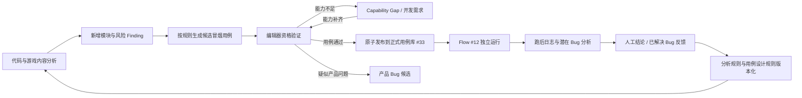

# Hub × Codex 多 Flow 自动化闭环改造需求

## 0. 文档信息

| 项目 | 内容 |
| --- | --- |
| 项目 | RacingGO / DeepFlow |
| 日期 | 2026-08-12 |
| 面向对象 | Hub 产品、后端、前端及负责修改 Hub 的 AI |
| 目标 | 让 Codex 能稳定调度多个独立 Flow，并在 Hub 中完成候选用例、能力缺口、执行证据、缺陷分析和学习反馈的闭环 |
| 最高约束 | **不得修改或阻断现有 Flow #12；Flow #12 始终可以按原计划独立启动和执行** |

本文不是要求 Hub 再实现一套智能总调度器。当前多 Flow 的先后顺序、重试、等待和分支判断由 Codex 执行 Agent 统一决定；Hub 负责提供可靠的状态、数据、资源、版本和审计能力。

## 1. 当前结论

Hub 已有的 Workflow Definition、Workflow Run、Step 状态/心跳/结果回写、用例库、用例库快照和报告能力可以继续复用，不需要推倒重做。

当前真正缺少的是以下控制面能力：

1. 候选用例从发现到正式入库的独立生命周期。
2. 用例库 #33 的带版本、幂等、并发保护的原子发布能力。
3. 代码发现、模块、候选用例、验证 Run、正式用例、Flow12 Run、缺陷和规则之间的完整追溯关系。
4. Unity、Bridge、手机、账号和用例库写入者的统一资源租约。
5. 供 Codex 查询和控制 Workflow Run 的过滤、关联标识及启动幂等能力。
6. 自动化 Capability 和开发需求之间的闭环。
7. 证据完整度、风险结论及后续人工反馈的结构化沉淀。

不建议在 Hub 内把所有阶段硬连成一个超长 Workflow。这样容易让代码分析、候选验证或人工审批阻塞稳定冒烟。正确方式是每个 Flow 独立运行，Codex 根据 Hub 状态决定下一步。

## 2. 职责边界

### 2.1 Codex 执行 Agent 负责

- 判断当前应该执行代码/内容分析、候选用例设计、资格验证、Flow12，还是跑后分析。
- 创建 Workflow Run、等待结果、检查结构化输出并选择下一分支。
- 遇到资源冲突时延后候选验证，优先保证 Flow12。
- 将验证通过的候选提交给 Hub 发布接口。
- 对异常进行有限重试；不得无限轮询或无限试跑。

### 2.2 Hub 负责

- 保存 Workflow 模板、Run、Step、候选用例、证据、Finding、Capability、资源租约、版本和审计记录。
- 提供稳定、可过滤、可幂等调用的 API。
- 保证正式用例库的并发写安全、快照和可回滚。
- 提供闭环看板和对象间双向链接。
- 做确定性状态校验，不做“下一步应该跑哪个 Flow”的 LLM 判断。

### 2.3 单个 Flow / Agent 节点负责

- 只完成本 Flow 的明确任务。
- 回写标准状态、指标、证据清单和结果分类。
- 不直接启动另一个 Flow。
- 不绕过候选用例资格验证直接写正式用例库。

### 2.4 现有 Hub 对象处理建议

| 现有对象 | 处理方式 |
| --- | --- |
| Workflow Definition #12 `racinggo_editor_smoke_report_only` | 保持现有执行路径，不增加依赖和门禁；只允许兼容地记录库快照与 controller/correlation 元数据 |
| 用例库 #33 | 继续作为 Flow12 唯一正式动作库；新增 revision、content hash、promotion 和回滚审计 |
| Workflow Definition #26 `racinggo_daily_code_risk_analysis` 草稿 | 不直接启用当前长流程；保留其只读代码风险分析部分，将验证、提单、通知和学习拆出 |
| 手机包库 #33 Workflow 模板 | 与本闭环资源租约共用手机和账号资源，但不纳入 Flow12 前置链路 |

建议在 Hub 中保留以下独立模板，均由 Codex 按状态启动：

1. `code_content_discovery`：只读分析提交、配置和新增模块，输出 Finding 与候选模块。
2. `candidate_case_design`：按用例设计标准生成/更新候选，不操作 Unity。
3. `candidate_editor_qualification`：短租 Unity/Bridge/账号，验证底座和用例可运行性。
4. `racinggo_editor_smoke_report_only`：即现有 Flow12，不变。
5. `post_run_bug_analysis`：读取 Flow12 证据，输出结构化风险结论。
6. `bug_rule_learning`：定时读取已解决 Bug、人工反馈和历史 Run，生成 draft 规则并做回放。

前两个只读 Flow 可与 Flow12 并行；第三个必须在资源空闲时执行；第五个依赖某次 Flow12 Run 已结束，但这层依赖由 Codex 判断，不在 Hub 模板间建立硬依赖。

## 3. 目标闭环



资源上允许只读分析与 Flow12 并行，但编辑器验证、手机操作和正式用例库写入必须通过租约治理。任何外围流程失败都不得改变 Flow12 的定时计划或可运行状态。

## 4. 必须保持不变的 Flow12 约束

1. 不给 Workflow Definition #12 增加上游 `depends_on`、审批门或候选队列门禁。
2. 不要求 Flow12 等待代码分析、用例生成、能力开发或跑后分析。
3. Flow12 仍以正式用例库 #33 为唯一动态动作库。
4. Flow12 启动时冻结本次使用的用例库快照；之后 #33 即使更新，也只能影响下一次 Run。
5. 新增的 Hub 字段和 API 必须向后兼容；旧的创建 Run 和 Step 回写请求仍可使用。
6. Flow12 的 Unity、Bridge、账号资源优先级最高；资格验证拿不到资源时返回 `DEFERRED_RESOURCE_BUSY`，不得抢占 Flow12。

## 5. P0：本轮必须完成的 Hub 改造

## 5.1 候选用例中心

新增独立实体 `automation_case_candidate`，不要在资格验证前直接创建正式 testcase。

### 状态机

```text
DISCOVERED
  -> DESIGNED
  -> WAITING_CAPABILITY | READY_FOR_CANARY
  -> QUALIFIED
  -> PENDING_PUBLISH
  -> ACTIVE
```

异常/终止状态：

- `CASE_DESIGN_ERROR`
- `PRODUCT_BUG_CANDIDATE`
- `ENV_BLOCKED`
- `QUARANTINED`
- `RETIRED`

### 最小字段

```json
{
  "id": 1001,
  "project_id": 6,
  "title": "签到执行一次领取并校验奖励变化",
  "module_key": "lobby.sign_in",
  "source_type": "content_scan",
  "source_refs": [
    {"type": "commit", "value": "abc123"},
    {"type": "panorama_node", "value": "node-456"},
    {"type": "finding", "value": "FND-789"}
  ],
  "case_draft": {
    "preconditions": [],
    "steps": [],
    "expected_results": [],
    "automation": {}
  },
  "required_capabilities": ["open_sign_in", "claim_once", "read_reward_state"],
  "state": "READY_FOR_CANARY",
  "qualification_outcome": null,
  "qualification_run_id": null,
  "production_library_id": 33,
  "production_case_id": null,
  "dedupe_key": "sha256:...",
  "version": 3,
  "created_by": "codex-controller",
  "created_at": "2026-08-12T10:00:00+08:00",
  "updated_at": "2026-08-12T10:10:00+08:00"
}
```

### API

- `POST /api/v1/automation-case-candidates:upsert`
- `GET /api/v1/automation-case-candidates?project_id=6&state=READY_FOR_CANARY`
- `GET /api/v1/automation-case-candidates/{id}`
- `PATCH /api/v1/automation-case-candidates/{id}`
- `POST /api/v1/automation-case-candidates/{id}/qualification-result`

写入要求：

- `upsert` 必须接受 `idempotency_key` 或稳定 `dedupe_key`，重复请求不能生成重复候选。
- `PATCH` 必须带 `expected_version`；版本冲突返回 HTTP `409`，不得静默覆盖。
- 所有状态迁移在服务端校验，不允许从 `DESIGNED` 直接跳到 `ACTIVE`。
- 资格验证结果只允许以下四类：
  - `QUALIFIED`
  - `AUTOMATION_CAPABILITY_GAP`
  - `CASE_DESIGN_ERROR`
  - `PRODUCT_BUG_CANDIDATE`

### 外围功能用例设计标准

Hub 在候选详情中展示并校验以下最小协议：

```text
打开模块 -> 执行一次最小正常操作 -> 校验业务状态变化 -> 关闭/返回大厅
```

例如：

- 签到：领取一次，校验已领取状态和奖励/资源变化；若账号当天已领，需要声明重置条件。
- 车辆升级：升级一次，校验车辆等级/属性变化及货币消耗。
- 盲盒：单抽一次，校验结果界面、券/货币变化以及背包或车辆状态。

仅“页面能打开”或“按钮点击成功”不能作为通过条件。

## 5.2 正式用例库的原子发布与版本控制

现有快照 API 可以保留，但需要补充一个面向候选晋级的事务接口：

`POST /api/v1/testcase-libraries/{library_id}/promotions`

请求示例：

```json
{
  "candidate_ids": [1001, 1002],
  "expected_library_revision": 17,
  "idempotency_key": "closed-loop-20260812-batch-004",
  "dry_run": false,
  "message": "资格验证通过，发布外围冒烟用例",
  "source_run_ids": [201, 202]
}
```

响应示例：

```json
{
  "promotion_id": 88,
  "library_id": 33,
  "before_revision": 17,
  "after_revision": 18,
  "content_hash": "sha256:...",
  "created_case_ids": [33041, 33042],
  "snapshot_version": 18,
  "candidate_states": {"1001": "ACTIVE", "1002": "ACTIVE"}
}
```

事务要求：

1. 校验全部候选均为 `QUALIFIED` 或 `PENDING_PUBLISH`。
2. 创建/更新 testcase、创建快照、更新候选状态和记录关系必须在同一事务完成。
3. 任一步失败则整体回滚。
4. 相同 `idempotency_key` 重放必须返回同一结果。
5. `expected_library_revision` 不匹配返回 HTTP `409`，不允许后写覆盖前写。
6. 返回后可按 revision、case ID 和 content hash 精确回读。
7. 支持 `dry_run=true`，只返回差异、冲突和预期 revision。

用例库详情需新增或可靠返回：

```json
{
  "revision": 18,
  "content_hash": "sha256:...",
  "case_count": 26,
  "updated_at": "...",
  "updated_by": "..."
}
```

现有快照的 checkout/diff/tag 能力继续保留，前端增加 revision 历史、promotion 记录和一键回滚入口。

## 5.3 Flow Run 查询、关联和启动幂等

Codex 需要可靠判断某个 Flow 是否已经启动、当前进行到哪一步，以及结果是否已经消费。

### 创建 Run

在现有 `POST /api/v1/workflow-runs` 上增加可选字段：

```json
{
  "workflow_definition_id": 12,
  "idempotency_key": "scheduler-20260812-flow12-window-2200",
  "controller_run_id": "codex-cycle-20260812-01",
  "correlation_id": "racinggo-dev2-abc123",
  "trigger_source": "codex_controller",
  "start_vars": {}
}
```

- 相同 Workflow Definition 和 `idempotency_key` 重复调用时返回同一个 Run。
- 旧客户端不传这些字段时，行为保持不变。

### 查询 Run

增强现有列表接口，至少支持：

`GET /api/v1/workflow-runs?workflow_definition_id=12&status=running,waiting_approval&created_after=...&controller_run_id=...&page=1&page_size=50`

列表项需要直接返回：

- `id`
- `workflow_definition_id` / `workflow_key`
- `status`
- `current_step_id`
- `current_step_status`
- `controller_run_id`
- `correlation_id`
- `started_at` / `updated_at` / `finished_at`
- `result_summary`
- `output_refs`

提供 `GET /api/v1/workflow-runs/latest?...` 可降低 Codex 的分页和竞态处理复杂度。

## 5.4 通用关系与数据血缘

新增通用关系实体，支持以下链路双向追溯：

```text
commit / requirement / panorama_node
  -> finding
  -> automation_case_candidate
  -> qualification_workflow_run
  -> production_testcase
  -> flow12_workflow_run
  -> post_run_finding / bug
  -> learned_rule
```

建议 API：

- `POST /api/v1/entity-relations:batch-upsert`
- `GET /api/v1/entity-relations?from_type=...&from_id=...`
- `GET /api/v1/entity-relations?to_type=...&to_id=...`

关系最小字段：`from_type`、`from_id`、`relation_type`、`to_type`、`to_id`、`metadata`、`created_by`、`created_at`。批量写入必须幂等。

每个相关详情页都应展示“来源”和“下游结果”，避免只能在日志里人工查 ID。

## 5.5 资源租约

新增通用 `resource_lease`，首批资源键：

- `unity:racinggo:dev2`
- `bridge:racinggo:dev2:mobile`
- `bridge:racinggo:dev2:ui`
- `device:{device_serial}`
- `account:{account_id}`（逻辑资源；P0 复用现有 `test-account-manager` 的 acquire/release/TTL，不在通用租约表重复建账）
- `testcase_library:33:writer`

API：

- `POST /api/v1/resource-leases/acquire`
- `POST /api/v1/resource-leases/{id}/renew`
- `POST /api/v1/resource-leases/{id}/release`
- `GET /api/v1/resource-leases?resource_key=...&status=active`

申请示例：

```json
{
  "resource_keys": ["unity:racinggo:dev2", "bridge:racinggo:dev2:ui"],
  "owner_type": "workflow_run",
  "owner_id": "118",
  "controller_run_id": "codex-cycle-20260812-01",
  "priority": 100,
  "ttl_seconds": 900,
  "idempotency_key": "run-118-editor-lease"
}
```

规则：

- 多资源申请必须全得或全不得，避免只占一半资源后死锁。
- 租约有 TTL、心跳续租、显式释放和超时回收。
- Flow12 优先级固定高于资格验证。
- 低优先级已有租约不做强杀；Flow12 到来前 Codex 应通过查询避免发起新验证。P0 阶段不要求 Hub 实现抢占调度。
- 冲突返回占用者、预计过期时间和 `retry_after_seconds`。
- 正式用例库 promotion 内部必须获取 `testcase_library:33:writer` 或使用等价数据库锁。
- 通用 `resource-leases/acquire` 首批只接受 Unity、Bridge 和 device；测试账号继续使用现有测试号 Skill，并加固行锁、keepalive 与超时回收。

## 5.6 Flow12 运行快照

Flow12 Run 创建或开始读取用例库时，Hub 记录不可变快照元数据：

```json
{
  "workflow_run_id": 118,
  "testcase_library_snapshot": {
    "library_id": 33,
    "revision": 18,
    "snapshot_version": 18,
    "content_hash": "sha256:...",
    "case_ids": [33001, 33002],
    "case_count": 26,
    "frozen_at": "..."
  }
}
```

要求：

- Run 后续只展示和引用该快照，不随 #33 当前内容变化。
- 快照记录失败不应阻断 Flow12；先记录告警并继续执行，避免新增基础设施反向影响稳定冒烟。
- 报告页可从 Run 直接跳到当时的用例库版本。

## 6. P1：完成基本闭环后的增强项

## 6.1 Capability Catalog 与开发需求

Capability 需要描述自动化底座能执行什么动作、能观测什么状态、支持哪些环境，而不只是一个自由文本标签。

最小字段：

```json
{
  "key": "vehicle.upgrade_once",
  "name": "车辆升级一次",
  "operations": ["open_vehicle_upgrade", "upgrade_once"],
  "observables": ["vehicle_level", "vehicle_stats", "currency_balance"],
  "reset_hooks": ["restore_test_account"],
  "platforms": ["unity_editor"],
  "status": "available",
  "implementation_version": "3",
  "health_checked_at": "..."
}
```

当候选验证返回 `AUTOMATION_CAPABILITY_GAP` 时：

1. 创建或关联一个 Capability Gap / 开发需求。
2. 保存缺少的 operation、observable、reset hook、受影响候选列表和证据。
3. 候选进入 `WAITING_CAPABILITY`，不能发布到 #33。
4. 开发需求变为 `done` 后，Codex 可查询受影响候选并重新放入 `READY_FOR_CANARY`。

API 建议：

- `GET/POST /api/v1/automation-capabilities`
- `POST /api/v1/capability-gaps:upsert`
- `GET /api/v1/capability-gaps?status=resolved&candidate_requeue_pending=true`
- `POST /api/v1/capability-gaps/{id}/resolve`

## 6.2 Evidence Manifest 与分析完整度

每个需要做潜在 Bug 分析的 Run，使用统一 Evidence Manifest：

```json
{
  "run_id": 118,
  "coverage": {
    "case_result": "complete",
    "ui_snapshot": "complete",
    "console": "missing",
    "logcat": "not_applicable",
    "screenshots": "partial",
    "performance": "not_requested"
  },
  "artifacts": [
    {
      "type": "screenshot",
      "uri": "hub-artifact://...",
      "sha256": "...",
      "size": 123456,
      "case_id": 33001,
      "step_id": "action_cases_execute"
    }
  ]
}
```

大日志、截图和性能文件只保存制品链接、hash 和元数据，不把大文件直接塞进 Workflow JSON。

跑后分析只能输出：

- `CONFIRMED_ANOMALY`
- `PRODUCT_BUG_CANDIDATE`
- `AUTOMATION_RISK`
- `PERFORMANCE_RISK`
- `ANALYSIS_INCOMPLETE`
- `NO_RISK_FOUND`

硬规则：Console、关键日志、UI 快照或坐标证据缺失导致无法判断时，必须是 `ANALYSIS_INCOMPLETE`，不能写“未发现 Bug”。

## 6.3 Finding 和反馈学习

Finding 至少关联：来源 commit/需求、模块、用例、Run、Step、证据、置信度、当前状态和 Bug/需求链接。

人工或后续系统反馈使用统一标签：

- `true_positive`
- `false_positive`
- `duplicate_bug`
- `automation_unsupported`
- `human_confirmed`
- `human_rejected`
- `fixed_before_validation`

规则学习不能直接覆盖线上规则。新增 `analysis_rule` 版本状态：`draft -> replay_passed -> active -> retired`。规则从 draft 变为 active 前，要用历史 Run/Finding 回放，展示命中数、真阳性、误报、漏报和变化范围。

## 6.4 闭环看板

新增项目级“自动化闭环”页，首版至少展示：

- 各候选状态数量和滞留时长。
- 等待 Capability 的候选及关联开发需求。
- 待资格验证、待发布和发布失败队列。
- 当前资源租约和冲突。
- #33 当前 revision、最近 promotion、最近回滚。
- 每次 Flow12 使用的 revision、用例数和结果。
- 跑后分析完整度及 Finding 分类。
- 从一个候选到最终 Bug/规则的完整链路。

## 7. P2：后续优化

- 规则历史回放批量任务和效果趋势图。
- 模块覆盖率、外围功能新增速度、自动化能力缺口消化周期。
- 基于历史数据给 Codex 提供只读的“建议下一动作”接口，但最终决策仍由 Codex 控制。
- Webhook/Event Stream 可作为减少轮询的优化，不是首版闭环的前置条件。

## 8. 当前接入问题需要一并修复

以下问题已在现有 DeepFlow/Hub 接入中出现，建议纳入 P0 稳定性修复：

1. Workflow Definition 保存后可能丢失顶层 `start_vars_schema`。必须做到字段完整持久化和 GET 回读一致；在修复前 Flow12 仍使用 context 中的默认库 ID，不应因此改 Flow12。
2. metrics/gates 依赖精确字段名，字段不一致时缺少清晰校验。保存模板时应做 schema 校验，并返回具体路径和错误信息。
3. 用例列表接口部分场景返回裸数组且默认只含前 20 条，容易被误判成全量。统一返回 `{items,total,page,page_size}`；过渡期至少明确 `total` 和分页信息。
4. 用例库更新或单用例 PUT 偶发返回 500，但其他操作仍可用。写接口需要事务、稳定错误码、request ID 和可重放的幂等键。
5. 所有写接口需要 write-after-readback 语义：响应包含新 revision/hash，后续 GET 能精确回读同一版本。
6. 现有更新可能发生后写覆盖前写。Workflow Definition、候选、Finding 和用例库都应增加 revision/expected_version 乐观锁。

## 9. 数据库与后端任务拆分

### P0 数据表/模型

- `automation_case_candidates`
- `automation_case_candidate_events`
- `entity_relations`
- `resource_leases`
- `testcase_library_promotions`
- `workflow_run_library_snapshots`
- 为 `workflow_runs` 增加 `idempotency_key`、`controller_run_id`、`correlation_id`、`trigger_source`
- 为 `testcase_libraries` 增加可靠的 `revision`、`content_hash`

### P1 数据表/模型

- `automation_capabilities`
- `capability_gaps`
- `evidence_manifests`
- `findings` / `finding_feedback`
- `analysis_rules` / `analysis_rule_versions` / `analysis_rule_replays`

### 通用后端要求

- 所有列表 API 支持稳定排序、分页、条件过滤和 `updated_after` 增量读取。
- 所有创建类写接口支持 `idempotency_key`。
- 所有更新类接口支持 `expected_version`，冲突返回 409。
- 所有写操作记录 actor、request ID、前后 revision 和差异摘要。
- 返回结构统一，错误响应至少包含 `code`、`message`、`details`、`request_id`。

## 10. 前端任务拆分

1. 候选用例列表、状态筛选、批量资格验证入口和详情事件时间线。
2. 候选详情中的来源、能力要求、验证结果、证据、正式用例和关联开发需求。
3. 用例库 revision、diff、promotion、回滚和并发冲突提示。
4. Workflow Run 列表新增 controller/correlation 过滤与本次库快照展示。
5. 资源租约页：资源、持有者、优先级、TTL、心跳和过期状态。
6. Finding 的证据覆盖度、结论分类和人工反馈。
7. 项目级闭环看板。

P0 首先保证接口和最小管理页面可用，图表和高级看板可放到 P1/P2。

## 11. 验收用例

### AT-01 创建 Run 幂等

对同一 Workflow Definition 使用相同 `idempotency_key` 连续创建两次，只产生一个 Run，两次返回相同 Run ID。

### AT-02 候选状态并发保护

两个客户端同时以 `expected_version=3` 更新同一候选，只允许一个成功，另一个返回 409。

### AT-03 能力不足不能入正式库

候选返回 `AUTOMATION_CAPABILITY_GAP` 后进入 `WAITING_CAPABILITY` 并关联需求；调用 promotion 必须失败且 #33 revision 不变。

### AT-04 验证通过只发布一次

候选验证通过后，同一 promotion 请求重放两次，只创建一个 testcase、一个快照和一条 promotion 记录。

### AT-05 两个发布者并发

两个发布者基于相同 library revision 写 #33，只允许一个提交成功，另一个返回 409 并可重新 dry-run。

### AT-06 Flow12 快照稳定

Flow12 启动并冻结 #33 revision 18；运行中将 #33 升到 revision 19，本次 Run 仍显示和执行 revision 18，下一次 Run 使用 revision 19。

### AT-07 Flow12 不受外围闭环阻断

代码分析失败、候选队列积压、Capability Gap 未解决或学习规则回放失败时，Flow12 仍可按原模板创建并执行。

### AT-08 资源冲突

Flow12 持有 Unity 租约时，资格验证申请相同资源返回冲突信息和重试时间；不得终止或修改 Flow12 Run。

### AT-09 租约超时回收

持有者停止续租后，租约在 TTL 后自动失效，新请求可以获得资源，并保留过期审计记录。

### AT-10 证据不全语义

跑后分析缺少 Console 和关键截图时只能保存 `ANALYSIS_INCOMPLETE`，接口拒绝将其写为 `NO_RISK_FOUND`。

### AT-11 全链路追溯

从任一正式用例能追溯到候选、来源 commit/模块、资格验证 Run、使用它的 Flow12 Run、相关 Finding/Bug 和后续规则；反向也能查询。

### AT-12 回滚

将 #33 从 revision 19 回滚至 18 后产生新的审计 revision，而不是删除历史；旧 Flow12 Run 的快照仍保持不变。

## 12. 迁移方案

### 第一步：只加字段和新表

- 不修改 Definition #12。
- 将现有用例库 #33 当前内容登记为初始可追溯 revision。
- Workflow Run 新字段全部可空，保证旧客户端兼容。

### 第二步：接入 Codex 控制器

- 先接 Run 过滤/幂等、候选队列和资源租约。
- Codex 仍可回退到旧接口；新接口异常不得影响 Flow12 的直接启动。

### 第三步：启用候选晋级

- 新用例先只进入候选中心。
- 通过编辑器资格验证后，经 promotion 原子写入 #33。
- 旧的直接 CRUD 暂时保留给管理员，但增加审计提示；稳定后再限制自动化账号直接写正式库。

### 第四步：接入分析和学习

- 接 Evidence Manifest、Finding 反馈和规则版本。
- 规则首批只运行历史回放，不自动改变线上判断。

## 13. 明确不做的事情

- Hub 不自动判断或启动“下一个 Flow”。
- Hub 不把多个 Flow 强行合并为一个跨流程 DAG。
- Hub 不修改 Flow12 的固定流程和定时任务。
- 未资格验证的候选不自动进入 #33。
- 底座能力不足时不把用例标记为通过。
- 证据不全时不输出“未发现风险”。
- 不自动创建 TAPD Bug、不自动发大群消息；这些仍由明确授权的独立流程处理。
- 不在 Workflow JSON 中保存大体积截图、日志和性能原始文件。

## 14. 交给 Hub AI 的实施顺序

请按以下顺序修改，完成一项就补充迁移、单元测试和 API 测试：

1. `workflow_runs` 的幂等键、controller/correlation 字段和过滤查询。
2. 候选用例实体、状态机、事件历史和乐观锁。
3. 用例库 revision/content hash 与原子 promotion。
4. Flow12 用例库运行快照，但不得给 Flow12 增加门禁。
5. 通用 entity relation。
6. 资源租约。
7. Capability Gap/开发需求关联。
8. Evidence Manifest、Finding 反馈和规则版本。
9. 最小管理页面及闭环看板。

每项实现后必须执行本文第 11 节对应的验收用例。P0 全部通过后，再让 DeepFlow/Codex 切换到新接口；在此之前保持现有接口和 Flow12 完全可用。
