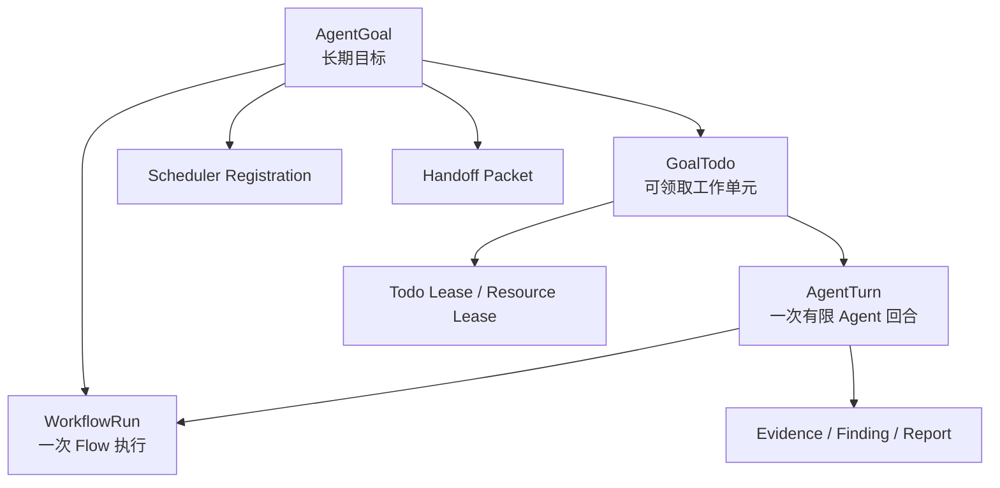
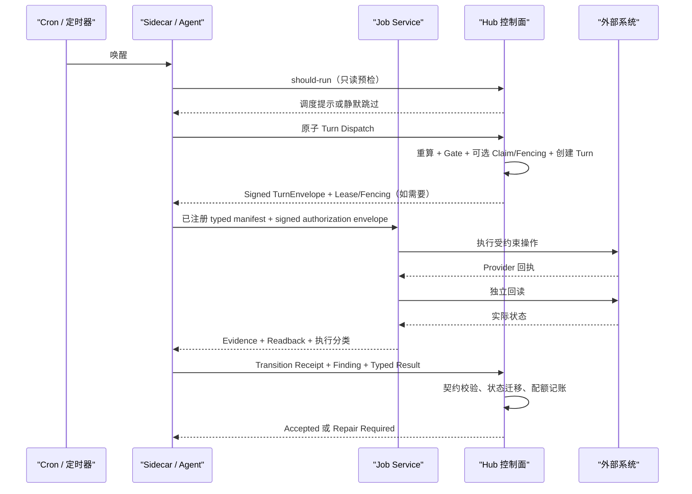

# Hub × Worker 长周期 Agent 控制面改造需求

## 0. 文档信息

| 项目 | 内容 |
| --- | --- |
| 文档日期 | 2026-08-15 |
| 适用系统 | ClawTeam Hub、Sidecar、Hermes/Codex/自定义 Agent Worker |
| 参考项目 | [LoopX](https://github.com/huangruiteng/loopx) |
| Worker 对齐文档 | `F:/Code/claw-worker-windows-v2/docs/agent-execution-kernel.md` |
| Hub 现有契约 | `docs/自定义Agent_Hub侧契约交接文档_2026-08-04.md` |
| Worker 评审结论 | 方向通过，需求文档修订后实施；2026-08-15 已按五项意见修订 |
| 改造目标 | 在复用现有 Workflow、Evidence、Finding、报告、权限和资源租约能力的基础上，补齐跨会话目标、统一调度决策、Worker 生命周期、标准回合契约和可靠写回能力 |
| 兼容原则 | 新协议按 Agent/Workflow 灰度启用；现有 Flow #12 和旧 Worker 在未显式切换前继续使用原执行路径 |

## 1. 背景与结论

Hub 已具备 Workflow Definition、Workflow Run、Step、并串行和条件分支、结果契约、Evidence Manifest、Finding、报告、临时鉴权、通知硬门禁、资源租约、用例库版本和审计等能力，不应引入第二套 Workflow 或第二套业务数据真相源。

LoopX 值得借鉴的是长周期 Agent 控制面的设计：将目标、边界、待办、证据、配额和交接持久化，由 Agent Runtime 执行有限回合，由控制面决定是否继续、是否需要用户处理以及结果是否可以被接受。LoopX 本身是 local-first 的轻量控制内核，不适合直接替代 Hub 的中心化数据库、API 和领域能力。

本次改造采用以下三层职责边界：

- **Hub 是控制面**：负责状态真相、Workflow/Todo、审批、租约、调度决策、权限门禁、结果验收和审计。
- **Sidecar/Agent 是认知面**：负责理解目标、选择已注册能力、分析失败、提出有限重试和 successor Todo 建议。
- **Job Service 是执行面**：只执行固定 schema、完整哈希绑定且已审批的 typed manifest，负责进程、路径、权限、取消、证据和独立验证。
- Worker 可以被 Hub Todo、Hermes Cron、Codex Automation 或操作系统定时器唤醒，但不能自行决定业务任务是否继续。
- 外部接口调用成功不等于业务进展，必须完成独立回读、契约校验和 Hub 状态提交。
- Prompt 只负责向 Agent 解释任务，不承担平台权限和安全门禁。
- 模型输出不能直接成为 PowerShell、cmd、ADB shell 或编辑器命令；模型只能选择 Hub/Worker 已注册的动作及受约束参数。

控制面应是护栏而不是收费站。普通代码分析、搜索、只读检查和方案生成默认不要求人工 Gate，也不要求强 Claim；修改共享工程、推进正式 Todo、操作共享测试环境或产生外部副作用前才要求 Claim/Fencing 和相应授权。

## 2. 现有能力复用范围

| 现有能力 | 处理方式 |
| --- | --- |
| Workflow Definition、Run、Step | 继续复用；Run 增加可空 `goal_id` 和 Turn 关联字段 |
| Workflow 并行、串行、条件分支 | 继续作为单次流程内部编排能力，不在 Goal 层重复实现 DAG |
| Evidence Manifest、Finding、报告 | 继续作为结果和证据数据面，由 Goal、Todo、Turn 建立关联 |
| Resource Lease | 继续负责设备、账号、Unity、Bridge、用例库写者等执行资源 |
| 测试账号管理 Skill | 继续负责测试账号分配、释放和 TTL，不重复建账号库存 |
| 临时鉴权 | 继续复用并扩展到 Goal、Todo、Turn 和 Effect 的作用域 |
| 通知硬门禁 | 继续由 Hub 执行，Worker 不直接取得未授权通知凭据 |
| 用例库 revision、promotion、rollback | 继续复用；不迁移到新的 Goal 状态存储 |
| AgentTask、ClawTodo | 保持兼容；逐步接入 Goal、统一调度登记和 Turn Contract |

## 3. 总体对象关系



说明：

- Goal 是跨会话、跨 Worker、跨多个 Workflow Run 的长期目标。
- Todo 是一个可领取、可校验、可转交的有限工作单元。
- Turn 是 Worker 一次被允许执行的有限 Agent 回合。
- Workflow Run 继续负责领域流程执行，Goal 不替代 Workflow。
- Dashboard、看板和交接页面均为上述持久状态的投影，不成为新的状态源。

### 3.1 统一门禁分级

Hub 与 Worker 使用同一套三级策略，不允许业务模块各自发明 Gate 语义：

| 级别 | 适用场景 | 默认行为 |
| --- | --- | --- |
| Hard Gate | 生产写入、删除或不可逆操作、对外发布、敏感数据使用、越出授权范围、显著新增成本、产品或业务取舍 | 必须等待有权限的人解决，Agent 和 Worker 不得绕过 |
| Automatic Gate | Claim/Lease/Fencing、Todo 版本、并发槽、Provider 健康、配额、Verifier 结果 | 系统自动检查；通过时不打扰用户 |
| Warning | 质量下降、证据较弱、预计成本偏高、非关键策略偏差 | 默认记录并继续；风险升级、连续失败或策略明确要求时再转为 Hard Gate |

Goal 或 Todo 启动时应保存预授权信封：

```json
{
  "write_scope": ["src/**", "tests/**", "docs/**"],
  "allowed_effects": ["edit_workspace", "run_tests", "git_commit"],
  "requires_gate": [
    "git_push",
    "external_message",
    "production_write",
    "delete_data"
  ]
}
```

Worker 在信封内执行普通修改和验证时不得反复申请审批；越界时由 Sidecar 向 Hub 创建 Gate。只有 Hub 可以根据有权限用户的决定扩大授权信封。

### 3.2 默认不阻断原则

新增控制面必须优先保证正常 Workflow 可继续运行，不能因为控制字段缺失、Worker 尚未升级或低风险验证不完整，把原本可运行的流程全部变成 blocked。默认策略如下：

1. **旧路径默认放行**：未显式启用新控制面的 Agent、Workflow Definition 和 Step 继续按原协议执行，不自动套用 Goal、Turn、配额或新 Gate。
2. **Warning 不改变流程状态**：质量下降、可选 Evidence 缺失、预计成本偏高和非关键 readback 异常只记录 Warning，不把 Step/Run 改成 blocked。
3. **Automatic Gate 静默执行**：正常 Claim、续租、版本、容量、Provider 健康和配额检查不得创建人工审批；通过后直接执行。
4. **只读和普通分析不要求 Claim**：代码分析、搜索、读取、方案生成和不产生共享副作用的检查不因 Claim 服务不可用而停止。
5. **只有确定性高风险条件硬阻断**：活动 Claim 冲突、失效 fencing token、明确越出授权信封、未授权的生产写入/删除/对外发布/敏感数据使用、显式暂停或取消。
6. **契约异常与业务阻断分离**：可选输出缺失只告警；必填输出缺失标记 `CONTRACT_INVALID`，是否阻断后续由该节点的显式策略决定。`on_fail=warn` 可以继续后续 Flow，但最终页必须展示异常。
7. **控制面故障按风险降级**：旧 Workflow 继续旧路径；只读诊断可以继续；已经取得有效授权的本地普通操作可到当前安全边界；新的共享写入和不可逆副作用才 fail closed。
8. **不得统一降速**：存在 ready Todo 且 Worker/Provider 健康时应立即执行；只对 busy、网络异常、连续失败和真实等待状态退避。

任何新 Gate 都必须说明其保护的具体风险、命中条件、默认模式、超时降级、回滚开关和不会阻断的场景。无法说明这些内容的 Gate 不得进入 enforce。

## 4. Hub 侧改造

### 4.1 P0：新增长期目标 AgentGoal

在 Workflow Run 上层增加 `AgentGoal`，建议最小字段如下：

```text
id
project_id
title
objective
scope_json
non_goals_json
authority_sources_json
current_belief
next_action
status
priority
compute_quota
version
created_by
created_at
updated_at
```

状态建议：

```text
DRAFT
ACTIVE
WAITING_USER
WAITING_EVIDENCE
REPLAN_REQUIRED
REPAIR_REQUIRED
PAUSED
COMPLETED
ARCHIVED
```

要求：

1. Goal 不依赖聊天线程或 Worker 本地上下文。
2. Agent 清理上下文、Worker 重启或执行 Runtime 更换后仍可恢复。
3. Goal 保存当前判断和下一安全动作，不保存无界聊天全文。
4. 用户修正目标、范围、优先级或权威信息源时，必须形成版本化事件。
5. `WorkflowRun.goal_id`、Evidence、Finding、Report 关联均先设计为可选，保持旧数据兼容。

建议 API：

```http
POST  /api/v1/agent-goals
GET   /api/v1/agent-goals
GET   /api/v1/agent-goals/{goal_id}
PATCH /api/v1/agent-goals/{goal_id}
POST  /api/v1/agent-goals/{goal_id}/pause
POST  /api/v1/agent-goals/{goal_id}/resume
POST  /api/v1/agent-goals/{goal_id}/archive
```

所有修改接口必须支持 `expected_version`；版本冲突返回 HTTP `409`，不得静默覆盖。

#### 4.1.1 P0：先落地最小 GoalTodo，再实现 Claim 和调度

GoalTodo 是 `should-run`、Claim、Gate、Turn 和 Handoff 的共同工作对象，必须在这些能力之前落地，不能到第二阶段才补。第一阶段最小字段：

```text
id
goal_id
title
description
task_class                 # advancement_task / continuous_monitor / user_action / user_gate
action_kind
priority
status                     # open / claimed / waiting / completed / cancelled / superseded
assigned_agent_id
claimed_by_worker_id
claim_expires_at
fencing_token
authorization_envelope_id
required_capabilities_json
required_write_scopes_json
resume_when_json
version
created_at
updated_at
```

第一阶段只要求支持创建、查询、修改、Claim、Heartbeat、Release 和终态迁移，不要求一次性实现完整任务图。现有 `WorkflowRunStep(worker_task)` 通过统一 `work_item_type/work_item_id` 适配层接入，旧 Step 不强制迁移为 GoalTodo。

建议 API：

```http
POST  /api/v1/agent-goals/{goal_id}/todos
GET   /api/v1/agent-goals/{goal_id}/todos
GET   /api/v1/goal-todos/{todo_id}
PATCH /api/v1/goal-todos/{todo_id}
POST  /api/v1/goal-todos/{todo_id}/claim
POST  /api/v1/goal-todos/{todo_id}/heartbeat
POST  /api/v1/goal-todos/{todo_id}/release
```

依赖顺序固定为：

```text
AgentGoal
  -> GoalTodo / WorkflowStep 统一工作项适配
  -> Claim + Fencing
  -> Formal Gate + 签名授权信封
  -> 原子 Dispatch
  -> TurnEnvelope
  -> Transition Receipt
  -> Handoff / Attention / Quota 优化
```

#### 4.1.2 P0：正式人工 Gate 模型

人工 Gate 不能只作为 `should-run` 的 reason 或页面提示，必须是可审计、可绑定、可解决的正式实体。建议新增 `agent_control_gates`：

```text
id
goal_id
work_item_type
work_item_id
turn_id
gate_type                    # production_write / delete / publish / sensitive_data / scope_expand / cost / business_decision
policy_level                 # hard / automatic / warning
status                       # open / approved / rejected / expired / cancelled / superseded
blocking_scope               # work_item / agent_lane / goal
question
reason_code
requested_scope_json
safe_fallback_json
decision_options_json
requested_by
resolved_by
resolution
resolution_note
expires_at
version
idempotency_key
created_at
resolved_at
```

建议 API：

```http
POST /api/v1/control-gates
GET  /api/v1/control-gates
GET  /api/v1/control-gates/{gate_id}
POST /api/v1/control-gates/{gate_id}/resolve
POST /api/v1/control-gates/{gate_id}/cancel
```

要求：

- Gate 创建必须幂等，同一风险和同一授权范围不能重复打扰用户。
- `blocking_scope=work_item` 只阻断绑定工作项，不阻断其他安全 Todo。
- `user_action` 只提醒、不阻断；`user_gate` 才参与 `should-run/dispatch`。
- Gate 过期后不得继续授权，必须重新评估当前状态和授权范围。
- 企微、Hub 页面和 Developer AI 临时链接只是同一个 Gate 的处理入口，不各自保存决定。
- Gate 解决后触发一次目标重评估和定向唤醒，不等待原定 Cron 周期。

### 4.2 P0：统一调度登记 Scheduler Registration

新增 `scheduler_registration`，登记所有能够唤醒 Agent 的来源：

```text
id
agent_id
goal_id
source_type
source_id
schedule_expression
enabled
runtime_status
next_run_at
last_run_at
last_reconciled_at
metadata_json
created_at
updated_at
```

`source_type` 至少支持：

```text
hub_todo
hermes_cron
codex_automation
os_cron
systemd_timer
windows_task_scheduler
external
```

Hub 需要提供：

- 查询某个 Agent/Goal 的全部调度源。
- 暂停和恢复单条调度。
- 暂停和恢复某个 Agent 的全部调度。
- 对 Worker 上报的真实状态做周期对账。
- 展示登记状态、真实状态、下次执行时间和状态漂移。

### 4.3 P0：Agent 原子暂停与恢复

建议接口：

```http
POST /api/v1/agents/{agent_id}/suspend
POST /api/v1/agents/{agent_id}/resume
GET  /api/v1/agents/{agent_id}/runtime-control
```

Agent 生命周期状态：

```text
active
draining
suspended
resuming
unhealthy
suspend_incomplete
```

暂停流程：

1. Hub 将 Agent 设置为 `draining`，立即禁止领取新任务。
2. Hub 向 Worker 下发暂停命令。
3. Worker 暂停 Hub Todo、Hermes Cron、Codex Automation 和可管理的 OS 调度。
4. Worker 安全结束或取消当前 Turn，并清理子进程、锁和临时凭据。
5. Worker 逐项回传调度和进程清理结果。
6. Hub 回读确认后将 Agent 设置为 `suspended`。
7. 任一来源未停止时设置为 `suspend_incomplete`，不得显示为完全暂停。

恢复时只能恢复暂停前处于启用状态的调度项，不能无差别启用全部任务。

### 4.4 P0：统一 should-run 与原子 Dispatch

接口：

```http
POST /api/v1/agent-goals/{goal_id}/should-run
```

请求示例：

```json
{
  "agent_id": 27,
  "worker_id": "xiaoma-sidecar",
  "trigger_source": "hermes_cron",
  "available_capabilities": [
    "shell",
    "filesystem_read",
    "filesystem_write",
    "browser"
  ]
}
```

响应示例：

```json
{
  "should_run": true,
  "decision": "READY_FOR_WORK",
  "candidate_todo": {
    "id": 318,
    "version": 4
  },
  "allowed_write_scopes": ["repo/**"],
  "notification_policy": "DONT_NOTIFY",
  "scheduler_hint_seconds": 900,
  "next_eligible_at": null,
  "reason": "存在可执行的 P0 待办"
}
```

Hub 判断顺序：

1. Agent 是否暂停或处于排空状态。
2. Goal 是否暂停、完成或归档。
3. 平台安全门禁和用户审批是否满足。
4. 当前 Turn 所需临时权限是否满足。
5. 上游证据是否发生有效变化。
6. 是否存在当前 Agent 可领取的有效 Todo。
7. Worker 能力和 Todo 要求是否匹配。
8. 设备、账号、环境、用例库写者等资源是否可用。
9. Goal 计算配额是否允许继续。

返回 `should_run=false` 时必须包含稳定的 decision、reason、下一次建议检查时间和通知策略。

`should-run` 是只读预检和调度提示，不授予执行权，也不能返回一个让 Worker 稍后直接执行的“已选中但未锁定”Todo。为避免两个 Worker 同时通过 `should-run` 后再竞争 Claim，正式执行使用原子 Dispatch：

```http
POST /api/v1/agent-goals/{goal_id}/turn-dispatches
Idempotency-Key: <dispatch-id>
```

Hub 在同一数据库事务中完成：

1. 重新计算最新 `should-run` 决策。
2. 选择当前可运行的 GoalTodo 或兼容 `WorkflowRunStep`。
3. 检查正式人工 Gate、能力、写入范围、资源和配额。
4. 对需要 Claim 的工作项创建/续领 Claim，并生成新的 fencing token。
5. 预留本次配额槽，但尚不记为已消费。
6. 创建 AgentTurn 和签名后的 TurnEnvelope。
7. 返回 Lease、Fencing Token、TurnEnvelope 和 `schedule_version`。

任一步失败则整体回滚，不出现“已选 Todo 但没有 Claim”“已有 Claim 但没有 Turn”或“两个 Worker 都拿到可执行信封”的状态。只读、不需要 Claim 的工作也必须通过 Dispatch 创建唯一 Turn，但可以没有工作项租约。

相同 `Idempotency-Key` 重放返回第一次 Dispatch 结果；状态已经变化但使用新的幂等键时重新评估，不复用旧 `should-run` 结果。

### 4.5 P0：计算配额与消费账本

新增：

```text
goal_compute_quota
goal_compute_spend_event
```

第一版使用“有效执行回合”或“执行分钟槽”，不要求精确计算 Token。至少支持：

- Goal 每日允许的有效回合数或分钟数。
- Agent 每小时最大执行回合数。
- `compute_quota=0` 时整个 Goal 停止自动执行。
- 没有状态变化的监控轮询不计入有效执行。
- Hub 返回下一次允许执行时间。
- 配额消费只在结果通过校验并成功写回后记录。

### 4.6 P0：标准 Agent Turn Contract

Hub 下发 `TurnEnvelope`：

```json
{
  "turn_id": "turn-20260815-001",
  "goal_id": 12,
  "todo_id": 318,
  "todo_version": 4,
  "route": "READY_FOR_HOST",
  "objective": "分析本次代码变更风险",
  "allowed_actions": ["read_repo", "write_report"],
  "denied_actions": ["send_wecom", "publish_testcase"],
  "required_outputs": ["findings", "evidence_manifest"],
  "required_readbacks": ["report"],
  "authorization_envelope": {
    "schema_version": "authorization_envelope_v1",
    "issuer": "clawteam-hub",
    "subject": "worker:xiaoma-sidecar",
    "audience": "job-service:claw-27",
    "key_id": "hub-auth-2026-08-a",
    "algorithm": "Ed25519",
    "issued_at": "2026-08-15T17:00:00+08:00",
    "expires_at": "2026-08-15T18:00:00+08:00",
    "nonce": "dispatch-opaque-nonce",
    "write_scope": ["repo/**"],
    "allowed_effects": ["edit_workspace", "run_tests"],
    "requires_gate": ["git_push", "external_message"],
    "manifest_hash": "sha256:...",
    "approval_scope_hash": "sha256:...",
    "signature": "base64url:..."
  },
  "manifest_schema": "agent_typed_manifest_v1",
  "manifest_hash": "sha256:...",
  "approval_scope_hash": "sha256:...",
  "schedule_version": 3,
  "deadline_at": "2026-08-15T18:00:00+08:00",
  "idempotency_key": "goal12-todo318-turn4"
}
```

`manifest_hash` 和 `approval_scope_hash` 只证明内容绑定，不能证明是谁授权。正式执行必须由 Hub 使用平台签名密钥签发 Authorization Envelope，Job Service 使用受保护的公钥集合验证签名、issuer、subject、audience、有效期、nonce、manifest hash 和 approval scope hash。

要求：

- 优先使用非对称签名（如 Ed25519；具体算法由平台安全基线确定），Job Service 不持有 Hub 签名私钥。
- `key_id` 支持公钥轮换；Hub 支持吊销未过期授权。
- `nonce + subject + audience` 防止授权跨 Worker、跨 Job Service 或跨 Turn 重放。
- 签名验证失败、授权过期、受众不匹配或 manifest hash 变化时 fail closed。
- Hash 继续用于内容寻址和幂等比较，但不能替代授权签名。

前置路由建议：

```text
READY_FOR_HOST
WAIT_USER_ACTION
WAIT_EXTERNAL_EVIDENCE
REPLAN_REQUIRED
REPAIR_REQUIRED
BLOCKED
CONTRACT_ERROR
```

Worker 回写结果只能使用标准结果类型：

```text
VALIDATED_PROGRESS
VALIDATED_COMPLETION
WAIT_USER_ACTION
WAIT_EXTERNAL_EVIDENCE
REPLAN_REQUIRED
REPAIR_REQUIRED
HOST_FAILURE
CONTRACT_INVALID
VALIDATION_FAILED
WRITEBACK_FAILED
QUOTA_SPEND_FAILED
CANCELLED
```

`passed/failed/blocked` 可继续作为旧接口兼容字段，但新控制面必须使用上述细分结果，避免把 Runtime 故障、业务失败、验证失败和写回失败混为同一状态。

### 4.7 P0：统一验收 Worker 写回

接口：

```http
POST /api/v1/agent-turns/{turn_id}/writeback
```

Hub 必须校验：

- `turn_id` 是否存在且仍可写。
- Todo 是否仍由当前 Worker 持有。
- Todo 的 `expected_version` 是否匹配。
- Todo Lease 是否有效。
- Turn 声明的 required outputs 是否齐全。
- Evidence Manifest、Finding 和输出引用是否真实落库。
- 外部副作用是否包含回执和独立回读。
- Worker 是否违反允许的写入范围和能力边界。
- 当前写回是否携带最新的 fencing token，旧租约产生的迟到结果必须拒绝。
- manifest schema、完整 manifest hash、approval scope hash 是否与批准版本一致。
- 幂等键重放是否返回第一次写回结果。

只有校验通过后，Hub 才更新 Goal、Todo、Workflow Run 状态并登记配额消费。

### 4.8 P0：Transition Receipt 与 Effect Receipt

`Transition Receipt` 是一次正式状态迁移的原子提交记录；外部副作用的 `Effect Receipt` 是其组成部分。Agent 只提交结果摘要、阻塞原因和 successor Todo 建议，不负责手工拼装复杂 Receipt。

Hub 必须在一个数据库事务中完成：

1. 校验 Todo version、活动 Claim、最新 fencing token 和幂等 transition id。
2. 校验 Provider 结果、独立 readback、Verifier 和必填 Evidence。
3. 追加不可变 Transition Receipt。
4. 更新 Todo、Turn、Workflow Run 和 Goal 状态。
5. 登记配额消费以及可发送通知的事实。

Hub 未确认 Transition Receipt 已原子提交前，Worker 不得把正式 Todo 标记为完成，也不得发送“已完成”通知。

对提单、通知、用例变更、报告生成、发布和外部状态修改统一保存：

```text
effect_type
request_summary
request_hash
idempotency_key
provider_receipt
readback_snapshot
validation_rule_version
validation_status
validation_errors
accepted_revision
created_at
```

标准链路：

```text
Agent 请求操作
  -> Provider 执行
  -> 保存接口回执
  -> 独立回读真实状态
  -> 校验业务后置条件
  -> Hub 接受状态迁移
```

接口返回成功但回读不一致时，结果应为 `VALIDATION_FAILED` 或 `WRITEBACK_FAILED`，不得显示为正常完成。

### 4.9 P0/P1：Claim、Fencing、Lease 和 CAS

现有 `worker_task` 强租约继续作为 P0 兼容基线：`claim/heartbeat/progress/result/status` 必须校验活动租约 owner，过期租约不能被 heartbeat 复活。下一步需要为每次成功 claim/reclaim 增加单调递增的 `fencing_token`（或 `claim_generation`），Worker 的 heartbeat、progress、result 和 Transition Receipt 均携带该值，拒绝旧租约迟到写回。

通用 GoalTodo 的最小 Claim/Lease/Fencing 属于 P0；Transfer、复杂依赖、`resume_when` 和任务图投影作为 P1 增强。建议接口：

建议接口：

```http
POST  /api/v1/goal-todos/{todo_id}/claim
POST  /api/v1/goal-todos/{todo_id}/heartbeat
POST  /api/v1/goal-todos/{todo_id}/release
POST  /api/v1/goal-todos/{todo_id}/transfer
PATCH /api/v1/goal-todos/{todo_id}
```

关键字段：

```text
claimed_by
claim_expires_at
expected_version
write_scope_json
heartbeat_at
transfer_to
release_reason
```

只读分析、搜索和方案生成不强制 Claim；修改共享资源、推进正式 Todo、操作共享测试环境或产生外部副作用前必须取得 Claim。Todo Lease 负责工作归属，现有 Resource Lease 负责设备、账号、环境和写者等资源竞争，两者不能混用。租约粒度以 Todo 为主，不锁整个 Goal，以允许不同 Agent 并行处理互不冲突的工作。

### 4.10 P1：标准交接包 Handoff Packet

接口：

```http
GET  /api/v1/agent-goals/{goal_id}/handoff-packet
POST /api/v1/agent-goals/{goal_id}/handoffs
```

交接包至少包含：

- 当前目标、范围和非目标。
- 当前判断和最近一次有效进展。
- 已完成和未完成待办。
- Evidence、Finding、Report 和 Workflow Run 引用。
- 未解决的用户门禁和外部证据等待。
- 当前可写范围和禁止操作。
- 临时凭据领取入口，不包含明文凭据。
- 下一建议动作。
- Goal、Todo 和 Turn 版本。

交接信息必须通过 API 获取和更新，不能依赖聊天全文，也不能通过直接修改 HTML 报告改变状态。

### 4.11 P1：统一关注队列

接口：

```http
GET /api/v1/control-plane/attention
```

至少支持以下分类：

```text
等待用户审批
等待 Developer AI
等待外部证据
需要重新规划
Worker 故障
契约异常
资源冲突
暂停不完整
可继续执行
静默观察
```

Hub 首页、Agent 页面、Workflow 页面和自动化闭环页面应消费同一份状态投影，避免各自推导不同结论。

## 5. Sidecar/Agent 与 Job Service 侧改造

Worker 不是单一职责模块：Sidecar/Agent 负责认知和控制协议，Job Service 负责受约束执行。Sidecar 不应把模型文本直接传给 shell；Job Service 不应自行进行业务规划、扩大权限或改变 Hub 状态。

### 5.0 Codex SDK 与 Job Service 边界

Codex SDK Provider 和 Job Service 必须是两个独立信任边界：

| 组件 | 负责 | 不负责 |
| --- | --- | --- |
| Sidecar | Hub 协议、Dispatch、Claim/Heartbeat、会话生命周期、能力路由、结果汇总 | 不执行未注册的系统命令，不自行签发授权 |
| Codex SDK Provider | 模型认证、会话创建、事件流、上下文和模型输出传递 | 不持有 Hub 签名私钥，不把模型文本直接执行为 PowerShell/cmd/ADB shell，不提交最终状态 |
| Agent/模型 | 分析目标、选择已注册 action、填写受约束参数、解释失败、建议下一 Todo | 不扩大 scope，不解除 Gate，不生成可直接执行的任意脚本作为 managed action |
| Job Service | 验证签名授权、typed manifest、路径/ACL、租约/fencing，执行注册 runner，捕获 Evidence 和 readback | 不调用模型，不做业务规划，不改变 Goal/Todo，不自行选择下一个任务 |

标准调用链：

```text
Hub signed TurnEnvelope
  -> Sidecar 验证并建立 Codex SDK 会话
  -> Agent 选择已注册 action + 受约束参数
  -> Sidecar 构造 typed manifest（不得拼接任意 shell）
  -> Job Service 重新验证签名、hash、scope、lease/fencing
  -> Job Service 执行并返回结构化结果、Evidence、readback
  -> Sidecar 构造 Transition Receipt
  -> Hub 原子验收
```

兼容期明确区分两种模式：

- `legacy_unmanaged`：旧 Worker 按原方式运行，不宣称获得 Job Service 的 typed execution、签名授权或 Receipt 安全保证。
- `managed_typed`：受保护副作用必须经过 Job Service；只有该模式可以生成 managed execution Receipt。

不得把旧 Codex SDK 直接工具调用伪装成 Job Service 已验证执行。迁移可以按 action 逐项进行，未迁移动作继续旧路径或保持不可用，不影响已经存在的普通 Workflow。

### 5.1 P0：Worker 启动注册与心跳

Worker 启动后向 Hub 注册：

```json
{
  "worker_id": "xiaoma-sidecar",
  "agent_id": 27,
  "runtime_type": "hermes",
  "runtime_version": "...",
  "sidecar_version": "...",
  "capabilities": [
    "shell",
    "filesystem_read",
    "filesystem_write"
  ],
  "schedule_sources": [
    {
      "source_type": "hermes_cron",
      "source_id": "daily-report"
    }
  ]
}
```

Worker 必须周期上报：

- 进程和 Runtime 健康状态。
- 当前执行 Turn。
- 当前租约和最近 heartbeat。
- 本地调度源及启停状态。
- 已验证的 Runtime 能力。
- Sidecar、Agent Runtime 和 Skill 版本。

Hub 应能区分 Worker 离线、Worker 在线但 Agent 不工作、Runtime 版本漂移和调度状态漂移。

Job Service 还必须上报已注册 typed runner、manifest schema 版本和真实能力快照；通用 shell 能力不能推导出 Windows UIA、Android 实机或 iOS 能力。

### 5.2 P0：每次执行前调用 should-run

所有调度源统一遵循：

```text
定时器唤醒
  -> Worker 调用 Hub should-run
  -> should_run=false：记录静默跳过，不启动模型
  -> should_run=true：领取 Todo，启动一个有限回合
```

禁止：

- Cron 到点后直接调用模型。
- Worker 根据本地 Prompt 自行绕过 Hub 门禁。
- 上游状态没有变化时持续启动 Agent。
- 未取得通知、发布或写入权限时尝试受保护操作。

Hub 暂时不可用时，新控制面任务默认 fail closed。需要维持旧行为的 Flow 必须显式配置 legacy compatibility，不能由 Worker 自行猜测是否绕过。

存在 ready Todo 且 Worker/Provider 健康时，Hub 应允许立即执行；刚产生有效进展时保持较快 cadence；Provider busy、网络故障或连续失败时退避；等待 CI、外部 readback 或人工 Gate 时降低频率；Gate 解除后立即唤醒。Sidecar 只服从 `decision`、`next_eligible_at`、`reason_code` 和 `schedule_version`，不独立决定全局下一轮。

### 5.3 P0：需要写入时 Claim，执行中续租

只读分析、搜索、检查和方案生成可以在授权边界内直接执行。修改共享工程、推进正式 Todo、操作共享测试环境或产生外部副作用时，Worker 执行流程为：

1. Claim Todo。
2. 获取 Todo 版本、租约 TTL、fencing token 和允许写入范围。
3. 执行期间定期发送 heartbeat，heartbeat 间隔必须严格小于租约 TTL。
4. 收到版本冲突、租约丢失、fencing token 失效或暂停命令后停止新的写操作和结果提交。
5. 执行完成后释放、关闭或转交 Todo。

Worker 不能仅凭本地缓存或聊天上下文判断任务仍属于自己。

### 5.4 P0：严格执行 TurnEnvelope

Worker 将 Hub 下发的以下内容注入 Agent：

- 当前目标和唯一任务。
- 允许和禁止的操作。
- 文件、数据和外部系统写入范围。
- 必填输出和必做回读。
- 通知策略和临时权限范围。
- 最大执行时间和最大工具调用预算。

硬约束必须由 Worker 工具层执行。例如 `send_wecom` 未授权时，工具层直接拒绝，不能仅在 Prompt 中提醒 Agent 不要发送。

Sidecar 只能从注册表选择 typed action；Job Service 必须拒绝任意 command/script/shell、未知字段、没有有效 Hub 签名授权的 manifest、越界路径和未注册 executor。内容 Hash 必须覆盖 target、workspace、完整 scenario 和 approval scope，Authorization Envelope 的签名再对这些 Hash、主体、受众、有效期和 nonce 授权；二者缺一不可。

### 5.5 P0：一次唤醒只执行一个有界 Turn

Worker 每次只执行一个有限回合：

- 取得可验证进展后结束并写回。
- 等待用户或外部证据时结束。
- 需要重新规划或修复时写回对应结果，不自行无限循环。
- 达到最大时间、工具调用数或模型调用预算后结束。
- 不在一个 Turn 内私自启动另一个 Flow。
- 后续 Turn 必须重新调用 `should-run`，不得复用旧决策。

### 5.6 P0：执行后独立回读

Worker 不仅上传调用回执，还必须按 Turn Contract 回读真实结果：

- 创建报告后，从 Hub API 重新读取报告。
- TAPD 提单后，重新查询 Bug 并校验关键字段。
- 修改用例后，读取用例、用例库 revision 和 content hash。
- 发送通知后，保存企微回执和消息哈希。
- 修改文件后，读取目标文件或 Git diff。
- 启动进程后，检查 PID、端口和健康接口。

回读失败必须作为独立结果上报，不得把 Provider 的初始成功回执当成最终成功。

### 5.7 P0：标准 Evidence 和结果上传

Worker 回写结构示例：

```json
{
  "result_kind": "VALIDATED_PROGRESS",
  "summary": "完成代码风险分析并生成 3 条 Finding",
  "evidence_manifest": {
    "screenshots": [],
    "snapshots": [],
    "ui_trees": [],
    "console_logs": [],
    "api_receipts": [],
    "readback_results": []
  },
  "findings": [],
  "outputs": {},
  "metrics": {},
  "next_action_proposal": "等待 Developer AI 处理高风险 Finding"
}
```

Worker 负责如实提交，Hub 负责根据 Turn Contract 判断是否完整和是否接受。

Transition Receipt 由 Sidecar/Job Service 流水线根据 Claim、Todo version、fencing token、Provider 结果、readback、Verifier、时间和错误分类自动构造，Agent 只提供摘要和下一步建议。

### 5.8 P0：所有写操作使用稳定幂等键

推荐幂等键规则：

```text
turn_id + operation_type + logical_target
```

网络重试时必须复用原幂等键，不能每次重新生成，否则可能产生重复报告、重复 Bug、重复通知或重复状态事件。

Job Service 本地 durable store 使用稳定来源键（现有实现为 `workflow:{run_id}:{step_id}`）保存脱敏任务、进度、日志和终态结果。相同来源和相同 manifest 重投时重放已有结果；相同来源但 manifest hash 不同时必须拒绝。服务在“结果已保存但终态尚未同步”窗口崩溃后，应先修复本地终态，再用原幂等键向 Hub 重放。

### 5.9 P0：支持排空、暂停、取消和清理上下文

Worker 必须支持：

```text
drain
suspend
resume
cancel_turn
shutdown
clear_context
```

语义：

- `drain`：不领取新任务，等待当前任务到达安全结束点。
- `suspend`：停止全部可管理调度和新任务。
- `cancel_turn`：终止指定 Turn，并写回取消或清理失败结果。
- `shutdown`：停止 Sidecar 服务。
- `clear_context`：结束旧 Agent 会话，下次从 Handoff Packet 恢复。

清理范围包括：

- Agent 会话和上下文。
- Agent 启动的子进程及进程组。
- MCP、浏览器和辅助进程。
- 本地锁、临时文件和短期缓存。
- 临时凭据和凭据文件。
- Hermes 原生 Cron。
- Worker 有权限管理的 OS Cron、systemd timer 或 Windows Task Scheduler。

Worker 必须逐项回传清理结果；任一关键项失败时 Hub 显示 `suspend_incomplete` 或 `PROCESS_CLEANUP_FAILED`。

本机 `cancel_requested`、Hub lease 丢失和服务停止应合并为同一取消信号并贯穿 controller。续租失败、续租异常或续租线程不能及时退出时，不得上报可能已经过期的成功结果。取消只能终止本次任务创建的进程、句柄和连接，不得结束用户原有编辑器实例或无关进程。

### 5.10 P1：统一 Scheduler Adapter

Worker 侧提供统一接口：

```text
list_schedules()
pause_schedule()
resume_schedule()
delete_schedule()
readback_schedule()
```

分别适配 Hub Todo、Hermes Cron、Codex Automation、Linux crontab/systemd timer、Windows Task Scheduler 和自定义 Agent 内置 Scheduler。Hub 不解析各 Runtime 的配置文件格式，由 Worker Adapter 转换为统一登记和回读结构。

### 5.11 P1：从 Handoff Packet 恢复

Worker 创建新会话时：

1. 拉取最新 Handoff Packet。
2. 校验 Goal、Todo 和 Turn 版本。
3. 加载必要的 Evidence、Finding 和报告摘要。
4. 不恢复过期的私有上下文。
5. 不复用过期临时凭据。
6. 从 Hub 指定的下一动作继续。

### 5.12 P1：本地故障分类

Worker 至少区分：

```text
MODEL_UNAVAILABLE
CONTEXT_OVERFLOW
TOOL_UNAVAILABLE
SIDECAR_ERROR
HUB_UNREACHABLE
LEASE_LOST
CREDENTIAL_EXPIRED
PROCESS_CLEANUP_FAILED
READBACK_FAILED
```

以上故障不得全部转成普通任务失败；Hub 应能据此判断重试、修复、等待用户还是暂停 Agent。

### 5.13 当前 Windows Worker 能力基线

Hub 的能力目录和 `should-run` 必须以 Worker 实际注册能力为准，当前已落地边界为：

- `windows_editor_readonly_smoke`：仅支持 `editor.launch`、`editor.wait_ready`、`editor.open_file`、`evidence.capture`。
- `android_readonly_smoke`：仅支持 `device.wait_online`、`app.launch`、`app.wait_foreground`、`evidence.screenshot`。
- Windows 编辑器和 Android runner 均为 readonly，不允许点击、输入、安装、卸载、任意 ADB shell 或模型提供 executable/argv。
- iOS 在 Windows Worker 上必须报告 `unavailable`，只能通过远端 Mac/XCUITest 或设备云适配。
- 未显式注册生产 executor，或配置文件、SHA-256、ACL、reparse 校验失败时，Job Service 必须 fail closed。

Hub 不得因为 Worker 具有通用 `shell` 就将上述专用能力标记为 available。

## 6. Hub 与 Worker 标准交互流程



## 7. 分阶段实施计划

### 阶段 A：基础控制协议

Hub：

- AgentGoal 最小模型及查询接口。
- GoalTodo 最小模型和现有 WorkflowStep 统一工作项适配。
- 正式人工 Gate 模型。
- Claim/Lease/CAS 和 fencing token。
- 签名 Authorization Envelope、公钥轮换和吊销。
- Scheduler Registration。
- Agent Suspend/Resume。
- 只读 `should-run`。
- 原子 Turn Dispatch。
- TurnEnvelope、Transition Receipt 和 Turn Writeback。

Worker：

- Worker 注册和心跳。
- 调度源上报。
- Codex SDK Provider 与 Job Service 进程、凭据和职责分离。
- 执行前 `should-run`，正式执行通过原子 Dispatch 领取。
- Job Service 验证 Hub 签名授权、manifest、scope、lease 和 fencing。
- 暂停、清理和状态回读。
- Typed Result、Evidence 和幂等写回。

阶段目标：优先解决 Agent 停不干净、上下文丢失、定时任务分散、无效轮询和结果不可验证的问题。

### 阶段 B：并发协作与交接

- Handoff Packet。
- Worker 从交接包恢复。
- 统一关注队列。
- Scheduler Adapter 对账。
- GoalTodo 依赖、转交、resume_when 和任务图投影增强。

### 阶段 C：配额与效果评价

- Goal 计算配额和消费账本。
- 无变化轮询识别和退避。
- 有效进展、人工驳回、返工和 Evidence 完整率统计。
- 基于验证结果的 Agent/Workflow 效果评价。

## 8. 兼容上线方案

1. 所有新增外键和控制字段先设计为可空。
2. 旧 Worker 不传 Turn Contract 时继续使用原接口。
3. 新协议通过 Agent、Workflow Definition 或项目级 Feature Flag 启用。
4. 控制规则先进入 `shadow`：只记录“本来会阻止什么”，不改变执行。
5. 再进入 `warn`：展示冲突、过期 Claim、缺失验证等问题，低风险任务仍可推进。
6. `enforce-p0` 首批只强制 Claim/Fencing 冲突、幂等 Receipt、凭据边界和高风险外部副作用。
7. `enforce-p1` 稳定后再强制一般验证、预算和自适应调度。
8. Flow #12 第一阶段只登记和观察，不接管原定时调度。
9. 先选择一个非核心 Agent 验证 `should-run + suspend + typed writeback`。
10. Flow #12 只有在旧路径、新路径并行观测结果一致后才允许切换。
11. Hub 新控制面不可用时，未启用新协议的旧 Flow 不受影响；已启用新协议且没有有效 Claim 的共享写入和不可逆副作用 fail closed，只读诊断可以继续。
12. 不在 Worker 本地建立第二套 Goal、Todo 或 Workflow 数据库。
13. 定时器只负责唤醒，Hub `should-run` 才是是否消耗 Agent 计算的最终决策源。
14. 每个 Definition/Step 可独立选择 `legacy_passthrough`、`shadow`、`warn`、`enforce-p0` 或 `enforce-p1`，不得用一个全局开关一次性阻断所有 Flow。

## 9. 验收标准

### 9.1 Hub 验收

- Goal 可跨 Worker 重启和上下文清理恢复。
- 相同幂等键创建 Goal、Turn、写回或配额消费时不产生重复记录。
- Todo stale version 稳定返回 HTTP `409`，不产生副作用。
- 两个 Worker 并发 Dispatch 同一工作项时最多一个获得 Turn/Claim，不产生孤立 Claim、重复 Turn 或重复配额预留。
- `should-run` 返回的候选项不能作为执行授权；正式执行必须持有 Dispatch 返回的 TurnEnvelope。
- 人工 Gate 有正式实体、明确 blocking scope、幂等创建和审计化 resolution；工作项 Gate 不阻断其他安全 Todo。
- Agent Suspend 后无法领取新任务。
- 暂停页面能展示所有调度源的真实回读结果。
- `should-run=false` 时不创建 Turn、不消费配额、不发通知。
- `should-run` 稳定返回 `decision`、`next_eligible_at`、`reason_code` 和 `schedule_version`。
- 缺少 required outputs/readback 时结果不能成为正常完成。
- 旧 fencing token 的迟到 heartbeat、progress、result 和 Receipt 均被拒绝。
- Transition Receipt 和正式状态更新在同一事务内提交，不出现 Receipt 成功但状态未推进或相反的情况。
- Authorization Envelope 的签名、受众、有效期、nonce 和内容 Hash 均可验证，并覆盖公钥轮换与授权吊销用例。
- Hub 能区分业务失败、Runtime 故障、验证失败和写回失败。
- Attention Queue 与 Goal/Todo/Turn 实际状态一致。
- Warning 和可选输出缺失不改变原 Step/Run 的可执行状态。
- `on_fail=warn` 的契约异常可继续后续节点，并在最终页明确展示。
- 未启用新协议的 Definition/Step 与改造前行为一致。

### 9.2 Worker 验收

- 任意调度源唤醒后都会先调用 `should-run`。
- `should_run=false` 时不会启动模型。
- Codex SDK Provider 不持有 Hub 签名私钥，不直接把模型输出执行为系统命令；Job Service 不调用模型、不选择下一任务。
- `managed_typed` 副作用只能由验证签名后的 Job Service 执行；`legacy_unmanaged` 不生成 managed Receipt。
- Worker 丢失租约后不继续进行写操作。
- 未授权通知、发布和写入在工具层被拒绝。
- 模型提供任意 shell/command、未知 typed action、授权签名无效或内容 hash 不匹配时 Job Service fail closed。
- 每个 Turn 都有稳定幂等键和最终写回。
- Provider 成功但回读失败时上报 `READBACK_FAILED` 或 `VALIDATION_FAILED`。
- `clear_context` 后能够从 Handoff Packet 恢复。
- `suspend` 能停止 Worker 管理的调度和子进程，并逐项回传结果。
- 续租失败或 fencing token 失效后不再提交正式结果。

### 9.3 兼容性验收

- 未启用新控制面的旧 AgentTask、ClawTodo 和 Workflow Run 行为保持不变。
- Flow #12 原定时任务和原执行链路不因新增字段、表或 API 受到阻断。
- 新 Worker 能消费旧任务；旧 Worker 在未启用新协议的 Agent 上继续工作。
- 数据库迁移失败或新控制面 Feature Flag 关闭时，旧业务路径可正常运行。
- 新控制面进入 enforce 前，核心旧 Flow 的 shadow 对比不得出现额外阻断。
- 每个新增硬门禁均有独立开关和一键回退到 warn/shadow 的路径。

### 9.4 体验与稳定性指标

上线验收还必须跟踪：

- Todo 从 ready 到开始执行的控制面新增延迟。
- 每个 Todo 的人工 Gate 数和 Gate 等待时间。
- Claim 获取延迟、冲突率和错误拒绝率。
- 重复执行率和迟到写回拒绝率。
- 无独立验证完成率。
- Agent 有效执行时间占比。
- 控制面故障导致的停顿率。
- Warning 升级为 Hard Gate 的准确率。

普通 Todo 的目标是控制面新增延迟不超过 1 秒、默认零人工 Gate；同一 Todo 原则上最多一次人工决策，确属高风险或扩大授权范围时例外。若门禁显著降低吞吐但没有降低重复执行、越权或错误完成率，应回退到 warn/shadow。

## 10. 明确不做

- 不把 LoopX 本地文件 Registry 作为 Hub 状态源。
- 不在 Hub 内重做另一套 Workflow DAG。
- 不在 Worker 内实现第二套调度决策系统。
- 不要求所有现有 Flow 一次性迁移到 AgentGoal。
- 不依赖 Prompt 实现权限、通知、发布或凭据门禁。
- 不把聊天全文作为跨会话恢复的唯一来源。
- 不把接口返回 200 直接视为业务完成。

## 11. 参考资料

- [LoopX README](https://github.com/huangruiteng/loopx/blob/main/README.md)
- [LoopX Architecture](https://github.com/huangruiteng/loopx/blob/main/docs/architecture.md)
- [LoopX State Interaction Model](https://github.com/huangruiteng/loopx/blob/main/docs/state-interaction-model.md)
- [LoopX Compute Quota](https://github.com/huangruiteng/loopx/blob/main/docs/quota-allocation.md)
- [LoopX Custom Agent Runner Integration](https://github.com/huangruiteng/loopx/blob/main/docs/guides/custom-agent-runner-integration.md)
- [Hub Codex 多 Flow 闭环调度改造需求](./Hub_Codex多Flow闭环调度改造需求_2026-08-12.md)
- [自定义 Agent Hub 侧契约交接文档](./自定义Agent_Hub侧契约交接文档_2026-08-04.md)
- `F:/Code/claw-worker-windows-v2/docs/agent-execution-kernel.md`

## 12. 开发验证记录（2026-08-15）

开发分支：`codex/long-agent-control-plane-pilot`。

本轮已完成阶段 A 的可独立验证纵向切片：

- AgentGoal、GoalTodo、Formal Gate、AgentTurn、Transition Receipt 模型与迁移。
- Goal/Todo 的创建、查询、CAS 修改，以及 Todo Claim、Heartbeat、Release。
- 只读 `should-run` 与“重评估 + Claim + fencing + Turn 创建”的原子 Dispatch。
- managed typed execution 的两阶段授权：Dispatch 只授予规划权限；Worker 提交完整 typed manifest 后，Hub 校验 schema、effect scope、approval scope、audience，并使用 Ed25519 签名。
- Job Service 可读取公钥并校验 issuer、subject、audience、有效期、manifest hash 和 approval scope hash；Hash 仅用于内容绑定，不替代签名。
- WorkflowStep 增加单调 fencing token。旧 Worker 默认可以不传 token；仅显式配置 `require_fencing_token=true` 或平台开关后强制校验，因此 Flow #12 仍保持旧路径兼容。
- `shadow`、`warn`、`enforce_p0` 下的一般验证缺失记录 `CONTRACT_INVALID` Warning，但不改变正常状态；`enforce_p1` 才阻断一般验证缺失。Claim/fencing、幂等冲突和 managed effect 授权仍按安全边界拒绝。

本轮暂不接管现有 Agent 定时任务，也不改 Flow #12 调度；Scheduler Registration、Agent Suspend/Resume 和 Worker Job Service 适配留在下一批，在 Hub 纵向切片验证稳定后推进。

本地验证结果：Hub 相关回归 `102 passed`；Worker 当前版本基线单元测试 `486 passed, 166 subtests passed`。未安装或合入 LoopX 代码。

## 12. 当前试点分支实现状态（2026-08-15）

试点分支：`codex/long-agent-control-plane-pilot`。本轮只实现可独立验证的最小纵向闭环，没有引入 LoopX 源码，也没有接管旧 Worker、`agent_task` 或 Flow #12。

已实现：

- Hub 的 AgentGoal、GoalTodo、人工 Gate、AgentTurn、Transition Receipt 模型和独立迁移；
- 只读 `should-run` 与原子 Dispatch，含工作项 Gate 检查、Claim/Lease、单调 fencing、Todo 版本和单活 Turn；
- Gate 幂等创建、人工版本化解决和工作项级阻断，单个 Gate 不扩散到其他安全 Todo；
- writeback 的 Turn/Claw/Worker/Todo version/fencing/lease/transition id 校验，以及 Receipt 与 Todo 状态同事务提交；
- 两阶段 `managed_typed` 授权：Dispatch 不预签未知 manifest，manifest 生成后再由 Hub 按 manifest hash、approval scope hash、subject、audience、期限和 nonce 签发 Ed25519 信封；
- Worker 的控制面客户端、Job Service 验签器、注册 typed-action 路由、任意 command/script/shell 拒绝，以及 SQLite 持久化 nonce 防重放；
- shadow/warn/enforce 分级：新增控制面默认不改变旧路径，严格验证策略可在试点 Goal 上单独开启。

自动化结果与部署边界见 `F:/Code/claw-worker-windows-v2/docs/long-agent-control-plane-pilot.md`。

仍是发布阻断项：Sidecar 调度源接线、Job Service 新 Turn runner/IPC、Scheduler Registration、Suspend/Resume、配额账本与自适应调度、正式密钥管理、Windows/Linux 锁版本验签 wheelhouse、MySQL 并发压测和真实 systemd canary。上述项目完成前不进入生产 enforce，也不合入 LoopX 的额外调度改造。
