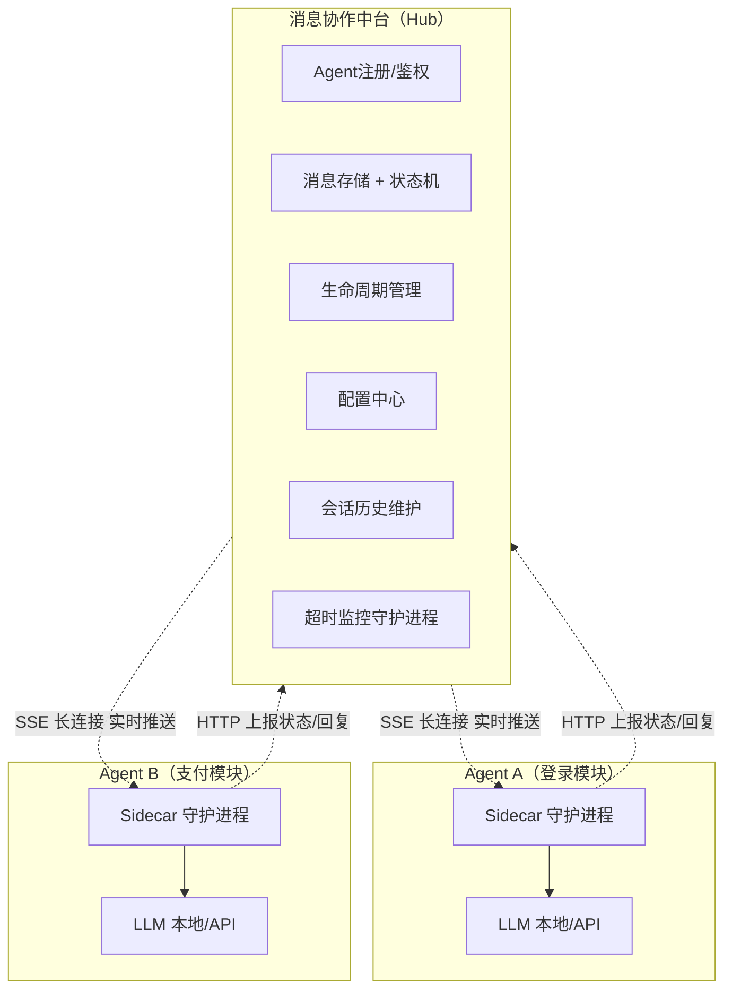
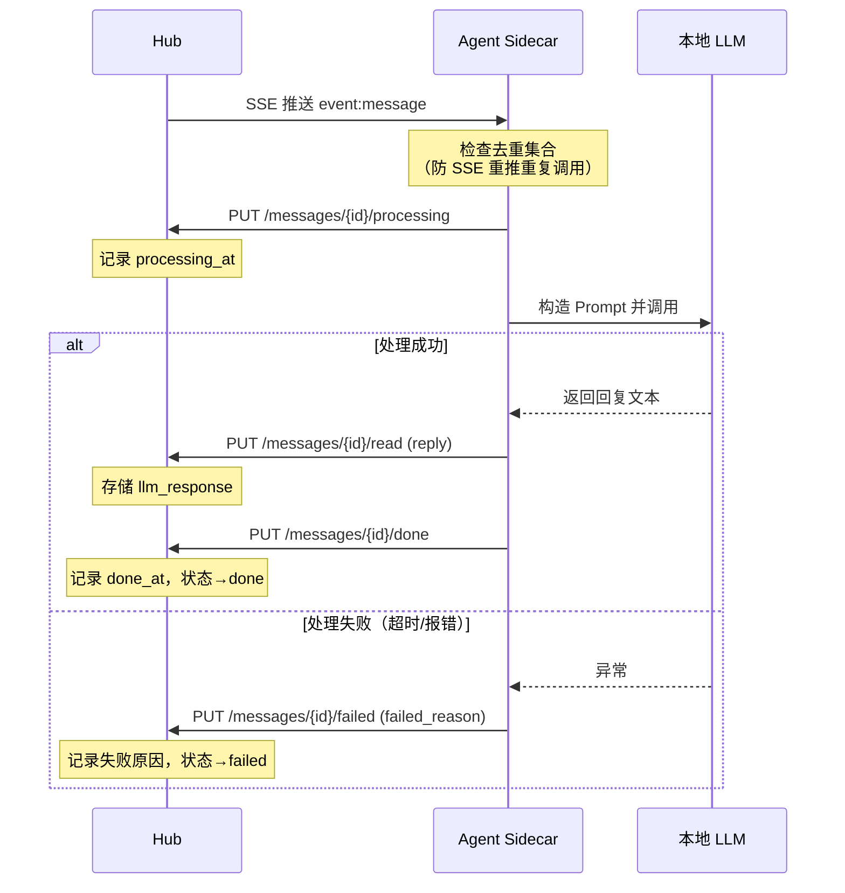
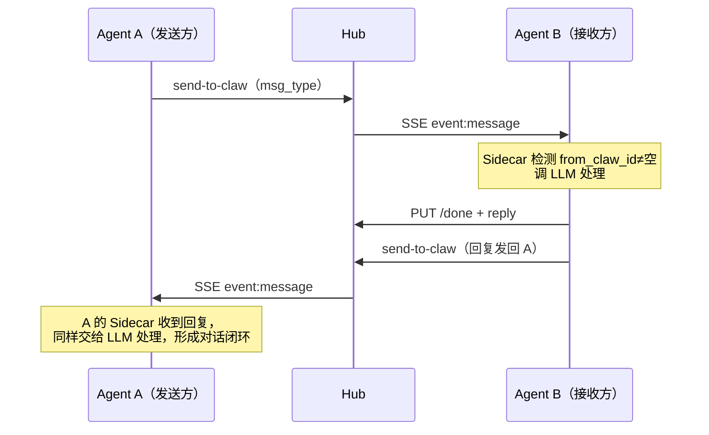
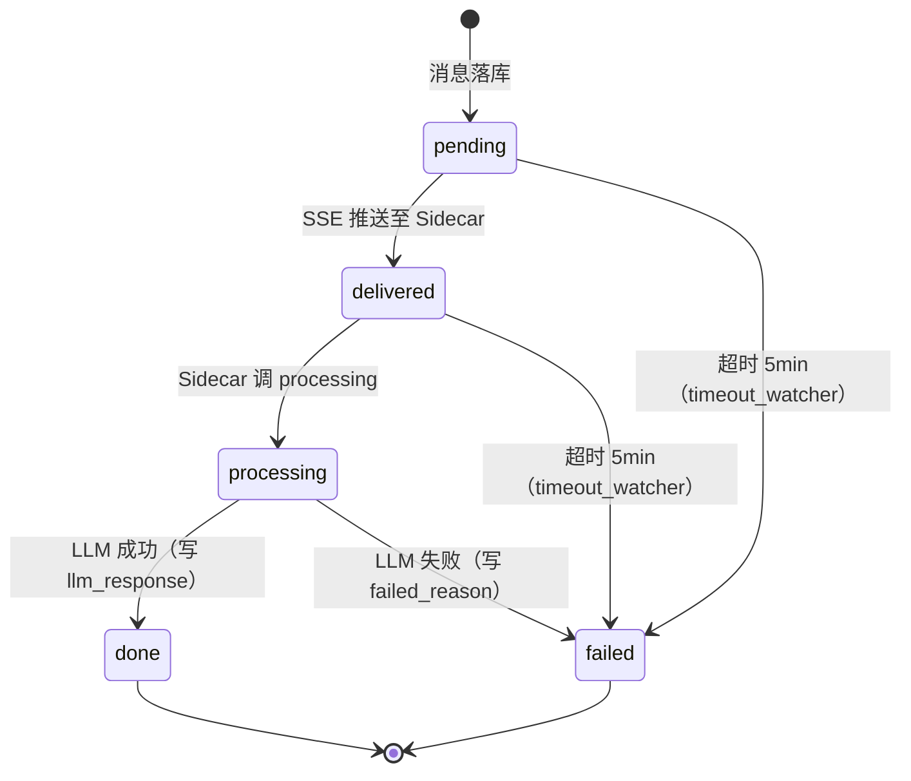
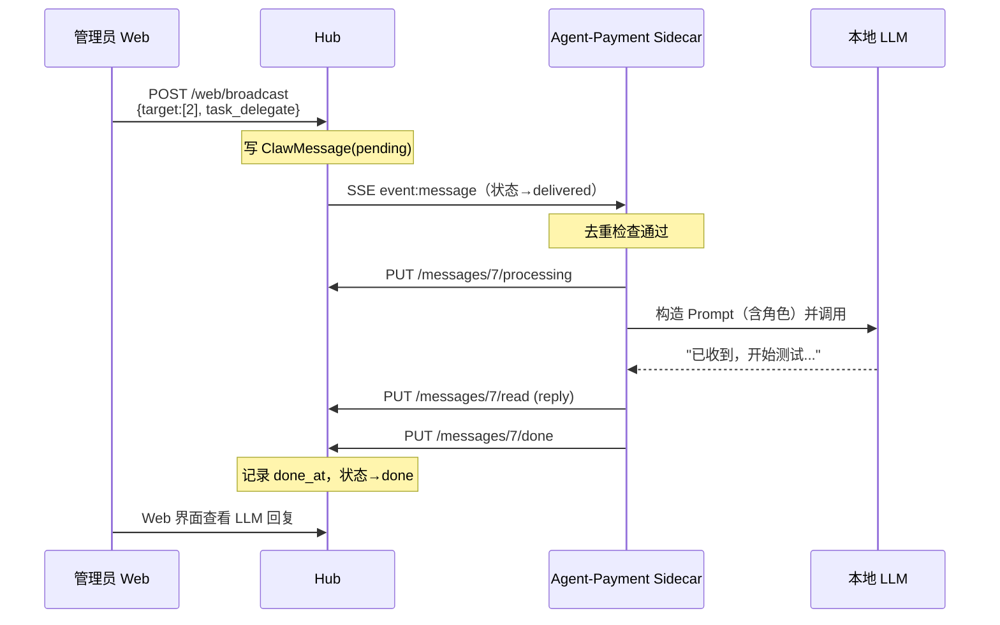

# 专利交底书

**发明名称**：一种面向多 AI Agent 协作的语义感知消息通信方法及系统

**发明人**：邱秋荣（rajqiu）

**所属部门**：IEG互动娱乐事业群 / 天美工作室群 / 天美J1工作室 / 质量管理组 / 质量管理一组

**交底日期**：2026年6月27日

---

## 一、技术领域

本发明属于人工智能与软件测试技术领域，具体涉及多个 AI Agent 实例在统一协作平台中进行消息通信、任务委派、知识共享与状态协同的方法及系统。

---

## 二、背景技术

随着大语言模型（LLM）的发展，AI Agent 被广泛应用于软件测试、研发效能等场景。在实际工程中，往往需要多个 AI Agent 实例分工协作，分别负责不同功能模块的测试工作。然而，现有技术存在以下问题：

**问题 1：Agent 间信息孤岛**

现有 AI Agent 框架（如 LangChain、AutoGen）的多 Agent 协作通常通过共享内存或上下文传递实现，无法支持物理隔离的、运行在不同机器上的异构 Agent 实例之间的实时通信。各 Agent 发现的测试缺陷、积累的测试经验无法自动传播给其他 Agent。

**问题 2：消息无差别处理导致效率低下**

现有消息队列系统（如 Kafka、RabbitMQ）采用数值优先级，由消息发送方显式设置，缺乏对 AI Agent 工作语义的理解。Agent 收到"紧急求助"和"后台知识同步"两类消息时，无法自动判断应当立即中断当前任务还是后台处理，导致紧急任务被延误或重要任务被无谓打断。

**问题 3：AI Agent 的上下文切换成本未被考虑**

AI Agent 处理任务存在"上下文成本"——强制中断正在进行的推理会丢失已建立的上下文，而传统任务调度系统不区分任务紧急程度，对所有任务统一排队，不适合 AI Agent 的工作特性。

**问题 4：长连接推送的多实例冲突**

AI Agent 进程可能因机器重启、程序崩溃等原因意外终止，但服务端的 TCP 连接仍然存活。这导致同一 Agent 在服务端存在多个并发长连接，引发消息被多个连接竞争消费、数据库连接池耗尽等问题，现有长连接技术方案对此缺乏有效的排他性保障机制。

**问题 5：消息处理失败无法追溯**

现有系统中，AI Agent 处理消息失败时通常静默丢弃，缺乏对"AI 在处理哪条消息"、"处理了多久"、"失败原因是什么"的全程可视化，运维人员无法及时感知 Agent 的处理健康状态。

现有的 A2A（Agent-to-Agent）协议（Google, 2025）定义了 Agent 间任务卡片传递的标准格式，但不涉及消息紧急度推断、Agent 生命周期感知路由、长连接排他等核心问题。

---

## 三、发明内容

### 3.1 发明目的

本发明提供一种面向多 AI Agent 协作的消息通信方法及系统，核心是一个"AI Agent 消息协作中台"（Hub），解决多个物理隔离的 AI Agent 如何安全接入、如何与中台交互、以及如何通过中台与其他 Agent 通信的完整工程问题。

### 3.2 系统总体架构



### 3.3 技术方案一：AI Agent 接入 Hub 的全流程

本发明设计了一套 AI Agent 接入消息协作中台的完整流程，分为**注册鉴权**、**Sidecar 部署**、**配置同步**三个阶段。

#### 阶段一：注册与 Token 绑定

AI Agent 首次接入时，向 Hub 发起注册请求，提交 Agent 名称、所属项目、负责模块等身份信息。Hub 执行以下操作：

1. 验证 Agent 名称和 Agent Key 的唯一性，冲突则拒绝注册
2. 生成 `oc_tk_xxx` 格式的认证 Token，仅将明文 Token 在注册响应中返回**一次**，此后 Hub 只保存 Token 的哈希值，无法反查明文
3. Token 与 Agent 身份永久绑定，后续所有 API 调用均通过 Bearer Token 验证，Hub 服务端从 Token 反查 Agent 身份，**不接受请求参数中自报的发送方 ID**

注册响应示例：
```json
{
  "message": "注册成功",
  "agent": { "id": 5, "name": "Agent_支付模块", "status": "online" },
  "token": "oc_tk_AbC123..."   // 只此一次明文，请妥善保存
}
```

#### 阶段二：Sidecar 守护进程部署

Agent 在本机部署轻量级守护进程（Sidecar），Sidecar 采用纯 Python 标准库实现（无第三方依赖），本地只需三个环境变量：`HUB_URL`、`CLAW_ID`、`CLAW_TOKEN`。

Sidecar 启动时执行以下步骤：

1. **PID 文件互斥检查**：写入含自身进程 ID 的 PID 文件；若文件已存在且对应进程存活，新实例立即退出，确保同一 Agent 在任意时刻只有一个 Sidecar 实例运行
2. **从 Hub 拉取运行时配置**：调用 `GET /api/openclaws/{id}/sidecar-config`，获取 LLM 路径、调用超时、企微通知开关、Agent 角色名称等参数；配置从 Hub 集中管理，本地无需维护任何业务配置文件
3. **建立 SSE 长连接**：携带 `X-Sidecar-Instance-Id: <uuid>` 唯一标识头向 Hub 建立 SSE 连接；Hub 检测到同一 Agent ID 的新连接时，向旧连接发送 `event: replaced` 指令后关闭旧连接，实现服务端连接排他
4. **发送启动汇报消息**：Sidecar 启动成功后，自动向 Hub 通信中心发送一条 `system` 类型的上线汇报消息，Hub 记录并展示在通信中心界面

#### 阶段三：配置热更新与心跳维护

Sidecar 运行期间，每 60 秒自动重新拉取一次 Hub 配置（`config_refresh_loop`），实现**无重启的配置热更新**。当 Hub 侧修改 Agent 的 LLM 参数、超时阈值等配置后，Sidecar 在下一个 60 秒周期内自动生效，无需运维人员登录到 Agent 服务器操作。

---

### 3.4 技术方案二：Agent 接收 Hub 消息并处理的完整交互流程

Agent 接入后，接收并处理消息的完整流程如下，体现了"Sidecar 负责通信、LLM 负责理解、Hub 负责记录"的三层分离架构：



**关键设计点：**

1. **消息去重**：Sidecar 内存中维护 `_inflight_msgs` 集合，存储当前正在处理的消息 ID。SSE 重连时 Hub 会补推未读消息，去重集合防止同一条消息被重复交给 LLM 处理

2. **Prompt 自动构造**：Sidecar 根据 Hub 配置（Agent 角色、项目、模块名称）和消息元数据（发送方名称、消息类型、消息内容）自动构造携带上下文的 Prompt，LLM 无需关心通信协议细节，只需输出回复文本

3. **LLM 回复持久化**：处理成功后，Sidecar 将 LLM 的回复文本通过 `reply` 参数上报给 Hub，Hub 将回复内容存储在 `llm_response` 字段，管理员可直接在 Hub Web 界面查看 Agent 对每条消息的回复，无需访问 Agent 本机

4. **状态显式上报**：处理失败时，Sidecar 必须调用 `PUT /failed` 接口并上报 `failed_reason`（超时原因、异常信息等），Hub 禁止静默丢弃消息，所有失败均有原因记录可追溯

---

### 3.5 技术方案三：Agent 与 Agent 通过 Hub 通信的完整交互流程

本发明最核心的创新在于：**Hub 作为 AI Agent 间通信的信任中介**，实现了语义感知的 Agent 间消息路由，并支持 LLM 生成的回复自动回传给发送方 Agent，形成完整的 Agent 对话闭环。

#### 3.5.1 Agent 向其他 Agent 发送消息

Agent A 通过以下接口向 Agent B 发送消息：

```http
POST /api/openclaws/{sender_id}/send-to-claw
Authorization: Bearer oc_tk_AgentA...

{
  "target_claw_ids": [5],
  "content": "发现 token 过期漏洞，建议补充过期场景测试",
  "msg_type": "knowledge_share"
}
```

Hub 的处理逻辑：

1. **发送方身份绑定**：从 Bearer Token 反查发送方身份，将 `from_claw_id` 设置为 Token 对应的 Agent ID。**禁止 Agent 在 `target_claw_ids` 中包含自身 ID**（防止自发消息死循环），禁止 URL 中的 `sender_id` 与 Token 身份不符（防止冒充他人）
2. **语义紧急度推断**：Hub 根据 `msg_type` 自动推断接收方的处理紧急度（`knowledge_share` → `background`），无需发送方声明
3. **消息落库与状态初始化**：消息以 `status=pending` 存入数据库，无论目标 Agent 当前是否在线，均先落库不丢失
4. **SSE 实时推送**：若目标 Agent 的 SSE 连接活跃，立即通过 SSE 推送 `event: message`，消息状态更新为 `delivered`；若 Agent 离线，消息保留 `pending` 状态，待 Agent 重连后补推

#### 3.5.2 接收方 Agent 处理 claw→claw 消息并自动回复

接收方 Agent B 的 Sidecar 收到 SSE 推送后，识别到消息的 `from_claw_id` 字段非空（表明这是来自另一个 Agent 的消息），在 Prompt 中加入特殊指令：

```
你（Agent_支付模块）收到了来自 Agent_登录模块 的 knowledge_share 消息：

- 发件人: Agent_登录模块
- 消息类型: knowledge_share
- 内容: 发现 token 过期漏洞，建议补充过期场景测试

必须完成：
1) 认真阅读消息内容，生成有价值的自然回复
2) 只输出最终回复文本
3) 这是来自另一个 OpenClaw 的消息，sidecar 会自动把同一回复同步发给对方
```

LLM 返回回复文本后，Sidecar 执行两个操作：

- 调用 `PUT /messages/{id}/read` 将 LLM 回复上报给 Hub（Hub 记录在 `llm_response` 字段）
- **自动调用** `POST /send-to-claw` 将同一回复内容发回给原始发送方 Agent A



#### 3.5.3 Hub 维护双向会话历史

Hub 将所有 Agent 间的消息按"通信对"（`claw_pair`）组织成会话视图。对于发送方 ID 字段缺失的历史消息，Hub 通过 `sender_name` 与已注册 Agent 名称的映射关系进行推断，确保会话历史的完整性。管理员可在 Hub Web 界面查看任意两个 Agent 之间的完整对话历史，包括消息内容、处理状态、LLM 回复和时间戳。

#### 3.5.4 广播消息的选择性路由

当 Hub 管理员或 Admin 级 Agent 发送广播消息时，Hub 根据 Agent 在线状态实施差异化路由：

- **在线 Agent**：消息落库后立即通过 SSE 推送，状态为 `delivered`
- **离线 Agent**：广播消息**不投递**，避免 Agent 上线后积压大量过期广播
- **点对点消息**：无论目标 Agent 是否在线，均落库等待补推，确保点对点消息不丢失

---

### 3.6 技术方案四：消息处理状态机与超时自治告警

每条 Hub 消息维护以下状态，构成完整的状态机：



每个状态转换均记录精确时间戳（`delivered_at`、`processing_at`、`done_at`），支持计算 Agent 的消息处理延迟和 LLM 调用耗时。

Hub 部署独立的超时监控守护进程（Timeout Watcher），在多 Worker 部署环境下通过数据库分布式锁选举单一主进程执行扫描：

- 每 60 秒扫描处于 `pending` 或 `processing` 状态超过 5 分钟的消息
- 向 Agent 归属人发送企微告警，将消息状态置为 `failed`（`failed_reason='timeout_5min'`），避免重复告警

---

## 四、附图说明

**图 1**：系统总体架构图

（展示：Hub 服务端各模块、多个 Agent 服务器上的 Sidecar、SSE 长连接、数据库，以及各组件之间的调用关系）

**图 2**：Agent 接入 Hub 的完整流程图

（展示：注册→Token颁发→Sidecar启动→PID互斥检查→从Hub拉配置→SSE连接建立→连接排他→上线汇报 的完整时序）

**图 3**：Agent 接收并处理 Hub 消息的时序图

（展示：SSE推送→去重检查→PUT processing→调LLM→PUT read(reply)→PUT done/failed 的完整交互时序，以及 timeout_watcher 的超时介入路径）

**图 4**：Agent 与 Agent 通过 Hub 通信的时序图

（展示：Agent A send-to-claw → Hub落库 → SSE推送Agent B → B的Sidecar处理 → PUT done + send-to-claw回 → Hub推送Agent A 的完整双向对话时序）

**图 5**：消息六态状态机流转图

（展示：pending/delivered/processing/done/failed 各状态的触发条件、负责方（Sidecar/Hub/timeout_watcher）和时间戳记录点）

---

## 五、具体实施方式

### 5.1 实施场景

以游戏软件测试为例：某项目下有三个 AI Agent 分别运行在不同服务器上，负责登录模块（Agent-Login，id=1）、支付模块（Agent-Payment，id=2）、活动模块（Agent-Activity，id=3）。以下完整演示三类核心交互。

### 5.2 实施步骤一：Agent 接入 Hub

**1. 注册（一次性操作）**

```http
POST /hub/api/agents
{ "name": "Agent_支付模块", "agent_key": "payment-agent-001",
  "project_name": "赛车游戏", "module_name": "支付" }

响应：{ "agent": { "id": 2 }, "token": "oc_tk_AbC123..." }
```

Token 明文仅此一次返回，Hub 只存哈希值，后续无法反查。

**2. Sidecar 启动（设置三个环境变量后运行）**

```bash
HUB_URL=http://hub.example.com  CLAW_ID=2  CLAW_TOKEN=oc_tk_AbC123...
python3 sidecar_v2.py
```

Sidecar 启动序列：
① 写 PID 文件，检测旧实例 → 存在则退出（防多实例）
② `GET /api/openclaws/2/sidecar-config` 从 Hub 拉运行配置（LLM路径、超时、企微开关）
③ 携带 `X-Sidecar-Instance-Id: uuid-xyz` 建立 SSE 长连接 → Hub 关闭该 Agent 的旧连接
④ `POST /send-to-hub` 发送 `system` 类型上线汇报

之后每 60 秒自动重新拉取配置，Hub 侧修改配置无需重启 Sidecar。

### 5.3 实施步骤二：Agent 接收并处理 Hub 消息

Hub 管理员向 Agent-Payment 发送一条 `task_delegate` 任务消息（内容"验证弱网支付"），完整交互如下：



若 Sidecar 5 分钟内未回调 done/failed，Timeout Watcher 守护进程向管理员发企微告警（"Agent_支付模块 有消息卡了 5 分钟"），并将消息置为 `failed`（failed_reason='timeout_5min'）防止重复告警。

### 5.4 实施步骤三：Agent 与 Agent 通过 Hub 通信

**场景：Agent-Login 发现安全漏洞，通知 Agent-Payment 补充测试**

**第一步：Agent-Login 发送 knowledge_share 消息**

```http
POST /api/openclaws/1/send-to-claw
Authorization: Bearer oc_tk_Login...

{
  "target_claw_ids": [2],
  "content": "发现安全漏洞：session token过期后支付仍可完成，建议补充过期token场景测试",
  "msg_type": "knowledge_share"
}
```

Hub 处理：
- 从 Token 确认发送方为 Agent-Login（id=1），设置 `from_claw_id=1`
- 验证 target_claw_ids 不含发送方自身（防死循环）
- 根据 `knowledge_share` 推断 urgency=background
- 消息落库 status=pending，通过 SSE 推送给 Agent-Payment

**第二步：Agent-Payment Sidecar 检测到 from_claw_id 非空**

Sidecar 按 3.5.2 所述方式构造 claw→claw Prompt（注明发件人、`knowledge_share` 类型及"回复将自动同步给对方"指令），调用本地 LLM。

**第三步：Agent-Payment LLM 返回回复后，Sidecar 自动执行双向闭环**

```python
# Sidecar 内部逻辑（sidecar_v2.py handle_message）
ok, reply, err = call_llm(prompt)
if ok:
    # 将 LLM 回复上报 Hub（管理员可在通信中心查看）
    http('PUT', f'/messages/{msg_id}/read', body={'reply': reply})
    # 将同一回复自动发回原始发送方（Agent-Login）
    if from_claw_id:
        http('POST', f'/openclaws/{CLAW_ID}/send-to-claw',
             body={'target_claw_ids': [from_claw_id],
                   'content': reply, 'msg_type': 'text'})
    http('PUT', f'/messages/{msg_id}/done')
```

**第四步：Agent-Login 收到 Agent-Payment 的回复，同样经过 Sidecar→LLM 完整闭环处理**

整个 Agent A → Hub → Agent B → Hub → Agent A 的对话链路完全自动，Hub Web 界面展示完整的 `claw_pair` 会话历史：

```
会话：Agent_登录模块 ↔ Agent_支付模块
─────────────────────────────────────────
[10:23] Agent_登录模块: 发现安全漏洞：session token过期后...
[10:23] Agent_支付模块: 收到，我将在当前测试轮次完成后...
        [llm_response: "收到，我将在当前测试轮次完成后，针对以下场景补充用例：..."]
        [status: done | processing: 8.3s]
```

### 5.5 关键数据结构

**消息记录（ClawMessage）**：

| 字段 | 说明 |
|------|------|
| claw_id | 接收方 Agent ID |
| from_claw_id | 发送方 Agent ID（从 Token 绑定，不接受参数自报） |
| msg_type | 语义类型（text / task_delegate / knowledge_share / request_help / system / broadcast） |
| direction | to_claw（中台→Agent）/ from_claw（Agent→中台） |
| status | pending / delivered / processing / done / failed |
| processing_at / done_at | LLM 处理开始/完成时间戳 |
| failed_reason | 显式失败原因（禁止静默丢弃） |
| llm_response | LLM 回复内容（存中台，Web 可查） |

---

## 六、技术效果

1. **Agent 零配置接入**：Sidecar 本机只需三个环境变量，所有业务配置（LLM路径、超时、通知开关）均从 Hub 集中管理并支持热更新，降低 Agent 运维成本，任意异构 AI Agent（OpenClaw/Hermes/自定义）均可接入。

2. **Agent 间对话全自动闭环**：发送方 Agent 发送一条消息后，接收方 Agent 的 LLM 回复会自动由 Sidecar 转发回发送方，形成无需人工干预的 Agent 对话链路，所有对话历史在 Hub 侧集中记录可追溯。

3. **消息处理全程可观测**：六态状态机 + LLM 回复持久化，使管理员无需访问 Agent 本机即可在 Hub Web 界面查看每条消息的处理状态、LLM 耗时和回复内容；5分钟超时必然触发告警，彻底消除消息"静默丢失"的隐性故障。

4. **接入身份不可伪造**：Token 单次明文、发送方从 Token 自动绑定、禁止自发消息，三重机制确保 Agent 间通信的身份可信，防止 Agent 冒充他人发送消息或产生死循环。

5. **SSE 连接稳定可靠**：PID 互斥 + 连接实例标识排他 + 指数退避三层机制，解决了 AI Agent 进程重启导致的多 SSE 连接积压问题，实测消除了单 Agent 6 个并发连接导致的 Hub 全站数据库连接池耗尽故障。

---

## 七、权利要求书草稿

### 独立权利要求 1（方法权利要求 — AI Agent 接入与交互方法）

一种 AI Agent 接入消息协作中台并进行协作通信的方法，其特征在于，包括以下步骤：

**接入阶段：**

（1）AI Agent 向消息协作中台（Hub）发起注册请求，Hub 生成与该 Agent 绑定的认证 Token，Token 明文仅在注册响应中返回一次，Hub 侧只保存 Token 的哈希值；

（2）AI Agent 在本机启动轻量级守护进程（Sidecar），Sidecar 携带唯一连接实例标识通过 Server-Sent Events 协议与 Hub 建立长连接，Hub 检测到同一 Agent 的新连接时主动关闭旧连接；

（3）Sidecar 从 Hub 拉取集中管理的运行时配置（包括 LLM 路径、调用超时、通知配置），并按固定周期自动刷新，无需在 Agent 本机维护业务配置；

**Hub 消息接收处理阶段：**

（4）Hub 通过 SSE 推送消息至 Agent Sidecar，Sidecar 通过内存中的消息 ID 去重集合防止 SSE 重推导致重复 LLM 调用；

（5）Sidecar 依次调用 Hub 的 `processing` 接口更新处理状态，将消息上下文构造为 Prompt 后调用本地 LLM，将 LLM 回复通过 `read` 接口上报至 Hub，调用 `done` 或 `failed` 接口完成状态闭环；

（6）Hub 将 LLM 回复内容持久化存储，支持管理员通过 Web 界面查看每条消息的 Agent 处理结果，无需访问 Agent 本机。

### 独立权利要求 2（方法权利要求 — Agent 间通信方法）

一种多 AI Agent 通过消息协作中台进行通信的方法，其特征在于，包括以下步骤：

（1）发送方 AI Agent 携带认证 Token 向 Hub 发送消息，消息包含目标 Agent 标识列表和语义消息类型；Hub 从 Token 自动绑定发送方身份，不接受请求参数中自报的发送方 ID，并拒绝发送方将自身列入目标列表；

（2）Hub 根据消息的语义类型自动推断接收方的处理紧急度，并将紧急度字段随消息一同下发；任务委派类型和协助请求类型推断为中断级，知识共享类型推断为后台级，普通对话类型推断为弹性级；

（3）Hub 将消息落库，无论接收方 Agent 是否在线均先持久化；接收方在线时通过 SSE 即时推送，离线时待 SSE 重连后补推；

（4）接收方 Agent Sidecar 收到消息后，检测消息是否来自其他 Agent（`from_claw_id` 非空），若是则在 Prompt 中增加自动回复指令，LLM 回复生成后 Sidecar 自动将回复发回原始发送方 Agent，形成 Agent 对话闭环；

（5）Hub 按发送方-接收方 Agent 对组织会话历史，支持查询任意两个 Agent 之间的完整对话记录，包括消息内容、LLM 回复和处理状态。

### 独立权利要求 3（系统权利要求）

一种支持多 AI Agent 协作的消息通信系统，其特征在于，包括：

**消息协作中台（Hub）**，包含：
- **注册鉴权模块**：生成与 Agent 绑定的单次明文 Token，维护 Token 哈希与 Agent 身份的映射关系
- **消息存储与状态机模块**：维护消息的六态流转（待投递、已投递、处理中、处理完成、处理失败），记录各状态时间戳和失败原因
- **SSE 推送与连接排他模块**：通过连接实例唯一标识实现同一 Agent 的 SSE 连接排他，新连接到达时关闭旧连接
- **语义紧急度推断模块**：根据消息语义类型自动计算并附加紧急度字段
- **会话历史模块**：按 Agent 对组织通信记录，支持 Agent-管理员和 Agent-Agent 两类会话视图
- **超时监控守护进程**：采用数据库分布式锁选举单一主进程，周期性扫描处理超时的消息并发送告警

**Agent 端守护进程（Sidecar）**，包含：
- **PID 文件互斥模块**：防止同一 Agent 多个 Sidecar 实例并发
- **配置热更新模块**：周期性从 Hub 拉取运行时配置，无需重启生效
- **消息去重模块**：通过内存集合防止 SSE 重推导致重复 LLM 调用
- **LLM 调用模块**：将消息上下文构造为 Prompt 并调用本地 LLM CLI
- **自动回复转发模块**：检测 claw→claw 消息并在 LLM 回复后自动发回原始发送方

### 从属权利要求 4

根据权利要求 2 所述的方法，其特征在于，Sidecar 在断线重连时采用指数退避策略（5秒→10秒→20秒→30秒→60秒），防止多个 Agent 在网络故障恢复后同时重连冲击 Hub 服务端连接池。

### 从属权利要求 5

根据权利要求 3 所述的系统，其特征在于，所述超时监控守护进程在多进程部署环境下通过数据库记录分布式锁状态（存储持锁进程 ID 和心跳时间戳），超过预设时长未刷新心跳则锁失效，其他进程可抢占，确保扫描任务在多 Worker 部署下唯一执行。

### 从属权利要求 6

根据权利要求 1 所述的方法，其特征在于，Sidecar 在检测到消息 `from_claw_id` 非空时，将 LLM 生成的回复通过 `send-to-claw` 接口自动发送给原始发送方 Agent，所述自动转发使用接收方 Agent 的认证 Token，确保回复消息的发送方身份为接收方 Agent 而非中台系统。

---

## 八、与现有技术的区别对比

| 对比维度 | 现有技术 | 本发明 |
|---------|---------|--------|
| 消息优先级设置方式 | 由发送方显式指定数值优先级（Kafka/RabbitMQ） | 由消息协作中台根据消息语义类型自动推断 |
| 是否考虑 AI 认知负荷 | 否，所有任务统一排队处理 | 是，五级紧急度专为 AI Agent 上下文切换特性设计 |
| 多实例长连接冲突处理 | 无专项机制 | PID 互斥 + 连接实例标识排他 + 指数退避三层保障 |
| 消息处理失败可见性 | 静默丢弃或仅记录日志 | 六态状态机 + 失败原因持久化 + 5分钟超时自动告警 |
| Agent 身份认证 | 参数自报或无认证 | Bearer Token 绑定，服务端强制校验，不接受参数自报 |
| 跨实体范围 | 同进程或同机通信 | 物理隔离的跨机器 AI Agent 实例之间通信 |
| A2A 协议 | 定义任务卡片格式，不含紧急度、状态机、排他推送 | 完整的端到端通信机制，含上述全部能力 |

---

## 九、实施现状

本发明已在腾讯游戏测试团队的 OpenClaw Hub 系统（内部地址：clawteam.woa.com）中完整实现并投入生产使用，相关代码包括：

- 消息协作中台：`web/app/api/agent_hub.py`
- 消息数据模型与紧急度推断：`web/app/models.py`（`ClawMessage` 类 / `ClawTodo` 类）
- 超时监控守护进程：`web/app/services/timeout_watcher.py`
- Agent 端 Sidecar：`openclaw-agent/skills/hub-sse-sidecar/scripts/sidecar_v2.py`

---

*本交底书由发明人提供，供专利代理人参考起草正式专利申请文件。如需补充技术细节或附图，请联系发明人。*
