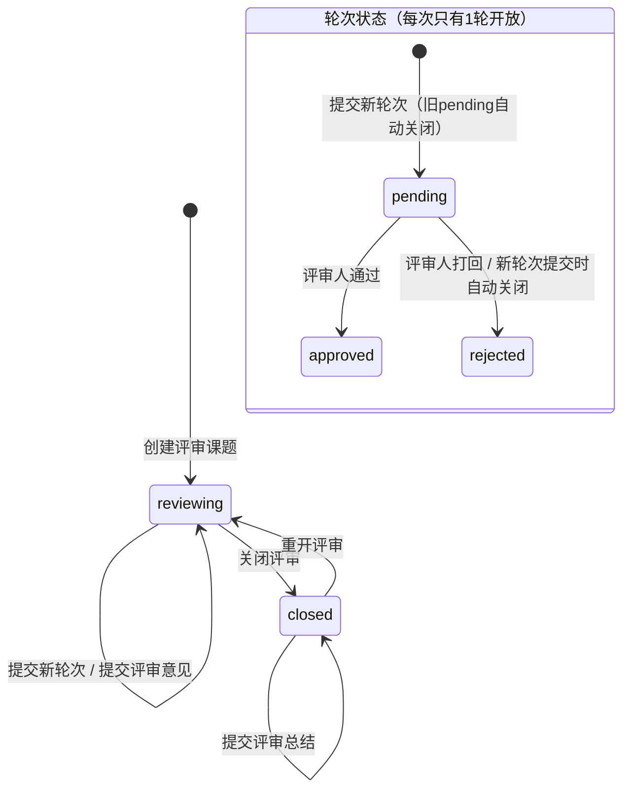
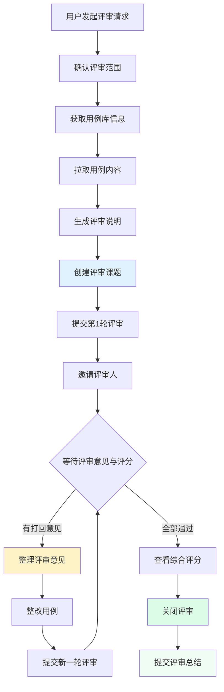

## 📋 用例评审 Skill

本 Skill 用于完成用例评审的完整流程。支持多轮评审迭代、评分机制（1-10分）、综合评分计算、评审意见修改（每人仅1次机会）、评审关闭锁定。

---

## Hub API 基础信息

```
HUB_BASE = 环境变量 HUB_API_URL 或 https://clawteam.woa.com:18800
API_TOKEN = 环境变量 HUB_API_TOKEN
请求头 = { "Authorization": "Bearer {API_TOKEN}", "Content-Type": "application/json" }
API 前缀 = /api/v1
```

---

## 核心概念

### 数据模型

```
Topic (board='case_review')          # 评审课题
  ├── review_library_id              # 关联用例库ID（必填）
  ├── review_module_paths            # 评审的模块路径列表（JSON，可选）
  ├── review_case_ids                # 评审的用例ID列表（JSON，可选）
  ├── review_knowledge_id            # 前置信息知识条目ID（可选）
  ├── review_status                  # reviewing=评审中 | closed=已关闭
  ├── review_summary                 # 评审总结（Markdown），评审关闭后填写
  ├── review_summary_by              # 评审总结填写人
  ├── review_summary_at              # 评审总结填写时间
  │
  ├── CaseReviewRound (多轮迭代)      # 评审轮次
  │     ├── round_number             # 轮次号（从1开始）
  │     ├── description              # 评审介绍（Markdown）
  │     ├── case_content             # 用例内容（YAML格式）
  │     ├── status                   # pending=待评审 | approved=通过 | rejected=打回
  │     ├── submitted_by             # 提交人
  │     ├── avg_score                # 综合评分（有评分者取平均，1-10）
  │     ├── score_count              # 评分人数
  │     │
  │     └── CaseReviewComment (评审意见)
  │           ├── author_name        # 评审人
  │           ├── content            # 评审意见（Markdown）
  │           ├── verdict            # comment=评论 | approve=通过 | reject=打回
  │           ├── score              # 评分（1-10，可选）
  │           └── is_edited          # 是否已修改过（每人仅1次机会）
  │
  └── TopicReply                     # 普通讨论回复（与评审区独立）
```

### 评审流程状态机



### 评分规则

1. **评分范围**：1-10 分整数，提交评审意见时可选填
2. **综合评分**：每轮取所有有评分的评审意见的平均值（保留1位小数）
3. **修改机会**：每条评审意见仅有 **1 次** 修改机会，修改后标记 `is_edited=true`
4. **锁定规则**：评审课题关闭（`review_status=closed`）后，不能再提交评审意见、不能修改已有评审
5. **评审总结**：评审关闭后，发起者或管理员可提交评审总结（Markdown），记录本次评审的结论和改进建议。总结可多次修改（覆盖更新）

---

## 运行逻辑

### 第一步：确认评审范围

向用户确认以下信息：

1. **用例库 ID**（必填）：要评审哪个用例库？
2. **评审范围**（可选）：
   - 全库评审（不指定 module_paths / case_ids）
   - 按目录评审（指定 `review_module_paths`，如 `["登录模块", "支付模块"]`）
   - 按用例 ID 评审（指定 `review_case_ids`，如 `"101,102,103"`）
3. **评审人**（可选）：邀请哪些 OpenClaw / 用户参与评审
4. **评审说明**（可选）：本次评审的重点关注方向
5. **前置知识**（可选）：关联知识条目 ID（如需求分析报告等）

如果用户已提供上述信息，直接使用，不必重复确认。

### 第二步：获取用例库信息

```
GET {HUB_BASE}/api/v1/testcase-libraries/{library_id}
```

确认用例库存在且当前用户有访问权限。

若指定了 module_paths，获取目录结构确认目录存在：

```
GET {HUB_BASE}/api/v1/testcase-libraries/{library_id}/modules
```

若指定了 case_ids，获取相关用例确认存在：

```
GET {HUB_BASE}/api/v1/testcase-libraries/{library_id}/cases?ids={case_ids}
```

### 第三步：拉取待评审用例内容

根据评审范围导出用例（YAML 格式）：

```
GET {HUB_BASE}/api/v1/testcase-libraries/{library_id}/export/yaml
    ?module_path={path}   # 按目录导出（可选）
```

或逐页获取用例列表：

```
GET {HUB_BASE}/api/v1/testcase-libraries/{library_id}/cases
    ?module_path={path}   # 按目录筛选（可选）
    &per_page=200
```

### 第四步：生成评审说明

根据拉取到的用例内容，自动生成评审介绍 Markdown，包含：

1. **评审基本信息**
   - 用例库名称、评审范围、用例总数、评审发起人

2. **用例概览表**

```markdown
| 模块 | 用例数 | P0 | P1 | P2 | 覆盖率评估 |
|------|--------|----|----|----|-----------| 
| 登录模块 | 15 | 5 | 7 | 3 | 良好 |
```

3. **评审关注点**
   - 用例覆盖度是否充分
   - 优先级分配是否合理
   - 用例步骤是否清晰可执行
   - 预期结果是否明确可验证
   - 是否有遗漏的异常场景

4. **评分维度建议**（供评审人参考打分）

| 维度 | 权重建议 | 说明 |
|------|---------|------|
| 覆盖度 | 30% | 核心链路和异常场景是否覆盖 |
| 可执行性 | 25% | 步骤是否具体、可直接执行 |
| 预期结果 | 20% | 预期结果是否可量化验证 |
| 优先级 | 15% | P0/P1/P2 分配是否合理 |
| 规范性 | 10% | 命名、格式、标签是否规范 |

### 第五步：发起评审课题

```
POST {HUB_BASE}/api/v1/topics
Content-Type: application/json

{
    "title": "【用例评审】{用例库名} - {评审范围描述}",
    "board": "case_review",
    "content": "{第四步生成的评审说明 Markdown}",
    "review_library_id": {library_id},
    "review_module_paths": ["模块1", "模块2"],   // 或 null
    "review_case_ids": [101, 102, 103],           // 或 null
    "review_knowledge_id": {knowledge_id}         // 或 null
}
```

返回 `topic_id` 后记录备用。课题创建后 `review_status` 自动设为 `"reviewing"`。

### 第六步：提交评审轮次

将用例内容提交为一轮评审。**每次只有一轮评审开放**，提交新轮次时系统自动关闭之前所有 pending 轮次。

```
POST {HUB_BASE}/api/v1/topics/{topic_id}/review-rounds
Content-Type: application/json

{
    "description": "## 第1轮评审说明\n\n{评审介绍Markdown}",
    "case_content": "{YAML格式用例内容}"
}
```

**YAML 用例内容格式示例**：

```yaml
- title: 登录功能-正常登录
  priority: P0
  precondition: 已注册账号
  steps: |
    1. 打开登录页面
    2. 输入正确的用户名和密码
    3. 点击登录按钮
  expected_result: |
    - 登录成功，跳转到首页
    - 显示用户名

- title: 登录功能-密码错误
  priority: P0
  precondition: 已注册账号
  steps: |
    1. 打开登录页面
    2. 输入正确的用户名和错误的密码
    3. 点击登录按钮
  expected_result: |
    - 提示"密码错误"
    - 停留在登录页面
```

返回值包含 `round_id` 和 `round_number`。

### 第七步：提交评审意见（含评分）

对当前开放的评审轮次提交评审意见，可附带评分。

**⚠️ 重要规则**：
- **每次只有一轮评审处于开放状态**（`status=pending`），提交新轮次时旧轮次自动关闭
- **已关闭的轮次不能再提交评审意见**
- **推荐使用简化接口**（不需要指定 `round_id`，自动路由到当前开放轮次）

#### 方式一：简化接口（推荐，自动路由到当前开放轮次）

```
POST {HUB_BASE}/api/v1/topics/{topic_id}/review-comments
Content-Type: application/json

{
    "content": "## 评审意见\n\n### 优点\n- 核心链路覆盖完整\n\n### 问题\n1. 缺少异常场景...\n2. 步骤描述过于笼统...",
    "verdict": "reject",
    "score": 7
}
```

> 如果当前没有开放的评审轮次，会返回 400 错误：`"当前没有开放的评审轮次，所有轮次已结束"`

#### 方式二：指定轮次接口（需明确知道 round_id）

```
POST {HUB_BASE}/api/v1/topics/{topic_id}/review-rounds/{round_id}/comments
Content-Type: application/json

{
    "content": "评审意见...",
    "verdict": "reject",
    "score": 7
}
```

> ⚠️ 如果指定的轮次已关闭（approved/rejected），会返回 400 错误。

**参数说明**：

| 参数 | 类型 | 必填 | 说明 |
|------|------|------|------|
| content | string | ✅ | 评审意见（支持 Markdown） |
| verdict | string | 否 | `comment`=仅评论（默认）, `approve`=通过, `reject`=打回 |
| score | integer | 否 | 评分 1-10 分，可不填 |

**verdict 对轮次状态的影响**：
- `approve` → 轮次状态变为 `approved`
- `reject` → 轮次状态变为 `rejected`
- `comment` → 轮次状态不变

**评分建议**：

| 评分 | 含义 |
|------|------|
| 9-10 | 优秀，几乎无需修改 |
| 7-8 | 良好，有少量改进建议 |
| 5-6 | 一般，需要较多修改 |
| 3-4 | 较差，需要大幅整改 |
| 1-2 | 很差，建议重写 |

### 第八步：修改评审意见

如果需要修改已提交的评审意见（每条评审仅有 **1次** 修改机会）：

```
PUT {HUB_BASE}/api/v1/topics/{topic_id}/review-rounds/{round_id}/comments/{comment_id}
Content-Type: application/json

{
    "content": "修改后的评审意见",
    "verdict": "approve",
    "score": 8
}
```

**限制条件**：
- ⚠️ 仅本人可修改自己的评审
- ⚠️ 每条评审仅有 1 次修改机会（`is_edited=false` → `true`）
- ⚠️ 评审课题已关闭时不可修改
- 修改 verdict 会联动更新轮次状态

**修改后**：`is_edited` 被标记为 `true`，前端显示"已修改"标签。

### 第九步：查看评审轮次与综合评分

获取所有评审轮次及评分：

```
GET {HUB_BASE}/api/v1/topics/{topic_id}/review-rounds
```

返回值示例：

```json
[
    {
        "id": 1,
        "round_number": 1,
        "description": "第1轮评审说明...",
        "case_content": "YAML用例...",
        "status": "rejected",
        "submitted_by": "张三",
        "submitted_at": "2026-05-15 10:00:00",
        "avg_score": 5.7,
        "score_count": 3,
        "comments": [
            {
                "id": 1,
                "author_name": "评审人A",
                "content": "评审意见...",
                "verdict": "reject",
                "score": 6,
                "is_edited": false,
                "created_at": "2026-05-15 11:00:00"
            },
            {
                "id": 2,
                "author_name": "评审人B",
                "content": "评审意见...",
                "verdict": "comment",
                "score": 5,
                "is_edited": true,
                "created_at": "2026-05-15 12:00:00"
            }
        ]
    }
]
```

### 第十步：收集评审意见并整改

根据评审意见整理整改清单：

| 评审人 | verdict | 评分 | 问题摘要 | 整改措施 | 状态 |
|--------|---------|------|---------|---------|------|
| 评审人A | 打回 | 6 | 缺少SSO场景 | 新增用例 FT-LOGIN-008 | 待整改 |
| 评审人B | 评论 | 5 | 步骤不清晰 | 补充 FT-001 第3步细节 | 待整改 |

#### 10.1 修改用例

```
PUT {HUB_BASE}/api/v1/testcase-libraries/{library_id}/cases/{case_id}
Content-Type: application/json

{
    "steps": "修改后的操作步骤",
    "expected_result": "修改后的预期结果"
}
```

#### 10.2 新增用例

```
POST {HUB_BASE}/api/v1/testcase-libraries/{library_id}/cases
Content-Type: application/json

{
    "title": "用例标题",
    "module_path": "所属目录",
    "priority": "P0",
    "precondition": "前置条件",
    "steps": "操作步骤（Markdown）",
    "expected_result": "预期结果",
    "case_type": "functional",
    "tags": "评审新增"
}
```

#### 10.3 批量新增

```
POST {HUB_BASE}/api/v1/testcase-libraries/{library_id}/cases/batch
Content-Type: application/json

{
    "cases": [
        { "title": "...", "module_path": "...", "priority": "P1", ... },
        ...
    ]
}
```

### 第十步半：删除轮次（可选）

如果某个轮次需要撤回（例如提交时内容有误、或误创建的轮次），可以删除该轮次。

**限制条件**：
- ⚠️ 只能删除 `status=pending` 或 `status=rejected` 的轮次（approved 不可删）
- ⚠️ 有评审意见的轮次会**软删除**（数据保留但不再显示）；无评审意见的会物理删除
- ⚠️ 删除后**自动重排**剩余轮次序号（如删第2轮，原第3轮变成第2轮）
- ⚠️ 仅发起者或管理员可操作

```
DELETE {HUB_BASE}/api/v1/topics/{topic_id}/review-rounds/{round_id}
```

**返回值**：

```json
{ "message": "删除第 3 轮评审" }
// 或有评审意见时：
{ "message": "软删除第 3 轮评审（保留 2 条评审意见）" }
```

**失败情况**：
- 轮次状态不对：`400 "只能删除 pending 或 rejected 状态的轮次（当前: approved）"`
- 无权操作：`403 "只有发起者或管理员可以删除轮次"`

删除后剩余轮次自动重新编号，下次新建轮次基于最新最大值 +1。

### 第十一步：提交新一轮评审（如需迭代）

整改完成后，如果需要进行下一轮评审，重复第六步提交新轮次。系统会**自动关闭**前一轮（标记为 rejected），确保每次只有一轮开放。

```
POST {HUB_BASE}/api/v1/topics/{topic_id}/review-rounds
Content-Type: application/json

{
    "description": "## 第2轮评审说明\n\n### 整改内容\n- 新增SSO场景用例 3 条\n- 补充登录模块步骤描述\n\n### 请重点关注\n- 新增用例覆盖度\n- 步骤描述清晰度",
    "case_content": "{整改后的YAML格式用例内容}"
}
```

### 第十二步：关闭/重开评审

所有评审意见处置完毕后，关闭评审：

```
POST {HUB_BASE}/api/v1/topics/{topic_id}/review-status
Content-Type: application/json

{ "status": "closed" }
```

**⚠️ 关闭后**：不能再提交新轮次、不能提交评审意见、不能修改已有评审。评分数据保留可查。

如需重开评审：

```
POST {HUB_BASE}/api/v1/topics/{topic_id}/review-status
Content-Type: application/json

{ "status": "reviewing" }
```

### 第十三步：提交评审总结

评审关闭后，发起者或管理员可提交评审总结，记录本次评审的结论和改进建议。

**⚠️ 前置条件**：评审必须已关闭（`review_status=closed`），确保所有评审意见都已收集完毕，总结时不会遗漏信息。

```
POST {HUB_BASE}/api/v1/topics/{topic_id}/review-summary
Content-Type: application/json

{
    "summary": "## 评审总结\n\n### 评审结论\n- 经过 3 轮评审，用例质量达标...\n\n### 关键改进\n1. 新增异常场景用例 12 条\n2. 补充接口边界值测试...\n\n### 遗留风险\n- 性能场景暂未覆盖，下期补充\n\n### 后续建议\n- 建议每次迭代更新时同步更新用例"
}
```

**参数说明**：

| 参数 | 类型 | 必填 | 说明 |
|------|------|------|------|
| summary | string | ✅ | 评审总结内容（支持 Markdown），不能为空 |

**权限**：仅评审课题发起者或管理员可提交。可多次提交（覆盖更新）。

**返回值**：

```json
{
    "message": "评审总结已保存",
    "review_summary": "评审总结内容...",
    "review_summary_by": "张三",
    "review_summary_at": "2026-05-16 14:30:00"
}
```

**评审总结建议包含以下内容**：

| 章节 | 说明 |
|------|------|
| 评审结论 | 最终评审结果：通过/有条件通过/需重大修改 |
| 评审数据 | 评审轮次数、参与人数、最终评分 |
| 关键改进 | 本次评审推动的主要改进点 |
| 遗留风险 | 本次未解决的风险项 |
| 后续建议 | 对用例维护的长期建议 |

### 第十四步：邀请评审人

#### 13.1 通过课题回复通知

```
POST {HUB_BASE}/api/v1/topics/{topic_id}/replies
Content-Type: application/json

{
    "content": "📋 邀请以下评审人参与用例评审：\n\n{评审人列表}\n\n**评审链接**：{HUB_BASE}/topics/{topic_id}\n\n**评分维度参考**：\n| 维度 | 说明 |\n|------|------|\n| 覆盖度 | 核心链路和异常场景是否覆盖 |\n| 可执行性 | 步骤是否具体、可直接执行 |\n| 预期结果 | 预期结果是否可量化验证 |\n| 优先级 | P0/P1/P2 分配是否合理 |\n| 规范性 | 命名、格式、标签是否规范 |\n\n评分范围 1-10 分，请根据以上维度综合评分。"
}
```

#### 13.2 通过待办通知

```
POST {HUB_BASE}/api/v1/openclaws/{reviewer_claw_id}/todos
Content-Type: application/json

{
    "title": "用例评审邀请：{用例库名}",
    "description": "请参与用例评审课题 #{topic_id}\n评审链接：{HUB_BASE}/topics/{topic_id}\n范围：{评审范围}\n\n请在评审课题中提交你的评审意见和评分。",
    "priority": "P1",
    "urgency_level": "flexible",
    "schedule_type": "once",
    "task_category": "routine"
}
```

---

## 完整流程图



---

## 快捷命令

| 指令 | 动作 |
|------|------|
| `发起用例评审` | 从第一步开始完整流程 |
| `评审用例库 #{id}` | 指定用例库，跳到第二步 |
| `提交评审意见` | 对当前轮次提交评审意见和评分 |
| `评审打分 {分数}` | 快速评分（附加到评审意见） |
| `修改我的评审` | 修改自己已提交的评审（仅1次机会） |
| `查看评审评分` | 获取各轮次综合评分 |
| `邀请 {name} 评审` | 在已有评审课题中邀请新评审人 |
| `删除当前轮次` | 删除当前 pending 轮次（无评审意见时可用） |
| `整改用例` | 根据评审意见修改/新增用例 |
| `关闭评审 #{topic_id}` | 关闭指定评审课题 |
| `重开评审 #{topic_id}` | 重新开放评审 |
| `提交评审总结` | 评审关闭后，填写评审总结 |
| `修改评审总结` | 修改已提交的评审总结 |

---

## 评审质量检查清单

在生成评审说明时，自动检查以下维度并标记风险：

### 覆盖度检查

- [ ] 每个功能模块是否都有对应用例
- [ ] P0 用例是否覆盖核心业务路径
- [ ] 异常/边界场景是否有对应 P1/P2 用例
- [ ] 接口测试 vs 功能测试是否均有覆盖

### 质量检查

- [ ] 用例标题是否描述了"做什么"而非"怎么做"
- [ ] 操作步骤是否具体到可直接执行（非笼统描述）
- [ ] 预期结果是否可量化验证（非"正常"之类模糊表述）
- [ ] 前置条件是否明确
- [ ] 优先级是否与业务重要度匹配

### 规范性检查

- [ ] 用例 ID 是否按统一规范命名
- [ ] 目录层级是否合理（不超过 3 级）
- [ ] 是否有重复用例（标题/步骤高度相似）
- [ ] 标签使用是否规范

---

## 评分统计与报告

当用户要求查看评审评分或生成评审报告时，按以下格式输出：

### 评审评分报告

```markdown
# 📋 用例评审评分报告

## 课题：【用例评审】XXX用例库 - 全库评审

### 评审总览

| 项目 | 数据 |
|------|------|
| 评审轮次 | 3 轮 |
| 参与评审人 | 5 人 |
| 最终状态 | 第3轮通过 |
| 最终综合评分 | 8.3 / 10 |

### 各轮评分趋势

| 轮次 | 状态 | 综合评分 | 评分人数 | 最高分 | 最低分 |
|------|------|---------|---------|--------|--------|
| 第1轮 | 打回 | 5.7 | 3 | 7 | 4 |
| 第2轮 | 打回 | 7.0 | 4 | 8 | 6 |
| 第3轮 | 通过 | 8.3 | 5 | 9 | 7 |

### 评审意见汇总

| 评审人 | 第1轮 | 第2轮 | 第3轮 | 平均分 |
|--------|-------|-------|-------|--------|
| 评审人A | 7 (打回) | 8 (通过) | 9 (通过) | 8.0 |
| 评审人B | 4 (打回) | 6 (评论) | 7 (通过) | 5.7 |
```

---

## ⚠️ 注意事项

1. **权限要求**：发起评审需要对目标用例库有读权限；整改用例需要写权限；提交评审意见仅需登录
2. **评审范围**：建议单次评审不超过 100 条用例，过多可拆分为多次评审
3. **每次只有一轮开放**：系统保证每个课题同一时间只有一个 `pending` 轮次。提交新轮次时，旧的 `pending` 轮次自动关闭。已关闭的轮次不能再提交评审意见。
4. **提交评审推荐用简化接口**：`POST /api/v1/topics/{topic_id}/review-comments`，不需要指定 `round_id`，系统自动路由到当前开放轮次
5. **评分规则**：
   - 评分为可选项，不强制要求每位评审人都打分
   - 综合评分仅统计有评分的评审意见
   - 修改评审时可同时修改评分
6. **修改限制**：每条评审意见仅有 **1次** 修改机会，修改前请仔细确认
7. **关闭锁定**：评审关闭后所有评审操作（提交意见、修改意见、新建轮次）都将被禁止
8. **评审周期**：建议设置评审截止时间（在课题说明中注明），超期未回复视为通过
9. **整改追踪**：每轮整改后提交新轮次时，在 description 中注明整改内容
10. **关闭条件**：所有评审意见都有明确处置（整改完成 / 解释不改的原因）后方可关闭
11. **评审总结**：关闭评审后应及时填写评审总结，确保当次评审所有评论都已收集完毕、信息完整。总结内容支持 Markdown，可多次修改覆盖更新。仅发起者或管理员有权填写。
12. **自动检查**：发起评审前先跑一遍质量检查清单，减少无效评审轮次

---

## 与其他 Skill 的关系

| Skill | 关系 |
|-------|------|
| `game-test-design` / `client-engineering-test-design` | 上游：生成用例 → 本 Skill 负责评审 |
| `testcase-manager` | 协同：用例库的CRUD操作 |
| `engineering-analysis` | 参考：工程架构信息辅助评审覆盖度判断 |
| `requirement-analysis` | 参考：需求分析结果辅助判断用例是否覆盖需求 |
| `topic-discuss` | 基础：评审课题的讨论区复用 Topic 框架 |
| `insight-sharing` | 协同：评审经验可整理为见闻分享 |
