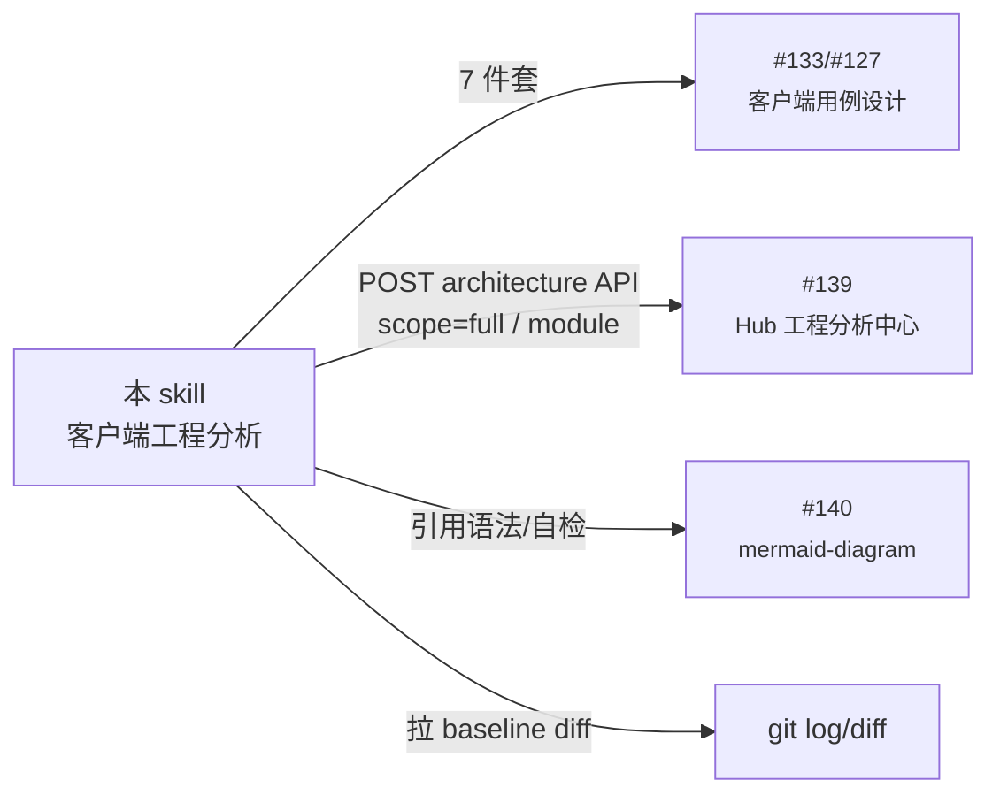

## 🛠️ 客户端工程分析 Skill

本 skill 站在**测试视角**对游戏/应用客户端工程做**系统化、可复核**的分析，最终交付物作为 `client-engineering-test-design` (#133) / `game-test-design` (#127) 的**前置输入**。

> **目标读者**：OpenClaw Agent（自动跑 / 半人工跑都适用）
> **使用时机**：第一次接触一个客户端工程、版本 baseline 重大变化、跨人接手前
> **不适用**：纯服务端工程（请用 `server-engineering-analysis` skill）

---

## 一、定位与边界

| 项 | 说明 |
|---|---|
| **是什么** | 客户端工程的"工程考古" + "可视化建图" + "测试关注点提炼" |
| **不是什么** | ❌ 不是开发者视角的架构设计文档（不评判好坏，只描述事实） |
| | ❌ 不是测试用例本身（用例由 #127/#133 据本 skill 输出生成） |
| | ❌ 不是 Bug 修复方案（只标注"测试关注点"，不开方子） |
| **依赖 skill** | `mermaid-diagram` (#140) — 所有图表语法/自检遵循此 skill |
| **下游 skill** | `client-engineering-test-design` (#133) / `game-test-design` (#127) |
| **下游 Hub 模块** | `engineering-analysis` (#139) — 输出可直接 POST 到 architecture API 沉淀 |

---

## 二、铁律（先立规矩，再做事）

> 这 8 条铁律 **每一条都不可妥协**。任一违反 → 输出物作废重做。

| # | 铁律 | 反例（禁止）| 正例（必须）|
|---|---|---|---|
| 1 | **先扫后说** | "登录走的应该是 HTTPS"（凭印象） | "见 `LoginManager.cs:42` 调用 `UnityWebRequest.Get`，URL 模板在 `ServerCfg.bytes` 第 7 行" |
| 2 | **每个结论都有源码引用** | "客户端有反作弊模块" | "客户端反作弊见 `AntiCheat/MemoryGuard.cs:1-200`，钩子注册在 `EntryPoint.Init():35`" |
| 3 | **不知道就标 ❓ 待确认** | 凭引擎常识硬编（"Unity 一般这样"）| `❓ 待确认：未找到登录 token 的本地存储位置，建议向 @author 确认` |
| 4 | **数据流双向验证** | 只 grep 发送方 | grep 发送方 (`SendXxx`) **+** 接收方 (`OnXxxResp`/`HandleXxx`) |
| 5 | **配置驱动逻辑必读配置** | "油耗规则写在代码里" | 实际是 `RGFuelCfg.bytes`，必须 dump 出来读，或至少标注配置文件路径 + 字段名 |
| 6 | **第三方 SDK 只标接入点** | 把 Bugly 当业务模块详细分析 | 标注"外部依赖：Bugly v4.x，接入点 `App.OnLaunch():12`，不展开" |
| 7 | **时序图来自代码静态读取** | 凭策划文档画时序 | 必须沿调用链 `MethodA → MethodB → MethodC` 一行一行追，不行就标 ❓ |
| 8 | **mermaid 必须能渲染** | `状态A --> 状态B`（中文 ID）| `A[状态A] --> B[状态B]`，并遵循 #140 mermaid-diagram skill |

---

## 三、分析顺序（**严格 10 步**，不要跳）

> 跳步会导致后续步骤建立在错误前提上。**前一步不通过就不进下一步**。

### Step 1. 项目档案（10 分钟）

最先必须搞清楚的事实：

| 项 | 怎么查 |
|---|---|
| 引擎与版本 | Unity: `ProjectSettings/ProjectVersion.txt`；UE: `*.uproject` 中 `EngineAssociation`；Godot: `project.godot` 中 `config_version`；Cocos: `package.json` 或 `cocos2d/CMakeLists.txt`；Web: `package.json` 中关键依赖 |
| 主要语言 | `find . -name "*.cs" -o -name "*.cpp" -o -name "*.ts" \| awk -F. '{print $NF}' \| sort \| uniq -c \| sort -rn` |
| 目标平台 | Unity: `ProjectSettings/ProjectSettings.asset` 中 buildTarget；UE: `Config/DefaultEngine.ini` |
| 仓库结构层级 | `find . -maxdepth 3 -type d -not -path '*/\.*' \| head -30` |
| 包/资源管理 | Unity: `Packages/manifest.json` + AssetBundle/Addressables/YooAsset；UE: 模块 `.Build.cs`；Web: `package.json` |
| 构建产物 | Unity: `Library/`、`Build/`；UE: `Binaries/`；Web: `dist/` |
| Git 当前 baseline | `git log -1 --pretty='%h %ad %s' --date=short` |
| 构建脚本 | `find . -name "Jenkinsfile" -o -name "*.bat" -o -name "*.sh" -path "*Build*"` |

**输出 1.1**：`项目档案表`（Markdown 表格，10 行内）

### Step 2. 入口与启动流程（30 分钟）

找到"App 启动 → 进大厅"的完整链路。

| 引擎 | 入口 |
|---|---|
| Unity | Build Settings 第 0 个场景（`ProjectSettings/EditorBuildSettings.asset`）→ 该场景上的脚本 `Awake/Start` |
| Unreal | `DefaultGame.ini` `GameDefaultMap` → `GameInstance::Init` |
| Godot | `project.godot` `[application] run/main_scene` |
| Cocos | `main.cpp` 或 `main.js` |
| Web | `index.html` `<script>` 入口 / `package.json` `main` |
| iOS Native | `AppDelegate.didFinishLaunchingWithOptions` |
| Android Native | `Application.onCreate` / 主 Activity |

按调用链一层层追，**禁止跳过任何一环**。每一步标注：
- 文件:行号
- 主要操作（"读 X 配置"/"调 Y SDK 初始化"）
- **跳转条件**（走 A 分支 vs B 分支）

**输出 2.1**：`启动时序图`（mermaid `sequenceDiagram` 或 `flowchart TD`，参考用户文档 `游戏启动流程分析文档.md` 的风格）
**输出 2.2**：`关键启动代码索引表`（每个生命周期/阶段一行）

### Step 3. 场景/页面图谱（20 分钟）

把所有"用户可达的画面"画出来 + 跳转关系。

- Unity：扫 `ProjectSettings/EditorBuildSettings.asset` + `SceneManager.LoadScene`/`Application.LoadLevel`/`UnityEngine.AddressableAssets.Addressables.LoadSceneAsync` 调用点
- UE：`UWorld` levels + `OpenLevel` 调用点
- Web：路由表（react-router / vue-router）

**输出 3.1**：`场景/页面跳转图`（mermaid `flowchart LR`）
**输出 3.2**：`场景索引表`（场景名 / 文件 / 用途 / 是否启用）

### Step 4. 模块清单（60 分钟）

按"引擎 typical 模块清单"（见 §五）逐项打钩，每个模块给：

| 字段 | 示例 |
|---|---|
| 模块名 | 登录 / 网络 / 战斗 / 背包 / ... |
| 主要目录 | `Assets/Scripts/Login/` |
| 入口类 | `LoginManager.cs` / `LoginController.ts` |
| 对外接口 | `Login(account, pwd)` / `Logout()` / `Refresh()` |
| 配置文件 | `LoginCfg.bytes` |
| 关键依赖 | `NetworkManager` / `UISystem` |
| 状态 | ✅ 已分析 / 🟡 部分 / ❓ 待确认 / ⚠️ 外部 SDK |

**输出 4.1**：`模块清单表`（每个 typical 模块一行；缺的也列出，标 "本工程未实现"）

### Step 5. 通信与协议（45 分钟）

> 这一步与服务端联系最强，**测试用例的"协议测试"全靠这步产出**。

依次扫：
1. **通信库**：`grep -rn "WebSocket\|UnityWebRequest\|HttpClient\|gRPC\|Socket\|UDP\|KCP\|protobuf" --include='*.cs' --include='*.ts'`
2. **协议定义**：`find . -name "*.proto" -o -path "*Protocol*" -o -name "*Msg*.cs"`
3. **消息派发器**：`grep -rn "Register.*Handler\|Dispatch\|HandleMsg\|OnRecv" <src>`
4. **域名/端口**：`grep -rn "wss://\|http://\|https://\|^.*=.*[0-9]\{4,5\}" Configs/`
5. **加密/签名**：`grep -rn "AES\|RSA\|MD5\|HMAC\|encrypt\|sign" <net_dir>`

**输出 5.1**：`通信总览`（协议 / 端口 / 加密 / 心跳 / 重连策略）
**输出 5.2**：`关键协议清单`（消息 ID / 名称 / 方向 / 触发场景 / 关联模块 / 是否加密）
**输出 5.3**：`一条核心链路时序图`（如登录 / 匹配 / 战斗结算）

### Step 6. 资源与配置（30 分钟）

| 项 | 关注 |
|---|---|
| 资源管线 | AssetBundle / Addressables / YooAsset / UE Pak |
| 资源加载入口 | `XxxAssetManager.cs` |
| 配置表系统 | Luban / xresloader / TDR / pbconfig — 找 `bytes`/`json`/`csv` 输出目录 |
| 热更内容 | 哪些是热更（Lua/JS/配置）哪些是 native |
| CDN/资源服务器 | 配置中的 URL |

**输出 6.1**：`资源/配置一览表`（表名 / 字段数 / 用途 / 关联模块）

### Step 7. 数据持久化与存档（20 分钟）

- `PlayerPrefs.SetXxx` / `EditorPrefs` / 本地 JSON / SQLite / Realm
- 加密方式
- 跨账号/跨设备数据策略

**输出 7.1**：`存档项清单`（key / 存储位置 / 加密 / 是否敏感）

### Step 8. 性能/兼容性/安全相关代码（30 分钟）

仅找**代码里已有的**，不要为还没做的开方：

- 帧率/分辨率自适应：`Application.targetFrameRate` / `Screen.SetResolution`
- 内存管理：`System.GC` / 对象池 `Pool` / `Resources.UnloadUnusedAssets`
- 反作弊：内存 hook / 时间篡改检测 / 整数溢出防护
- 日志/上报：Bugly / Firebase / Sensors / 自研

**输出 8.1**：`性能与安全代码索引表`

### Step 9. GM / 调试入口（15 分钟）

> 这一步**测试同学最爱用**：能直接定位测试入口、跳关、给资源。

- GM 控制台：`grep -rn "GM\|gm\|cheat\|debug" --include='*.cs' \| head -50`
- 调试快捷键
- 内置作弊指令

**输出 9.1**：`GM 入口与可用指令表`

### Step 10. 风险与待确认清单（强制）

把全程所有 ❓ 待确认 / ⚠️ 高风险 / 💀 严重坑 整理一份，按优先级排序。**这一段是最值钱的产出**。

**输出 10.1**：`风险与待确认清单`（条目 / 严重性 / 影响范围 / 建议动作 / 责任人 ❓）

---

## 四、按引擎/技术栈识别工程类型（速查）

| 特征文件 | 引擎 | 主要语言 | 备注 |
|---|---|---|---|
| `ProjectSettings/`, `Assets/`, `*.unity` | **Unity** | C#（+ Lua/IL2CPP）| 最常见手游 |
| `*.uproject`, `Source/*.Build.cs` | **Unreal** | C++（+ Blueprint）| 大型 3D |
| `project.godot` | Godot | GDScript / C# | 中小型 |
| `cocos2d/CMakeLists.txt` 或 `assets/main.js` | Cocos2d-x / Cocos Creator | C++ / TS | 小游戏多 |
| `App.config.js` + `pages/` | 微信/抖音小游戏 | JS/TS | 小游戏专用 |
| `package.json` + `pixi/phaser/three` | H5 游戏 | JS/TS | 浏览器 |
| `AppDelegate.swift/m` | iOS 原生 | Swift/OC | App / 工具型 |
| `AndroidManifest.xml` | Android 原生 | Kotlin/Java | 同上 |
| `pubspec.yaml` | Flutter | Dart | 跨端 App |
| `tauri.conf.json` / `electron-builder.json` | 桌面应用 | TS + Rust/Node | 工具型 |

---

## 五、各引擎 typical 模块清单（**Step 4 必须逐项打钩**）

> 下面是**经验值**，本工程没有的标"本工程未实现"，**不要凭经验编出来**。

### 5.1 Unity 手游（手游中最常见）

| 模块 | 典型目录/文件 | 测试关注点初值 |
|---|---|---|
| 启动 / 入口 | `Scenes/Entry.unity` + `EntryPoint.cs` | 多次冷启 / 杀进程后重启 |
| 资源更新 | `UpdateBoard.cs` / `AssetBundleManager.cs` / YooAsset | 断网中途 / 进程切后台 / 磁盘空间不足 |
| 登录 / 账号 | `LoginManager.cs` | Token 过期 / 多端登录 / 实名 / 游客 |
| 网络通信 | `NetworkManager.cs` / `KcpClient` / `WebSocketClient` | 断线重连 / 弱网 / 切前后台 |
| 协议层 | `Protocol/*.cs` (proto 生成) | 字段缺失 / 越界 / 重放 / 乱序 |
| UI 框架 | `UISystem` / `Window` / `Popup` | 多窗叠加 / 返回栈 / 横竖屏 |
| 场景/关卡 | `Scenes/Level_*.unity` + `LevelManager` | Level 读取 / 中途崩溃 / 资源缺失 |
| 角色 / 物理 | `Character/`, `Vehicle/` + Rigidbody | 极限速度 / 碰撞 / 物理穿模 |
| 战斗 / 玩法 | 项目特定（如 RG 的"惊险超车"）| 边界数值 / Combo 窗口 / 状态机非法转换 |
| 背包 / 道具 | `Bag/`, `Inventory/` | 满仓 / 0 / 并发使用 |
| 商城 / 充值 | `Shop/`, `Purchase/` + IAP | 取消支付 / 重复支付 / 货币溢出 |
| 任务 / 活动 | `Quest/`, `Activity/` | 跨天 / 时区 / 时间回拨 |
| 社交 | `Friend/`, `Chat/`, `Guild/` | 并发操作 / XSS / 频次 |
| 配置系统 | `Configs/*.bytes` (Luban/xresloader/TDR) | 配置缺失 / 字段类型变化 |
| 本地存档 | `PlayerPrefs` / `Save*.cs` | 数据破坏 / 跨账号污染 |
| 统计上报 | Bugly / Firebase / Sensors | 关键事件不漏报 |
| GM / 调试 | `GMTool.cs`, `Debug.Log` | 上线 build 是否禁用 |
| 反作弊 | `AntiCheat/` | 内存修改 / 加速 / 多开 |
| 平台 SDK | 微信 / TapTap / Apple Login / Bugly | 各平台版本兼容 |
| Lua/JS 热更（如有）| `LuaScripts/` | 热更失败 / 回滚 |

### 5.2 Unreal 工程

| 模块 | 典型位置 |
|---|---|
| GameInstance | `Source/<Project>/Public/<Project>GameInstance.h` |
| GameMode / GameState | `Source/<Project>/Public/.../GameMode.h` |
| Character / Pawn | `Source/<Project>/Public/Character/` |
| Net 复制 | `Replication`/`PlayerController` |
| UMG UI | `Source/<Project>/UI/` + `Content/UI/` |
| 数据资产 | `Content/DataTables/` + `UDataAsset` |
| Blueprint | `Content/*.uasset` （需 UAssetGUI 才能 grep）|

### 5.3 Cocos / 小游戏

| 模块 | 典型位置 |
|---|---|
| 入口 | `assets/Scripts/main.ts` |
| 场景管理 | `cc.director.loadScene` |
| UI | `assets/resources/ui/` |
| 网络 | `wx.connectSocket` (微信小游戏) / `WebSocket` |
| 配置 | `assets/resources/config/*.json` |

### 5.4 Web 应用

| 模块 | 典型位置 |
|---|---|
| 入口 | `src/main.{ts,jsx}` / `src/index.{ts,jsx}` |
| 路由 | `src/router/` (vue-router / react-router) |
| 状态管理 | `src/store/` (vuex/pinia/redux/zustand) |
| 网络层 | `src/api/` + axios/fetch 拦截器 |
| 鉴权 | `src/auth/` + token 存储 |
| 国际化 | `src/i18n/` |

---

## 六、必须输出的「**7 件套**」（缺一不可）

最终交付以一份 markdown 文档形式输出，建议命名 `<Project>_Client_Engineering_Analysis_<yyyyMMdd>.md`，**严格包含且仅包含**以下 7 节：

| # | 件 | 内容 | 体量参考 |
|---|---|---|---|
| 1 | **项目档案表** | Step 1 输出 | 10 行表格 |
| 2 | **架构总图** | mermaid `flowchart LR`，节点 = 模块组（UI/网络/逻辑/资源/平台 SDK） | 1 张图 |
| 3 | **启动时序图** | mermaid `sequenceDiagram` 或 `flowchart TD`，从 App 启动到进大厅 | 1-2 张图 |
| 4 | **场景/页面跳转图** | mermaid `flowchart LR` | 1 张图 |
| 5 | **模块清单表** | Step 4 输出，按 §五打钩；缺项也列出 | 一行一模块 |
| 6 | **关键链路时序图** | 至少 1 张协议链路时序图（推荐选项目最高频/最高风险） | 1-3 张图 |
| 7 | **测试关注点 + 风险/待确认清单** | Step 8/9/10 合并 | 一行一关注点，按优先级排序 |

> 为什么是 7 件套不是 10 件？因为后 3 步（性能 / GM / 风险）合并为第 7 件，更利于测试同学一眼看完做决策。

### 文档骨架模板（拷走改）

```markdown
# <Project> 客户端工程分析（baseline: <commit>）

> 分析人：<agent>  分析时间：<yyyy-MM-dd>  引擎：<Unity 2022.3.x>  代码量：<XX 万行>

## 1. 项目档案
（10 行表格）

## 2. 架构总图
\`\`\`mermaid
flowchart LR
    ...
\`\`\`

## 3. 启动时序图
\`\`\`mermaid
sequenceDiagram
    ...
\`\`\`

## 4. 场景/页面跳转图
\`\`\`mermaid
flowchart LR
    ...
\`\`\`

## 5. 模块清单
| 模块 | 目录 | 入口 | 配置 | 状态 |
|---|---|---|---|---|
...

## 6. 关键链路：<登录/匹配/战斗结算>时序图
\`\`\`mermaid
sequenceDiagram
    ...
\`\`\`

## 7. 测试关注点与风险清单
### 7.1 高优先级测试关注点（P0）
- ...
### 7.2 ❓ 待确认（需向开发同学求证）
- ...
### 7.3 ⚠️ 已发现风险
- ...
```

---

## 七、给测试用例设计（#127 / #133）的交接清单

完成 7 件套后，**显式列一份"传递清单"**，让 #127/#133 拿了就能开干：

| 测试维度 | 本 skill 已交付的依据 |
|---|---|
| 单元测试用例（数值/状态机/集合）| §5 模块清单 + §6 关键链路里抽出的"纯函数" |
| 协议测试用例 | §5 通信总览 + §5.2 关键协议清单（一个协议出 5+ 用例：正常/缺字段/越界/重放/乱序）|
| 业务功能用例 | §3 场景跳转图 + §6 链路时序图（一个分支一个用例）|
| 安全用例 | §7.3 风险清单（按风险等级映射 P0/P1）|
| 性能用例 | §8 性能代码索引（"已实现" → 验证；"未实现" → 不强测）|
| 兼容性用例 | §1 目标平台 + §6 资源管线（多分辨率/多机型）|
| GM 验证用例 | §9 GM 入口表（每条指令一条用例）|

---

## 八、提交前自检清单

- [ ] 7 件套完整，无任何"// TODO" 或占位文字
- [ ] 每一条结论都有"文件:行号"或配置文件路径引用
- [ ] mermaid 全部经过 dry-run（语法遵循 #140 mermaid-diagram skill）
- [ ] 至少 1 张图节点 ≥ 5 且 ≤ 30
- [ ] 模块清单与 §5 typical 列表对照过，所有"本工程未实现"明确标出
- [ ] 风险清单不为空（至少 3 条 ❓ 待确认）—— 没有的工程不存在
- [ ] 总长度 ≤ 60KB（投到 Hub 的 `content_md` 上限）
- [ ] 文档头部标注 `baseline: <commit hash>`，便于下次增量分析对比

---

## 九、与其他 skill / Hub 的协作



### 投递到 Hub（推荐）

```python
import os, requests

HUB = os.environ.get("OPENCLAW_HUB", "http://9.134.11.169:8088")
H = {"Authorization": f"Bearer {os.environ['HUB_API_TOKEN']}",
     "Content-Type": "application/json"}

def publish_client_arch(baseline_id, full_md, summary):
    r = requests.post(
        f"{HUB}/api/v1/engineering/baselines/{baseline_id}/architecture",
        headers=H, json={
            "scope": "full",
            "target_module": "",
            "title": f"[客户端工程分析] {summary[:30]}",
            "summary": summary,
            "content_md": full_md,
            "structured": {},
            "source_type": "agent",
        }, timeout=30)
    r.raise_for_status()
    print(f"✅ 客户端架构快照 #{r.json()['id']}")
```

---

## 十、附录：常用 grep / find 模板（**直接拷走**）

```bash
# A. Unity C# 入口扫描
grep -rn "void Awake\|void Start\|void Main\|void OnEnable" \
  --include='*.cs' Assets/ | head -100

# B. 网络通信扫描
grep -rn "WebSocket\|UnityWebRequest\|HttpClient\|TcpClient\|KcpClient\|grpc" \
  --include='*.cs' Assets/ | head -50

# C. 协议派发器（同时扫常见命名）
grep -rEn "(Register|Bind|Dispatch|On)(Msg|Cmd|Handler)" \
  --include='*.cs' Assets/ | head -50

# D. 配置加载入口（typical 配置系统）
grep -rn "LoadConfig\|ParseConfig\|TableMgr\|ConfigManager" \
  --include='*.cs' Assets/ | head -30

# E. 本地存档
grep -rn "PlayerPrefs\.\|EditorPrefs\.\|Application\.persistentDataPath" \
  --include='*.cs' Assets/ | head -50

# F. URL/端口/秘钥（敏感）
grep -rEn "(https?|wss?)://[a-zA-Z0-9./_-]+" --include='*.cs' --include='*.bytes' --include='*.json' Assets/ Configs/ | head -50
grep -rEn "(api_key|app_secret|token).{0,3}=" --include='*.cs' Assets/ | head -30

# G. 反作弊/调试
grep -rEn "AntiCheat|MemoryGuard|DebugCheck|IsHacked" --include='*.cs' Assets/ | head -30
grep -rEn "GMTool|gm_command|cheat" --include='*.cs' Assets/ | head -30

# H. UE C++ 入口
grep -rn "GameInstance::Init\|GameMode::BeginPlay\|UWorld::BeginPlay" Source/ | head -30

# I. Web 入口
grep -rn "createApp\|ReactDOM.render\|new Vue" src/ | head -10
```

---

## 十一、触发时机（让 Agent 知道何时启用本 skill）

下列任一情境出现时，Agent 应启用本 skill：

- 用户提供"客户端工程路径" + 任一关键字：`分析工程`/`了解工程`/`工程结构`/`代码分析`/`接手项目`
- 用户要求"画启动流程"/"画场景跳转图"/"画客户端架构图"
- 用户要求"做客户端测试方案"但未提供工程分析输入（先跑本 skill 再交给 #133/#127）
- baseline 切换到一个新的大版本（如 RacingGo 从 framework v1 → v1.5 后）

---

**技能版本**：v1.0  
**生效日期**：2026-04-23  
**维护**：OpenClaw 平台组  
**说明**：客户端工程分析专用，输出作为 `client-engineering-test-design` (#133) / `game-test-design` (#127) 的前置输入，配套服务端版 `server-engineering-analysis` 同步发布
