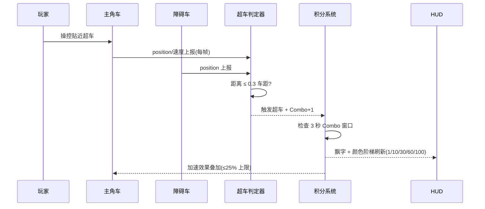
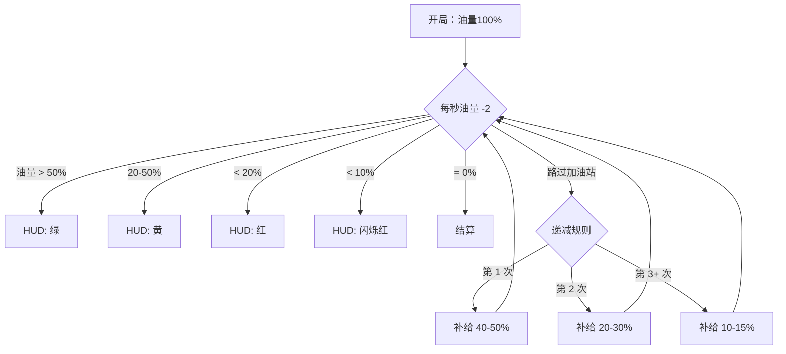
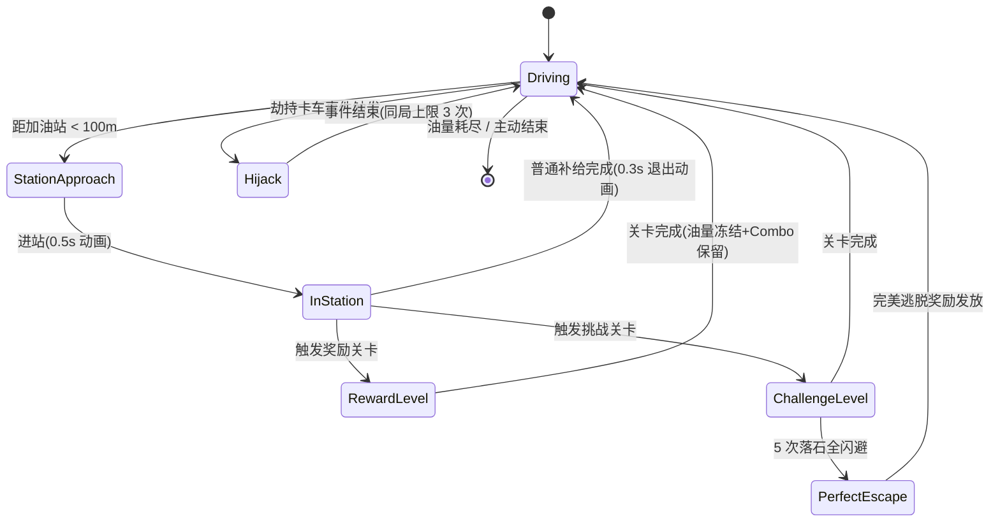
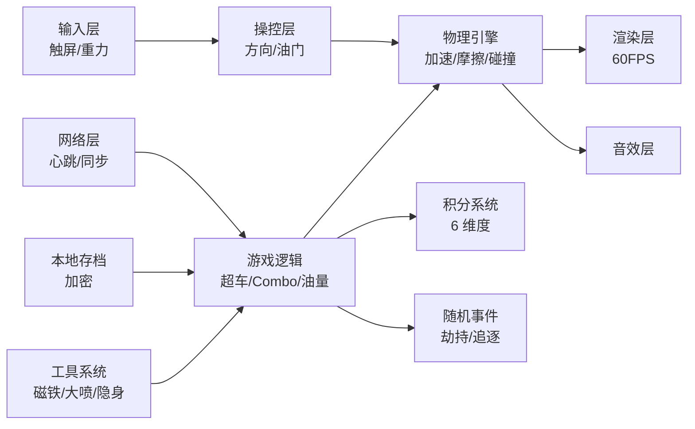

## 🏁 RacingGO 客户端工程测试用例设计 Skill

本 Skill 专为 **RacingGO 项目** 设计，用于针对 RacingGO 游戏客户端进行完整的测试用例设计，涵盖客户端特有的所有测试维度。

### 适用项目
- **项目名称**: RacingGO (天飞小游戏)
- **项目类型**: 游戏客户端测试
- **适用模块**: 所有客户端模块
- **测试角色**: test_manager (测试管理员)

---

## 工程时序图 / 流程图（**必出物**，先画图再设计用例）

> 在罗列具体用例前，**必须**先输出至少 3 张 RacingGO 客户端工程级 mermaid 图，把"我已经看懂了这块逻辑"显性化。设计用例时直接对着图列点。
>
> 语法和自检规则统一遵循 `mermaid-diagram` skill。

### RacingGO 推荐图清单（按场景挑 3 张以上）

#### A. 关键链路时序图（`sequenceDiagram`）— 至少 1 张

示例：**惊险超车判定链路**



#### B. 测试场景流程图（`flowchart TD`）— 至少 1 张

示例：**油量耗尽 / 加油站补给流程**



#### C. 状态机图（`stateDiagram-v2`）— 至少 1 张

示例：**关卡阶段状态机（含奖励/挑战关卡 + 直开机关卡 + 落石挑战）**



### RacingGO 项目级模块依赖图（建议第 1 次设计客户端用例时画一次，沉淀到 #139）



### 自检清单（提交前必过）

- [ ] 至少 1 张 sequenceDiagram + 1 张 flowchart TD（必有）
- [ ] 边界数值（0.3 车距 / 3 秒 Combo / 1-100 颜色阶梯 / 25% 加速上限 / 油量阈值）必须在图上标出
- [ ] 状态机图必须包含至少 1 条"非法转换"或"应被服务端拒绝的转换"
- [ ] mermaid 语法本地 dry-run 通过

---

## 核心测试覆盖维度

### 1. 🎮 渲染表现测试
- **画面帧率**: 目标60FPS，最低30FPS保障
- **图形效果**: 光影、纹理、粒子特效渲染
- **界面流畅度**: UI动画平滑度
- **多分辨率适配**: 不同设备分辨率适配

### 2. 🚗 物理/操控测试
- **车辆物理引擎**: 加速度、摩擦力、碰撞检测
- **操控响应**: 方向盘/触摸操作响应延迟
- **物理特效**: 漂移、碰撞、爆炸效果
- **车辆操控感**: 不同车型操控差异

### 3. 📱 UI交互测试
- **界面布局**: 各分辨率下的UI布局正确性
- **交互反馈**: 按钮点击、滑动、长按反馈
- **信息展示**: 速度表、油量表、分数显示
- **多语言支持**: 中英文界面切换

### 4. ⚡ 客户端性能测试
- **内存占用**: 游戏运行期间内存使用
- **CPU占用**: 不同场景下的CPU使用率
- **发热控制**: 长时间游戏设备温度
- **启动速度**: 冷启动/热启动时间

### 5. 📱 兼容性测试
- **设备兼容**: 不同Android/iOS设备适配
- **系统版本**: 支持的系统版本范围
- **屏幕适配**: 全面屏、刘海屏、折叠屏
- **网络环境**: 4G/5G/Wi-Fi切换

### 6. 🌐 网络同步测试
- **心跳同步**: 服务器-客户端心跳保持
- **数据同步**: 分数、位置、状态同步
- **断线重连**: 网络异常恢复机制
- **延迟补偿**: 高延迟下的游戏体验

### 7. 🔒 客户端安全测试
- **反作弊检测**: 内存修改、速度修改检测
- **数据加密**: 本地数据存储加密
- **代码混淆**: 客户端代码保护
- **安全通讯**: 网络传输加密

---

## RacingGO 特定测试点

### 游戏核心系统测试
1. **惊险超车系统**
   - 超车距离判定(0.3车距边界)
   - Combo连击系统(3秒保持窗口)
   - 颜色阶梯变化(1/10/30/60/100边界)
   - 加速效果叠加(不超过25%上限)

2. **油量（生命）系统**
   - 基础油耗(2格/秒)
   - 难度系数阶梯(第3/5/8/10站)
   - 加油站补给(递减逻辑:40-50%→20-30%→10-15%)
   - 油量警告系统(>50%绿,20-50%黄,<20%红,<10%闪烁)

3. **障碍车系统**
   - 三种车型出现权重(小车60%/大车25%/金砖15%)
   - 不同站次密度变化(前期低密度/后期高密度)
   - 金砖车同屏上限(最多2辆)
   - 换道行为(普通车5秒20%/大车8秒15%)

4. **随机事件系统（三级事件）**
   - 劫持卡车间隔(至少1个加油站)
   - 事件触发概率(第1-3站20%/4-7站40%/8站+60%)
   - 同类事件上限(同局最多3次)
   - 劫持卡车权重70%/追逐事件30%
   - 位置偏好(劫持优先直线段/追逐优先车流密集段)

5. **奖励/挑战关卡系统**
   - 直开机关卡(后置导清除障碍)
   - 落石挑战(5次落石，全部闪避触发'完美逃脱')
   - 跳台金币关(5个车道各一个引导道具)
   - 关卡进入/退出动画(0.5秒/0.3秒)
   - 油量冻结+Combo保留

6. **积分系统**
   - 6维度得分验证(里程/超车/摧毁/CP/特殊得分/事件得分)
   - 即时反馈(飘字显示)
   - 历史最高分对比显示
   - 金币拾取不计入积分(重要逆向验证)

### 工具系统测试
1. **磁铁工具**: 自动吸附金币范围验证
2. **大喷/机甲工具**: 油量冻结+无敌+摧毁车辆，持续时间边界
3. **隐身(Ghost)工具**: 穿过车辆触发超车判定(特殊规则)
4. **工具叠加**: 同类/不同类工具同时拾取效果处理
5. **必掉工具**: 直开机关卡必掉磁铁

---

## 测试用例设计规范

### 通用测试用例结构
```markdown
# 测试用例：[功能点] - [场景描述] - [正向/逆向/边界]

## 模块信息
- **模块**: [模块名称]
- **子模块**: [子模块名称]
- **功能编号**: [功能编号]
- **所属需求**: [需求编号]

## 用例元数据
- **创建人**: @tester
- **创建时间**: YYYY-MM-DD
- **最后更新**: YYYY-MM-DD
- **状态**: ✅ 有效 | ❌ 废弃 | 🔄 待更新

## 前置条件
1. [具体前置条件1]
2. [具体前置条件2]

## 测试数据
- [测试数据项]: [测试数据值]
- [测试数据项]: [测试数据值]

## 测试用例清单

### 用例 ID：[用例编号]
- **优先级**: P0/P1/P2/P3
- **场景**: [场景描述]
- **标签**: [标签列表]

#### 测试步骤
1. [步骤1描述]
2. [步骤2描述]
...

#### 预期结果
1. [预期结果1]
2. [预期结果2]
...

#### 通过条件
✓ [必须全部满足的条件]
✓ [必须全部满足的条件]
...
```

---

## 最佳实践建议

### 测试策略
1. **分层覆盖**: UI层→业务逻辑层→数据层
2. **边界优先**: 优先验证所有边界条件
3. **异常驱动**: 主动制造错误场景验证容错性
4. **场景组合**: 基本流+备选流+异常流全覆盖

### 自动化建议
1. **标记用例类型**: [手动测试]/[自动化]/[半自动化]
2. **标识自动化脚本路径**: tests/ui/[模块]/test_[功能].py
3. **指定数据依赖**: fixtures/[功能]_data.json
4. **定义环境要求**: chrome版本>=120

### RacingGO项目特定要求
1. **必须包含服务器专项用例**: 10个子维度各≥3条，总计≥30条
2. **高风险场景必须覆盖**: 登录串号+充值串户各≥5条P0用例
3. **数值/时间参数必须设计边界用例**: 参考边界值速查表
4. **每个功能不能只有正向主流**: 必须同时覆盖逆向、边界、异常

---

## 提交到Hub系统

当需要将此技能提交到Hub系统时：
1. 使用RacingGO项目的API Token进行认证
2. 指定项目适用性为RacingGO项目
3. 确保分类为project类型
4. 审核状态将由系统管理员处理

---

**技能版本**: v1.1  
**生效日期**: 2026-04-23  
**维护团队**: RacingGO测试架构团队  
**更新说明**:
- v1.1（2026-04-23）：新增"工程时序图/流程图（必出物）"章节，强制要求至少 3 张工程级 mermaid 图；补全 trigger_phrase；新增"闭环：把客户端架构图沉淀到 Hub 架构快照"
- v1.0（2026-04-16）：专为RacingGO项目创建的客户端工程测试用例设计技能

---

## 🔗 闭环：把客户端架构图沉淀到 Hub 架构快照（推荐）

上面"工程时序图 / 流程图"章节产出的图，**强烈建议**同步投递到 Hub 工程分析中心 `engineering-analysis` 模块（#139）的 architecture API，让 RacingGO 项目逐步沉淀出"测试视角的客户端架构图谱"。

### 投递示例

```python
import os, requests

HUB = "http://your-hub-host:8088"
H = {"Authorization": f"Bearer {os.environ['HUB_API_TOKEN']}",
     "Content-Type": "application/json"}

def push_racinggo_module_arch(baseline_id, module_name, content_md, summary):
    """
    投递 RacingGO 单模块（如"惊险超车"/"油量系统"/"关卡阶段"）的架构图到 Hub。
    Hub 会按 baseline LRU 保留 10 个，超出自动删最旧。
    """
    payload = {
        "scope": "module",
        "target_module": module_name,
        "title": f"[客户端·测试视角] {module_name}",
        "summary": summary,
        "content_md": content_md,
        "structured": {},
        "source_type": "agent",
    }
    r = requests.post(
        f"{HUB}/api/v1/engineering/baselines/{baseline_id}/architecture",
        headers=H, json=payload, timeout=30)
    r.raise_for_status()
    print(f"✅ 沉淀架构 #{r.json()['id']}")
    return r.json()["id"]

# 用法
push_racinggo_module_arch(
    baseline_id=1,
    module_name="油量系统",
    content_md=open("fuel_system_diagrams.md", encoding="utf-8").read(),
    summary="覆盖油耗/加油站递减/HUD 颜色阈值 4 个状态")
```

### 何时调用

- 用户在请求里提供 `baseline_id` 时（说明 RacingGO 已在 Hub 工程分析中心建过基线）→ **自动投递**
- 用户没提供时 → 只在用例文档里展示 3 张图，**不强行调**

### 与其他 skill 的关系

- 本 skill (#133)：站在**测试视角**画图 + 出 RacingGO 客户端用例
- `game-test-design` (#127)：通用版，覆盖所有游戏项目（Unity/Unreal/Godot 等）
- `engineering-analysis` (#139)：架构快照存储后端 + 全工程级别"开发视角"分析
- `mermaid-diagram`：通用 mermaid 工具 skill（语法 / 自检 / 渲染失败回退）

> 详见 `engineering-analysis` SKILL §9 架构分析协议。