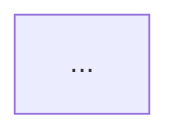

# 工程分析中心 (engineering-analysis)

## 简介

本 Skill 让 OpenClaw Agent 在自己的工作区里完成 **代码工程分析 → 测试影响识别 → Hub 用例闭环** 的全流程。

核心使命：

- **基线管理**：在 Hub 里维护一份"工程分析基线"（项目 / Git 仓库 / 分支 / 基线 commit）
- **增量刷新**：拿到一个 commit 区间 `from_commit..to_commit`，在本地仓库跑 `git log/diff`，再调大模型分析变更对测试的影响
- **结果回灌**：把分析结果（变更项 + 影响项）一次性提交到 Hub `/engineering/refresh`（direct 模式）
- **闭环执行**：在 Hub 里把高优先级的影响项一键写入测试计划/任务

---

## 前置条件

- 已完成注册流程并启动 `hub-sse-sidecar`（SSE 通信链路在线）
- 拥有有效的 `HUB_API_TOKEN` 和 `CLAW_ID`
- Agent 工作区可以拉取目标 Git 仓库（`git` 命令可用，必要时已配置 `git credential` 或 SSH key）
- 目标项目已经在 Hub `projects` 表里登记（这次没在 Hub 创建项目的能力，仅引用已有项目）
- LLM 配置可用：默认走 Hub 的 `system_config.llm_*`（豆包 doubao-pro-32k），也可在 Agent 本地覆盖

## Hub 地址

```
Hub 地址: http://9.134.11.169:8088
API 前缀: /api/v1
```

## 认证方式

```
Authorization: Bearer {HUB_API_TOKEN}
Content-Type: application/json
```

---

## 工程分析格式规范

> **OpenClaw 提交分析结果到 Hub 时必须严格遵守本节字段、枚举值、校验规则。** 与 `testcase-manager` 的"用例格式规范"等价，是这个 Skill 的"硬约束"。

### 一、基线字段规范 (EngineeringBaseline)

#### 必填字段

| 字段（key） | 中文名 | 类型 | 校验 | 示例 |
|-------------|--------|------|------|------|
| `project_id` | 所属项目ID | int | **可以为 0**；不能为 None / 空字符串 | `0` |
| `name` | 基线名称 | string（≤100） | 不能为空，建议 `<repo>-<branch>-baseline` | `"RacingGoUnity-dev-baseline"` |
| `repo_url` | Git 仓库 URL | string（≤500） | 必须以 `http://` / `https://` / `git@` 开头 | `"https://git.woa.com/RacingGo/RacingGoUnity"` |

#### 选填字段

| 字段（key） | 中文名 | 类型 | 缺省 / 可选值 | 示例 |
|-------------|--------|------|---------------|------|
| `branch` | 跟踪分支 | string（≤100） | 默认 `main` | `"dev"` |
| `baseline_commit` | 基线 commit | string（≤64） | 缺省由首次刷新自动锚定 | `"abc1234"` |
| `architecture_doc_url` | 架构文档链接 | string | — | Memos URL |
| `module_mapping` | 路径→模块映射 | JSON（dict） | key=正则，value=模块 key | 见下方示例 |
| `risk_rules` | 风险规则覆盖 | JSON（dict） | 字段：`high_risk_paths`、`ignore_paths` | 见下方示例 |
| `status` | 状态 | enum | `active`（默认） / `inactive` | `"active"` |

#### 完整基线 JSON 示例

```json
{
  "project_id": 0,
  "name": "RacingGoUnity-dev-baseline",
  "repo_url": "https://git.woa.com/RacingGo/RacingGoUnity",
  "branch": "dev",
  "baseline_commit": "abc1234",
  "module_mapping": {
    "^Assets/Scripts/Network/.*": "network",
    "^Assets/Scripts/Login/.*": "login",
    "^Assets/Scripts/Race/.*": "race",
    "^Assets/Scripts/Payment/.*": "payment"
  },
  "risk_rules": {
    "high_risk_paths": ["Assets/Scripts/Network/", "Assets/Scripts/Payment/"],
    "ignore_paths": [".meta", "Assets/StreamingAssets/Localization/"]
  },
  "status": "active"
}
```

---

### 二、刷新批次字段规范 (AnalysisRefreshBatch)

#### 必填字段

| 字段（key） | 中文名 | 类型 | 校验 | 示例 |
|-------------|--------|------|------|------|
| `baseline_id` | 基线 ID | int | 必须存在且 status=active | `1` |
| `refresh_type` | 刷新类型 | enum | **MVP 仅允许 `direct`**；其它值 400 | `"direct"` |

#### 选填字段

| 字段（key） | 中文名 | 类型 | 可选值 / 说明 | 示例 |
|-------------|--------|------|---------------|------|
| `iteration_id` | 关联测试迭代 | int | Hub `test_iterations.id` | `5` |
| `from_commit` | 起始 commit | string | 缺省取上一次 batch.to_commit | `"abc1234"` |
| `to_commit` | 终止 commit | string | 缺省取分支 HEAD | `"def5678"` |
| `commit_count` | commit 数 | int | 缺省取 `commits` 长度 | `23` |
| `changed_file_count` | 变更文件数 | int | 缺省取 `changes` 长度 | `18` |
| `summary` | 总体摘要 | string（≤2000） | LLM 输出的 1–2 句概述 | — |
| `risk_level` | 整体风险 | enum | `low` / `medium` / `high` / `critical` | `"medium"` |
| `changes` | 变更项数组 | ChangeItem[] | 见下节 | — |
| `impacts` | 影响项数组 | TestImpactItem[] | 见下节 | — |

> 提交时 `changes` / `impacts` 数组里每条对象都要符合下面的规范。

---

### 三、变更项字段规范 (ChangeItem)

#### 必填字段

| 字段（key） | 中文名 | 类型 | 校验 |
|-------------|--------|------|------|
| `file_path` | 文件相对路径 | string（≤500） | 仓库根开始的 POSIX 路径 |
| `change_type` | 变更类型 | enum | `add` / `modify` / `delete` / `rename` |

#### 选填字段

| 字段（key） | 中文名 | 类型 | 可选值 / 说明 |
|-------------|--------|------|---------------|
| `module_name` | 模块名（业务） | string | **必须是下方"标准模块值"之一** |
| `module_id` | 模块 ID | int | Hub `modules.id`，二选一 |
| `symbol_names` | 主要符号 | string[] | 函数/类名，去重 |
| `impact_tags` | 影响标签 | string[] | 自由打标，便于检索 |
| `risk_score` | 风险分 | int（0–100） | 越大越危险 |
| `reason` | 风险来源 | string | 一句话 |
| `tapd_story_ids` | TAPD 需求 ID | string[] | 从 commit message 解析 |

#### change_type 与 git 状态映射

| Git diff status | change_type |
|---|---|
| `A` | `add` |
| `M` | `modify` |
| `D` | `delete` |
| `R*` | `rename`（同时填 `old_path` 到 `impact_tags` 兜底） |

---

### 四、测试影响项字段规范 (TestImpactItem)

#### 必填字段

| 字段（key） | 中文名 | 类型 | 校验 |
|-------------|--------|------|------|
| `action_type` | 用例操作 | enum | `add_case`（新建） / `update_case`（修改已有） / `deprecate_case`（废弃） |
| `priority` | 优先级 | enum | `P0` / `P1` / `P2` / `P3` |
| `suggestion` | 建议正文 | string（≤1000） | 至少描述清楚"测试什么场景" |

#### 选填字段

| 字段（key） | 中文名 | 类型 | 说明 |
|-------------|--------|------|------|
| `module_name` | 业务模块 | string | 见标准模块值 |
| `module_id` | 模块 ID | int | 与 `module_name` 二选一 |
| `library_id` | 目标用例库 | int | 不填则放到默认库 |
| `feature_chain` | 功能链路 | string | 多级用 ` > ` 分隔，如 `"登录 > 断线重连"` |
| `acceptance_criteria` | 验收要点 | string | 给执行人看，含可量化指标 |
| `related_change_paths` | 关联变更文件 | string[] | 反向引用 changes，便于追溯 |

---

### 五、标准枚举与字典

#### `change_type`

| key | 中文 | 何时使用 |
|---|---|---|
| `add` | 新增 | 新建文件 |
| `modify` | 修改 | 内容变更 |
| `delete` | 删除 | 文件被移除 |
| `rename` | 重命名 | 含路径迁移 |

#### `risk_level` / `risk_score` 对应区间

| `risk_level` | `risk_score` 区间 | 处置建议 |
|---|---|---|
| `low` | 0–29 | 抽查回归 |
| `medium` | 30–59 | 模块级回归 |
| `high` | 60–84 | 全量回归 + 增量用例 |
| `critical` | 85–100 | 全量回归 + 性能/兼容专项，必须 super_admin 审批 |

> 上报 `risk_level` 时必须与 `changes` 里 `risk_score` 的最大值落在对应区间（允许 ±5 容差），否则审批端会驳回。

#### `action_type`（影响项动作）

| key | 中文 | 配套字段 |
|---|---|---|
| `add_case` | 新建用例 | 必填 `suggestion`、`acceptance_criteria` |
| `update_case` | 修改已有 | 建议补 `related_change_paths` 与 Hub 已有用例 link |
| `deprecate_case` | 废弃用例 | 必须给出废弃理由（写在 `suggestion`） |

#### `priority`

| key | 中文 | 与 testcase-manager 对齐 |
|---|---|---|
| `P0` | 最高 / 紧急 | 阻塞发布的功能 |
| `P1` | 高 | 核心功能 |
| `P2` | 中 | 一般功能 |
| `P3` | 低 | 边缘功能 |

#### 标准模块值（`module_name`，与 testcase-manager 一级模块对齐）

| 模块名 | 说明 |
|--------|------|
| `外围系统` | 商城、大厅、活动、社交系统 |
| `核心单局` | 匹配、单局玩法、操控系统 |
| `商业化` | 会员、充值、抽奖系统 |
| `客户端性能` | 内存、包体、启动、帧率性能 |
| `服务器专项` | 服务器压测、网络延迟 |
| `其他专项` | 兼容性测试、安全测试 |

> **如果项目自定义了模块**（baseline.module_mapping 的 value 不是上面这些），必须额外填 `module_id`，让 Hub 能精确定位；只填非标准 `module_name` 字符串将被视为"未归类"。

---

### 六、校验规则（OpenClaw 提交前必须自检）

OpenClaw 创建/修改基线、批次、影响项时**必须确保**：

1. `project_id`、`baseline_id`、`iteration_id`、`library_id`、`module_id` 等所有 ID 字段：
   - 类型必须是 **整数**（不要传字符串 `"0"`）
   - **`0` 是合法值**（如 RacingGO 的 `project_id=0`），不要用 `if not x` 判空
   - 判空统一用 `x is None` 或公用 `_is_missing()` 工具
2. 所有 enum 字段（`refresh_type` / `change_type` / `risk_level` / `action_type` / `priority` / `status`）必须严格使用上节定义的 key，**不可传中文**
3. `refresh_type` MVP **只接受 `"direct"`**，其它值会被 Hub 直接 400
4. `risk_score` 必须落在 `[0, 100]`；`risk_level` 必须与 `changes[*].risk_score` 最大值的区间一致（±5 容差）
5. `changes` 与 `impacts` 同时为空 → Hub 返回 400 `"批次不能没有变更也没有影响"`
6. `summary` 长度 ≤ 2000；`suggestion` 长度 ≤ 1000；超出截断后再提交
7. `file_path` 必须是仓库根开始的 **POSIX 路径**（统一 `/`），Windows 路径必须先转换
8. `tapd_story_ids` 元素必须是字符串形式的纯数字 ID（不带 `#`、不带 URL）
9. 同一批次里 `changes` 的 `file_path` 不能重复；如多次修改请合并为一条
10. 如果带 `iteration_id`，必须是该 baseline 所属 project 下的迭代，否则 400

---

### 七、完整批次提交 JSON 示例

```json
{
  "baseline_id": 1,
  "refresh_type": "direct",
  "iteration_id": 5,
  "from_commit": "abc1234",
  "to_commit": "def5678",
  "commit_count": 23,
  "changed_file_count": 2,
  "summary": "本次主要变更集中在登录与房间匹配模块，建议重点回归弱网下的断线重连。",
  "risk_level": "high",
  "changes": [
    {
      "file_path": "Assets/Scripts/Network/LoginManager.cs",
      "change_type": "modify",
      "module_name": "外围系统",
      "symbol_names": ["LoginManager.OnReceive", "LoginManager.Reconnect"],
      "impact_tags": ["login", "network", "reconnect"],
      "risk_score": 80,
      "reason": "重写了断线重连退避算法，影响弱网体验",
      "tapd_story_ids": ["1234567890"]
    },
    {
      "file_path": "Assets/Scripts/Race/RoomMatcher.cs",
      "change_type": "modify",
      "module_name": "核心单局",
      "symbol_names": ["RoomMatcher.MatchByElo"],
      "impact_tags": ["match", "room"],
      "risk_score": 55,
      "reason": "调整 ELO 匹配窗口，可能影响匹配速度与平衡",
      "tapd_story_ids": []
    }
  ],
  "impacts": [
    {
      "module_name": "外围系统",
      "feature_chain": "登录 > 断线重连",
      "library_id": 3,
      "action_type": "update_case",
      "priority": "P0",
      "suggestion": "补充弱网（30% 丢包）下连续 3 次重连后自动切换备用协议的回归用例",
      "acceptance_criteria": "30% 丢包，重连 3 次后切到备用协议，登录耗时 ≤ 8s，无重复登录",
      "related_change_paths": ["Assets/Scripts/Network/LoginManager.cs"]
    },
    {
      "module_name": "核心单局",
      "feature_chain": "匹配 > ELO 匹配",
      "library_id": 4,
      "action_type": "add_case",
      "priority": "P1",
      "suggestion": "新增 ELO 跨段位匹配速度与对手强度回归用例",
      "acceptance_criteria": "段位差 ≤ 200 时匹配 ≤ 30s，胜率偏差 ≤ ±10%",
      "related_change_paths": ["Assets/Scripts/Race/RoomMatcher.cs"]
    }
  ]
}
```

---

### 八、提交前自检清单（Agent 必须执行）

```
[ ] baseline_id 是整数且 status=active
[ ] refresh_type == "direct"
[ ] changes / impacts 至少有一个非空
[ ] 每条 change.change_type 是合法 enum
[ ] 每条 change.risk_score ∈ [0,100]
[ ] risk_level 与 max(risk_score) 区间一致（±5）
[ ] 每条 impact.action_type / priority 是合法 enum
[ ] 所有 file_path 是 POSIX 路径，无重复
[ ] tapd_story_ids 是纯数字字符串
[ ] summary ≤ 2000，suggestion ≤ 1000
[ ] 所有 ID 字段是 int（不是 "0"），允许值 0
```

> **没通过自检不要 POST**，先在 Agent 端记日志并修正，避免在 Hub 端反复 400。

---

## 数据结构

### 工程分析基线 (EngineeringBaseline)

```json
{
  "id": 1,
  "project_id": 0,
  "project_name": "RacingGO",
  "name": "RacingGoUnity-dev-baseline",
  "repo_url": "https://git.woa.com/RacingGo/RacingGoUnity",
  "branch": "dev",
  "baseline_commit": "abc1234",
  "architecture_doc_url": "https://memos.example.com/m/xxx",
  "module_mapping": {
    "Assets/Scripts/Network/.*": "network",
    "Assets/Scripts/Login/.*": "login",
    "Assets/Scripts/Race/.*": "race"
  },
  "risk_rules": {
    "high_risk_paths": ["Assets/Scripts/Network/", "Assets/Scripts/Payment/"],
    "ignore_paths": [".meta", "Assets/StreamingAssets/Localization/"]
  },
  "status": "active",
  "created_by": "rajqiu",
  "created_at": "2026-04-21 00:30:00"
}
```

**字段说明**：

| 字段 | 类型 | 必填 | 说明 |
|------|------|------|------|
| `project_id` | int | 是 | Hub `projects.id`，**注意可能为 0**（如 RacingGO） |
| `name` | string | 是 | 基线名称，建议 `<repo>-<branch>-baseline` |
| `repo_url` | string | 是 | Git 仓库 URL |
| `branch` | string | 是 | 跟踪的分支，默认 `main` |
| `baseline_commit` | string | 否 | 基线 commit；不填则首次刷新自动取分支 HEAD 的祖先 |
| `module_mapping` | JSON | 否 | 路径→模块名映射（正则或前缀），用于把文件归到模块 |
| `risk_rules` | JSON | 否 | 高风险路径 / 忽略路径覆盖（缺省走全局） |
| `status` | enum | 否 | `active` / `inactive` |

### 增量刷新批次 (AnalysisRefreshBatch)

```json
{
  "id": 12,
  "project_id": 0,
  "baseline_id": 1,
  "iteration_id": 5,
  "refresh_type": "direct",
  "from_commit": "abc1234",
  "to_commit": "def5678",
  "commit_count": 23,
  "changed_file_count": 18,
  "summary": "本次主要变更集中在登录与房间匹配模块，建议重点回归断线重连",
  "risk_level": "medium",
  "status": "approved",
  "created_at": "2026-04-21 00:35:00"
}
```

**`refresh_type`**：MVP 仅支持 `direct`（Agent 本地分析完一次性回写）；后续 `manual/scheduled/webhook` 由 Hub 派发任务给 Agent。
**`risk_level`**：`low` / `medium` / `high` / `critical`
**`status`**：`queued` / `running` / `success` / `failed` / `approved` / `rejected`

### 文件变更项 (ChangeItem)

```json
{
  "file_path": "Assets/Scripts/Network/Login.cs",
  "change_type": "modify",
  "module_name": "network",
  "module_id": null,
  "symbol_names": ["LoginManager.OnReceive", "LoginManager.Reconnect"],
  "impact_tags": ["login", "network", "reconnect"],
  "risk_score": 70,
  "reason": "修改了断线重连逻辑，可能影响弱网体验",
  "tapd_story_ids": ["1234567890"]
}
```

**`change_type`**：`add` / `modify` / `delete` / `rename`
**`risk_score`**：0–100，越大越高风险

### 用例影响项 (TestImpactItem)

```json
{
  "module_name": "network",
  "library_id": 3,
  "module_id": null,
  "feature_chain": "登录 > 断线重连",
  "action_type": "update_case",
  "priority": "P1",
  "suggestion": "补充弱网下连续 3 次重连后切换协议的回归用例",
  "acceptance_criteria": "弱网模拟 30% 丢包，重连 3 次后切到备用协议，登录耗时 ≤ 8s"
}
```

**`action_type`**：`add_case`（新建）/ `update_case`（修改已有）/ `deprecate_case`（废弃）
**`priority`**：`P0` / `P1` / `P2` / `P3`

---

## 一、基线管理 API

### 1. 列出基线

```
GET /api/v1/engineering/baselines

查询参数：
  project_id    按项目过滤
  status        active / inactive
```

**响应**：`{"baselines": [...], "count": N}`

### 2. 创建基线

```
POST /api/v1/engineering/baselines

{
  "project_id": 0,                                 // 必填，整数（0 也合法）
  "name": "RacingGoUnity-dev-baseline",            // 必填
  "repo_url": "https://git.woa.com/RacingGo/RacingGoUnity",  // 必填
  "branch": "dev",                                 // 默认 main
  "baseline_commit": "abc1234",                    // 选填
  "architecture_doc_url": "https://...",           // 选填
  "module_mapping": { ... },                       // 选填
  "risk_rules": { ... },                           // 选填
  "status": "active"
}
```

> ⚠️ **不要用 `if not project_id`** 判断是否为空，Hub 里项目 `id=0`（RacingGO）是合法值。要用 `project_id is None`。

### 3. 查/改/删基线

```
GET    /api/v1/engineering/baselines/{BASELINE_ID}
PUT    /api/v1/engineering/baselines/{BASELINE_ID}    # 增量更新
DELETE /api/v1/engineering/baselines/{BASELINE_ID}    # 软删除（status=inactive）
```

---

## 二、增量刷新 API（核心）

### 4. 列出刷新批次

```
GET /api/v1/engineering/refresh

查询参数：
  project_id / baseline_id / status / iteration_id
```

### 5. 创建刷新批次（direct 模式，本 Skill 主用）

```
POST /api/v1/engineering/refresh

{
  "baseline_id": 1,                       // 必填
  "refresh_type": "direct",               // 必填，MVP 只支持 direct
  "iteration_id": 5,                      // 选填，绑定 Hub 测试迭代
  "from_commit": "abc1234",               // 选填
  "to_commit": "def5678",                 // 选填
  "commit_count": 23,                     // 选填，默认取 changes.length
  "changed_file_count": 18,               // 选填，默认取 changes.length
  "summary": "本次主要影响登录与房间匹配模块...",
  "risk_level": "medium",
  "changes": [ ChangeItem, ... ],         // 见上方数据结构
  "impacts": [ TestImpactItem, ... ]
}
```

**响应**：`AnalysisRefreshBatch` 完整对象，含自动落库的 `id`。

### 6. 查批次详情（含 changes/impacts）

```
GET /api/v1/engineering/refresh/{BATCH_ID}
GET /api/v1/engineering/refresh/{BATCH_ID}/changes
GET /api/v1/engineering/refresh/{BATCH_ID}/impacts
```

### 7. 审批 / 驳回批次

```
POST /api/v1/engineering/refresh/{BATCH_ID}/approve
POST /api/v1/engineering/refresh/{BATCH_ID}/reject
{ "reject_reason": "分析不准确，请重跑" }
```

> 仅 `super_admin` 可审批。

### 7.5 删除自己提交的批次（含级联）

```
DELETE /api/v1/engineering/refresh/{BATCH_ID}
```

**权限规则**（OR 关系，满足其一即可）：

1. 当前调用方就是该批次的提交者：`batch.triggered_by == _operator()`
   - 注意 `_operator()` 优先取 `_claw_name`（token 认证）再取 `username`，所以 Agent 用自己 token 提的批次只有该 Agent 自己能删
2. 角色为 `super_admin` 或 `admin` 的用户可以删任何提交者的批次

**业务约束**：

| 拦截 | HTTP | 处置 |
|------|------|------|
| 不是提交者 / 非 admin | 403 | 申请权限或换账号 |
| 批次 `status='approved'`（已审批） | 409 | 先调 `/reject` 驳回再删，避免抹掉已生效的决策 |
| 任意 impact 已写入测试任务（`linked_test_task_id` 非空） | 409 | 先去 `test_tasks` 删除/解绑下游任务，否则会留孤儿任务 |

**级联删除范围**（一次事务内硬删，**不可恢复**）：

- `engineering_test_case_links`：本批次所有 impact 关联的用例 link
- `engineering_test_impact_items`：本批次所有 impact
- `engineering_change_items`：本批次所有 change
- `analysis_refresh_batches`：批次本身

**响应**：

```json
{
  "status": "deleted",
  "soft": false,
  "batch_id": 12,
  "cascaded": {
    "change_items": 18,
    "impact_items": 5,
    "case_links": 3
  }
}
```

**Agent 推荐用法**（在分析自检失败 / LLM 输出错误后清理脏批次）：

```python
# 场景：Agent 提交后才发现 risk_score 没归一化、或 impacts 描述有缺陷，
# 与其等管理员驳回，不如自己清理重提。
def cleanup_my_bad_batch(batch_id: int):
    r = requests.delete(
        f'http://9.134.11.169:8088/api/v1/engineering/refresh/{batch_id}',
        headers={'Authorization': f'Bearer {HUB_API_TOKEN}'},
        timeout=30,
    )
    if r.status_code == 403:
        print('不是该批次提交者，无法删除')
    elif r.status_code == 409:
        print('已审批或有下游任务：', r.json().get('error'))
    else:
        r.raise_for_status()
        print('已删除：', r.json()['cascaded'])
```

---

## 三、影响项操作 API

### 8. 查 / 改影响项

```
GET /api/v1/engineering/impacts/{IMPACT_ID}

PUT /api/v1/engineering/impacts/{IMPACT_ID}
{
  "status": "in_progress",   // todo / in_progress / done / rejected
  "owner": "小测",
  "priority": "P0"
}
```

### 9. 关联 / 取消关联 Hub 已有用例

```
POST   /api/v1/engineering/impacts/{IMPACT_ID}/links
{ "test_case_id": 123, "link_type": "affected" }   // affected / newly_created / replaced

DELETE /api/v1/engineering/impacts/{IMPACT_ID}/links/{LINK_ID}
```

### 10. 一键写入 Hub 测试任务

```
POST /api/v1/engineering/impacts/{IMPACT_ID}/create-task

{
  "plan_id": 12,                       // 选填，缺省自动找/建
  "task_name": "登录-断线重连回归",     // 选填，缺省自动生成
  "task_type": "regression",
  "assignee_claw_id": 5
}
```

> 要求该影响项所在批次已绑定 `iteration_id`，否则 400。

---

## 四、Lookup 辅助 API（前端下拉用，Agent 也可参考）

```
GET /api/v1/engineering/lookups/projects                # 全部项目
GET /api/v1/engineering/lookups/libraries?project_id=X  # 项目下用例库
GET /api/v1/engineering/lookups/iterations?project_id=X # 项目下迭代
GET /api/v1/engineering/lookups/modules?project_id=X    # 项目下模块
```

---

## 五、Agent 工作流（核心：从 commit 区间到 Hub 入库）

这是这个 Skill 区别于其它 CRUD Skill 的关键 —— 由 Agent 自主完成"代码 → 分析 → JSON"。

### 步骤 0：准备本地仓库

```bash
# 第一次：克隆
git clone {baseline.repo_url} /workspace/{baseline.name}
cd /workspace/{baseline.name}
git checkout {baseline.branch}

# 后续每次：增量更新
cd /workspace/{baseline.name}
git fetch origin {baseline.branch}
```

### 步骤 1：确定 commit 区间

```bash
FROM_COMMIT={baseline.baseline_commit  或  上次 to_commit}
TO_COMMIT=$(git rev-parse origin/{baseline.branch})

# 防御：FROM_COMMIT 为空时，取 HEAD~50 作为兜底
if [ -z "$FROM_COMMIT" ]; then
    FROM_COMMIT=$(git rev-parse HEAD~50)
fi
```

### 步骤 2：枚举变更文件

```bash
git diff --name-status $FROM_COMMIT..$TO_COMMIT > /tmp/changes.txt
git log --pretty=format:'%H|%an|%ad|%s' --date=iso $FROM_COMMIT..$TO_COMMIT > /tmp/commits.txt
```

输出每行格式：`M\tAssets/Scripts/Login/LoginManager.cs`，change_type 映射：

| Git status | change_type |
|---|---|
| `A` | `add` |
| `M` | `modify` |
| `D` | `delete` |
| `R*` | `rename` |

### 步骤 3：模块归类（按 baseline.module_mapping 正则匹配）

```python
import re
def map_module(file_path, mapping_dict):
    for pattern, module in mapping_dict.items():
        if re.match(pattern, file_path):
            return module
    return ''  # 未归类
```

### 步骤 4：风险粗筛（先用规则过一遍降低 LLM token）

```python
def base_risk_score(change):
    score = 30  # 基础分
    if change['file_path'].startswith(tuple(risk_rules.get('high_risk_paths', []))):
        score += 40
    if change['change_type'] == 'delete': score += 20
    if change['change_type'] == 'rename': score += 10
    # 命中忽略路径直接 0 分（后续过滤掉）
    if change['file_path'].startswith(tuple(risk_rules.get('ignore_paths', []))):
        return 0
    return min(score, 100)
```

### 步骤 5：调 LLM 做语义分析（重点）

**逐个高风险文件调用，或批量分组调用**（推荐每批 5–10 个文件，控制 token）。

#### LLM Prompt 模板

```
你是一名资深的游戏测试架构师，正在分析以下 Git 提交对测试用例的影响。

## 项目信息
- 项目：{project.name}
- 仓库：{baseline.repo_url}
- 分支：{baseline.branch}
- commit 区间：{FROM_COMMIT}..{TO_COMMIT}

## 本次变更（{N} 个文件）
{对每个文件：}
### {idx}. {file_path}  [{change_type}, +{lines_added} -{lines_deleted}]
模块：{module_name}
最近 3 条相关 commit message：
- {commit.message}
关键 diff（截断到 200 行内）：
```diff
{git diff 输出}
```

## 输出要求
请为每个文件输出 JSON，字段：
1. risk_score: 0-100 整数，综合评估测试风险
2. reason: 一句话说明风险来源
3. impact_tags: 影响标签数组，如 ["login","network","performance"]
4. symbol_names: 主要变更的函数/类名数组
5. tapd_story_ids: 如果 commit message 包含 TAPD 需求 ID（形如 #1234567890），列出来

然后整体输出 impacts 数组，每条字段：
1. module_name, feature_chain（如 "登录 > 断线重连"）
2. action_type: add_case/update_case/deprecate_case
3. priority: P0/P1/P2/P3
4. suggestion: 建议补充/修改的测试场景描述
5. acceptance_criteria: 验收要点

只输出 JSON，结构如下：
{
  "summary": "本次变更整体评估，1-2 句话",
  "risk_level": "low|medium|high|critical",
  "changes": [ChangeItem, ...],
  "impacts": [TestImpactItem, ...]
}
```

#### LLM 调用方式

```python
# 优先走 Hub 的统一 LLM 入口，确保 key 集中管理
import requests

def call_llm_via_hub(prompt):
    resp = requests.post(
        'http://9.134.11.169:8088/api/v1/system/llm-call',
        headers={'Authorization': f'Bearer {HUB_API_TOKEN}'},
        json={'prompt': prompt, 'response_format': 'json'},
        timeout=120,
    )
    return resp.json()['content']
```

> 当前 Hub `system_config.llm_api_key` 是测试值（`test-key***`），实际跑前请先确认管理员已配真实火山方舟 key，否则建议在 Agent 本地 `.env` 配置 `OPENAI_API_KEY` / `ARK_API_KEY` 直接调用。

### 步骤 6：组装并 POST 给 Hub

```python
payload = {
    "baseline_id": baseline_id,
    "refresh_type": "direct",
    "iteration_id": current_iteration_id,  # 可选
    "from_commit": FROM_COMMIT,
    "to_commit": TO_COMMIT,
    "commit_count": len(commits),
    "changed_file_count": len(changes),
    "summary": llm_result['summary'],
    "risk_level": llm_result['risk_level'],
    "changes": llm_result['changes'],
    "impacts": llm_result['impacts'],
}

resp = requests.post(
    'http://9.134.11.169:8088/api/v1/engineering/refresh',
    headers={'Authorization': f'Bearer {HUB_API_TOKEN}'},
    json=payload,
    timeout=60,
)
batch = resp.json()
print(f'批次已创建：{batch["id"]}, 待 super_admin 审批')
```

### 步骤 7：可选 — 自动绑定已有用例

对每个 impact，搜 Hub 用例库里 title 匹配 `feature_chain` 的旧用例，调 `POST /engineering/impacts/{id}/links` 标 `affected`。

```python
# 拉取项目下用例库
libs = get('/engineering/lookups/libraries?project_id={pid}')
for impact in impacts:
    for lib in libs:
        cases = get(f'/testcase-libraries/{lib.id}/cases?keyword={impact.feature_chain}')
        for c in cases:
            post(f'/engineering/impacts/{impact.id}/links',
                 {'test_case_id': c.id, 'link_type': 'affected'})
```

---

## 六、推荐工作流（Agent 实际执行序列）

### 场景 A：首次为某仓库建基线

```
1. GET /engineering/lookups/projects → 找到 RacingGO 的 project_id
2. POST /engineering/baselines     → 录入仓库/分支/baseline_commit
3. 把 baseline.id 存到本地 state（后续刷新引用）
```

### 场景 B：增量刷新（每次 commit 推送或定时触发）

```
1. cd 到本地工作区，git fetch
2. 取上一次 batch.to_commit 作为 FROM；当前 origin/branch HEAD 作为 TO
3. git diff --name-status FROM..TO 枚举变更
4. 模块映射 + 规则风险粗筛
5. 调 LLM 出 changes + impacts JSON
6. POST /engineering/refresh 提交直录批次
7. 等管理员审批
8. 审批通过后，对高优先级 impact 执行 POST /engineering/impacts/{id}/create-task
```

### 场景 C：把建议落到测试任务

```
1. 拿到 impact_id（来自上一步 batch 详情）
2. 确认其所在 batch 已绑定 iteration_id（如果没有，先 PUT 批次补上）
3. POST /engineering/impacts/{id}/create-task
   {
     "task_name": "...",
     "task_type": "regression",
     "assignee_claw_id": 当前claw_id
   }
4. 后续测试执行复用 testplan-manager Skill 的上报流程
```

---

## 七、错误处理

| HTTP | 含义 | 应对 |
|------|------|------|
| 400 | 参数错误（如 `project_id 为必填项`、`refresh_type 必须为 direct`）| 检查必填字段，注意整数 0 是合法值 |
| 401 | Token 缺失 | 检查 `HUB_API_TOKEN` |
| 403 | 权限不足：非 super_admin 想审批；非提交者想删别人的批次 | 切换账号或请求授权 |
| 404 | 基线/批次/影响项不存在 | 检查 ID |
| 409 | 删除批次时被业务规则拦截（已审批 / 有下游任务）| 先 `/reject` 或解绑下游任务 |
| 500 | Hub 服务器错误 | 看 Hub `flask.log`，常见为 LLM 超时或 SQL 死锁，可重试 |

### 常见踩坑

1. **`project_id 必填`** 报错但其实选了项目 → 该项目 id=0，前端/Agent 用了 `if not project_id`，要改成 `is None` 判断（已修复 Hub 端，但 Agent 端也要注意）
2. **MariaDB 不支持 JSON 类型** → MariaDB 10.1 实际用 LONGTEXT 存 JSON 字符串，SQLAlchemy 自动 dumps/loads，Agent 端只管发标准 JSON 即可
3. **`该批次未绑定测试迭代`** → create-task 前要先 PUT 批次补 `iteration_id`
4. **LLM 输出非合法 JSON** → 用 `try/except json.JSONDecodeError`，降级写入只含 changes（不含 impacts）的 batch，让人工补 impacts

---

## 九、架构分析协议（双子模块改版）

> 工程分析中心从 v2 起拆为两个子模块：
> - **架构分析（EngineeringArchitectureSnapshot）** — 给整个工程出"全局画像"，含模块图 / 时序图 / 流程图，给测试 / 新人快速建立心智模型
> - **代码提交分析（AnalysisRefreshBatch）** — 已有功能，针对 commit 区间出"增量影响"

两者都挂在同一个 `EngineeringBaseline` 下。架构快照 **每条基线最多保留 10 个**，超出由 Hub 自动 LRU 删最旧（**Agent 不需要关心删除**）。

### 9.1 数据模型 EngineeringArchitectureSnapshot

| 字段 | 类型 | 说明 |
|---|---|---|
| `baseline_id` | int | 必填，路径参数传入 |
| `scope` | enum | `full` 全工程 / `module` 单模块深度，**必填** |
| `target_module` | string(100) | `scope=full` 时**必须为空**；`scope=module` 时**必填**（如 "登录"/"网络通信"） |
| `title` | string(200) | 必填，如 `"v1.2.0 全工程总览"` / `"登录模块深度分析"` |
| `summary` | text | 1-2 句概述 |
| `content_md` | text(≤60000) | 完整 markdown，**必填**，嵌入 ` ```mermaid ` 三要素图 |
| `structured` | json | 结构化字段：`modules / communications / key_logic / risks / suggestions` |
| `analyzed_commit` | string(64) | 本次分析对应的 commit hash |
| `source_type` | enum | `agent` / `manual` / `memos_import`，Agent 默认填 `agent` |
| `triggered_by` | string | 服务端用 `_operator()` 自动从 Bearer token 反解，Agent 不需传 |

> **content_md 上限 60KB**（MariaDB Text 限制）。若全工程内容接近上限，**自检阶段必须拒绝并改用单模块拆分**。

### 9.2 全工程分析任务（scope=full）

**输入**：`baseline_id`（可选 `analyzed_commit`，缺省取 HEAD）

**Agent 步骤**：

1. `cd` 到本地仓库，`git pull` 同步到目标 commit
2. 扫描目录树（`git ls-files | head -2000`），按一级目录归并模块
3. 找关键入口：Unity 项目找 `Assets/Scripts/` 下顶层 `.cs`、Go 项目找 `cmd/` 与 `main.go`、前端找 `src/main.{ts,tsx}`
4. 分析 `*.proto` / `*.tdr` / `IRPC` / WebSocket / SSE 等通信契约
5. 拼 LLM 上下文，要求 LLM 输出 markdown，**至少 3 张 mermaid 图**：
   - 1 张 `flowchart LR` — 模块依赖图
   - 1 张 `sequenceDiagram` — 核心链路（如登录→匹配→对局）
   - 1 张 `flowchart TD` — 关键时序 / 状态机

### 9.3 单模块深度分析任务（scope=module）

**输入**：`baseline_id` + `target_module`

**Agent 步骤**：

1. 从 `EngineeringBaseline.module_mapping` 读出该模块的文件 glob，圈出全部源码
2. `grep -rn` 该模块对外暴露的关键类/函数被谁调用（建立调用图）
3. LLM 出该模块详细架构 + 内部时序图

### 9.4 LLM Prompt 模板（关键约束）

```
请输出严格的 markdown，结构如下：

# {title}

## 模块依赖
```mermaid
flowchart LR
    ...（必须包含至少 3 个节点的依赖关系）
```

## 核心时序
```mermaid
sequenceDiagram
    participant ...
    ...
```

## 关键流程


## 模块清单
| 模块 | 主要文件 | 职责 |
| --- | --- | --- |
...

## 通信机制
- ...

## 风险点 & 建议
- ...

要求：
1. mermaid 三张图都必须语法正确（不要包含 ```mermaid 之外的反引号）
2. 中文 + 简洁；总长 ≤ 50000 字符
3. 同时输出一份 structured JSON（modules / communications / key_logic / risks / suggestions）
```

### 9.5 LRU 行为

- POST 创建后，Hub 立刻按 `created_at desc` 保留最新 10 条，超出删最旧
- 响应 body 里 `lru_trimmed` 告诉你删了几条，**Agent 不需要主动调 DELETE**
- 想清掉某条具体快照（如 AI 跑歪了）：调 `DELETE /engineering/architecture/{snap_id}`

### 9.6 提交前自检清单（必须通过）

- [ ] `scope` ∈ {`full`, `module`}
- [ ] `scope=full` 时 `target_module=""`；`scope=module` 时 `target_module` 非空
- [ ] `content_md` 长度 ≤ 60000，否则拆成多个 `module` 快照
- [ ] `content_md` 至少包含一段 ` ```mermaid `（语法检查：把每段 mermaid 抽出来本地用 mmdc 或 mermaid CLI dry-run）
- [ ] `structured` 是合法 JSON 对象（不能是字符串）
- [ ] 标题必填，且建议带版本号 / commit 短 hash 便于排序

### 9.7 API 端点

| Method | Path | 用途 |
|---|---|---|
| `GET` | `/engineering/baselines/{bid}/architecture` | 列出该 baseline 全部快照（最多 10），可加 `?scope=full\|module&target_module=登录` 过滤 |
| `GET` | `/engineering/architecture/{sid}` | 单个快照详情（含完整 content_md + structured） |
| `POST` | `/engineering/baselines/{bid}/architecture` | 创建快照，Hub 自动 LRU 修剪 |
| `PUT` | `/engineering/architecture/{sid}` | 编辑（仅提交者本人 / admin / super_admin） |
| `DELETE` | `/engineering/architecture/{sid}` | 删除（同上权限） |

### 9.8 Agent 调用示例

```python
import requests, json

HUB = "http://9.134.11.169:8088"
TOKEN = os.environ["HUB_API_TOKEN"]
H = {"Authorization": f"Bearer {TOKEN}", "Content-Type": "application/json"}

def submit_full_architecture(baseline_id, title, content_md, structured, commit=""):
    """提交全工程架构快照。返回 (snap_id, lru_trimmed)。"""
    # 9.6 自检
    assert len(content_md) <= 60000, "content_md 超长，请改用 scope=module 拆分"
    assert "```mermaid" in content_md, "必须至少包含一段 mermaid 图"
    assert isinstance(structured, dict), "structured 必须是对象"

    payload = {
        "scope": "full",
        "target_module": "",
        "title": title,
        "summary": structured.get("summary", "")[:200],
        "content_md": content_md,
        "structured": structured,
        "analyzed_commit": commit,
        "source_type": "agent",
    }
    r = requests.post(
        f"{HUB}/api/v1/engineering/baselines/{baseline_id}/architecture",
        headers=H, json=payload, timeout=30)
    r.raise_for_status()
    data = r.json()
    return data["id"], data.get("lru_trimmed", 0)


def submit_module_architecture(baseline_id, module_name, title, content_md, structured, commit=""):
    """提交单模块深度分析快照。"""
    assert module_name, "scope=module 必须填 target_module"
    payload = {
        "scope": "module",
        "target_module": module_name,
        "title": title,
        "content_md": content_md,
        "structured": structured,
        "analyzed_commit": commit,
        "source_type": "agent",
    }
    r = requests.post(
        f"{HUB}/api/v1/engineering/baselines/{baseline_id}/architecture",
        headers=H, json=payload, timeout=30)
    r.raise_for_status()
    return r.json()["id"]


def cleanup_my_arch(snap_id):
    """删除自己提交的架构快照（403 表示不是本人 / 不是 admin）。"""
    r = requests.delete(f"{HUB}/api/v1/engineering/architecture/{snap_id}", headers=H)
    if r.status_code == 403:
        print("无权删除：", r.json())
        return False
    r.raise_for_status()
    return True
```

### 9.9 与代码提交分析的关系

- **架构快照是只读知识**：变更项 / 影响项 不会和它建立外键关联
- **建议触发时机**：基线首建后跑一次 `full`；后续每个里程碑（如版本发布）跑一次 `full`；做"单模块深度回归"前跑一次对应 `module`
- **不替代代码提交分析**：日常增量影响仍走 `/engineering/refresh`

---

## 八、与其它 Skill 的协作

| 协作 Skill | 协作点 |
|---|---|
| `hub-connect` | 拿 `HUB_API_TOKEN` / `CLAW_ID` |
| `tapd-integration` | 解析 commit message 里的 TAPD 需求 ID，互相挂 link |
| `testplan-manager` | create-task 之后的执行流程接力 |
| `testcase-manager` | 关联用例 / 自动建议新用例 |
| `knowledge-manager` | 把每次批次的 summary 沉淀到 `knowledge_entries`（category=engineering_analysis） |

---

## 触发词

- "工程分析"
- "代码影响分析"
- "增量刷新"
- "刷新基线"
- "git 变更分析"
- "测试影响矩阵"
- "用例变更建议"
- "建工程基线"
- "工程分析报告"
- "影响用例"
- "RacingGoUnity 分析"
- "本周代码变更"
- "上线回归用例"
- "工程架构分析"
- "全工程分析"
- "单模块深度分析"
- "架构图"
- "时序图"
- "模块依赖图"
- "出张架构图"
- "画一下时序图"
- "EngineeringArchitectureSnapshot"

---

## 结果引用与协作（跨 OpenClaw / 跨项目）

> **核心理念**：每个分析结果都有**稳定的人类可读 URL**，引用时直接贴 URL 即可，**不要粘贴完整 Markdown 内容**到讨论里。接收方拿到 URL 调一次 `/resolve` 或直接调对应 API 就能拿到全文。

### 1. 三类资源的稳定 URL

| 资源 | Web 链接（贴给人 / 别的 claw） | 直接取数 API |
|---|---|---|
| 基线 | `/engineering/baselines/{id}` | `GET /api/v1/engineering/baselines/{id}` |
| 刷新批次 | `/engineering/refresh/{id}` | `GET /api/v1/engineering/refresh/{id}` |
| 架构快照 | `/engineering/architecture/{id}` | `GET /api/v1/engineering/architecture/{id}` |

> Web URL 与 API URL **只差 `/api/v1` 前缀**，规则非常稳定，可在前端/后端互转。

### 2. 权限模型（写代码 / 跨 claw 协作前必读）

- **同项目**：项目内所有用户和 OpenClaw **默认可只读**；作者本人可读改删；项目管理员（admin 且 `managed_projects` 含本项目）可删；其他项目成员 **只读**。
- **跨项目**：默认看不到。需要作者 / 项目管理员 / super_admin 通过共享授权显式开放。
- **共享授权 3 种**：指定用户（其名下 OpenClaw 自动继承）/ 指定 OpenClaw / 全部登录账号开放。
- **龙虾王 / super_admin**：跨项目全可见。

### 3. 怎么把分析结果发给别人 / 别的 OpenClaw

**步骤 A：复制链接**（在 Web 详情页）
- 打开任一基线 / 批次 / 快照详情，点 **🔗 复制链接** 按钮 → 拿到完整 URL
- 在课题讨论 / IM / Memos 里直接发这条 URL 即可

**步骤 B：让对方有权限**
1. 如果**对方是同项目**：什么都不用做，他/它已经能看
2. 如果**对方跨项目**：在详情页点 **👥 共享** → 选「指定用户 / 指定 OpenClaw / 🌐 全部开放」→ 可选填过期时间
3. 讨论完想关闭：再次进 👥 共享 → 撤销对应记录 / 点「关闭全部开放」

**步骤 C：API 形式（适合 claw 自动化）**

```bash
# 给用户 #15 临时开放某个架构快照（24小时后过期）
POST /api/v1/engineering/snapshot/87/shares
Authorization: Bearer <your_token>
Content-Type: application/json

{
  "share_type": "user",
  "target_user_id": 15,
  "expires_at": "2026-04-21 18:00:00",
  "note": "课题 #45 临时讨论"
}

# 一键全部开放
POST /api/v1/engineering/snapshot/87/shares/public
{ "note": "供 #45 课题讨论用" }

# 关闭全部开放
DELETE /api/v1/engineering/snapshot/87/shares/public

# 查看当前所有授权
GET  /api/v1/engineering/snapshot/87/shares

# 撤销某条
DELETE /api/v1/engineering/shares/{share_id}
```

### 4. 收到一条 URL 后该怎么取数

**做法 A（推荐）：调 `/engineering/resolve` 一步到位**

```bash
GET /api/v1/engineering/resolve?url=http://9.134.11.169:8088/engineering/architecture/87
Authorization: Bearer <your_token>

# 返回：
{
  "type": "snapshot",
  "id": 87,
  "title": "RacingGoUnity v1.2.0 全工程总览",
  "summary": "...",
  "project_id": 5,
  "viewable": true,                       # ← false 表示当前账号没权限
  "share_required": false,                # ← true 时提示申请共享
  "scope": "full",
  "baseline_id": 12,
  "web_url": "/engineering/architecture/87",
  "api_endpoint": "/api/v1/engineering/architecture/87",
  "hint": "..."                           # viewable=false 时给出申请方式
}
```

拿到后：
- `viewable=true` → 用 `api_endpoint` 取完整内容（`content_md` + `structured`）
- `viewable=false` → 把 `hint` 反馈给用户，让 ta 联系作者授权

**做法 B：自己解析 URL**（不推荐，维护成本高）

只有当无法连 hub 时才用。规则：
- `/engineering/baselines/<id>` → baseline，调 `/api/v1/engineering/baselines/<id>`
- `/engineering/refresh/<id>` → batch，调 `/api/v1/engineering/refresh/<id>`
- `/engineering/architecture/<id>` → snapshot，调 `/api/v1/engineering/architecture/<id>`

### 5. 反面教材

❌ 把 `content_md`（可能 60KB）整段贴进课题讨论 → 信息过载，对方还得自己核对版本  
✅ 贴一条 `/engineering/architecture/<id>` URL，对方调 resolve / API 拿最新版本

❌ 看到对方 claw 没权限就直接复制粘贴整段内容绕过权限 → 破坏审计与共享统计  
✅ 让作者点 **👥 共享** 一键开放给对方 claw，讨论完再关掉

❌ 自己创建大量重复快照只为了"给对方一份独立的"  
✅ 用同一个 snap_id + 共享给对方 claw，保持单一事实源

