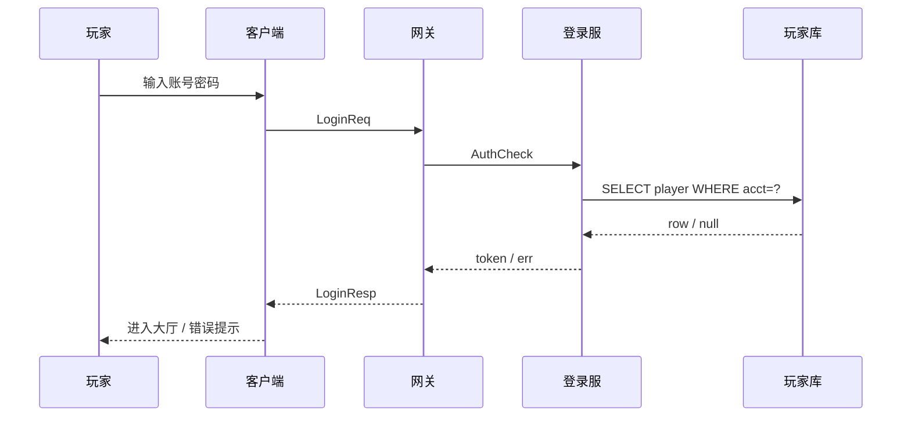
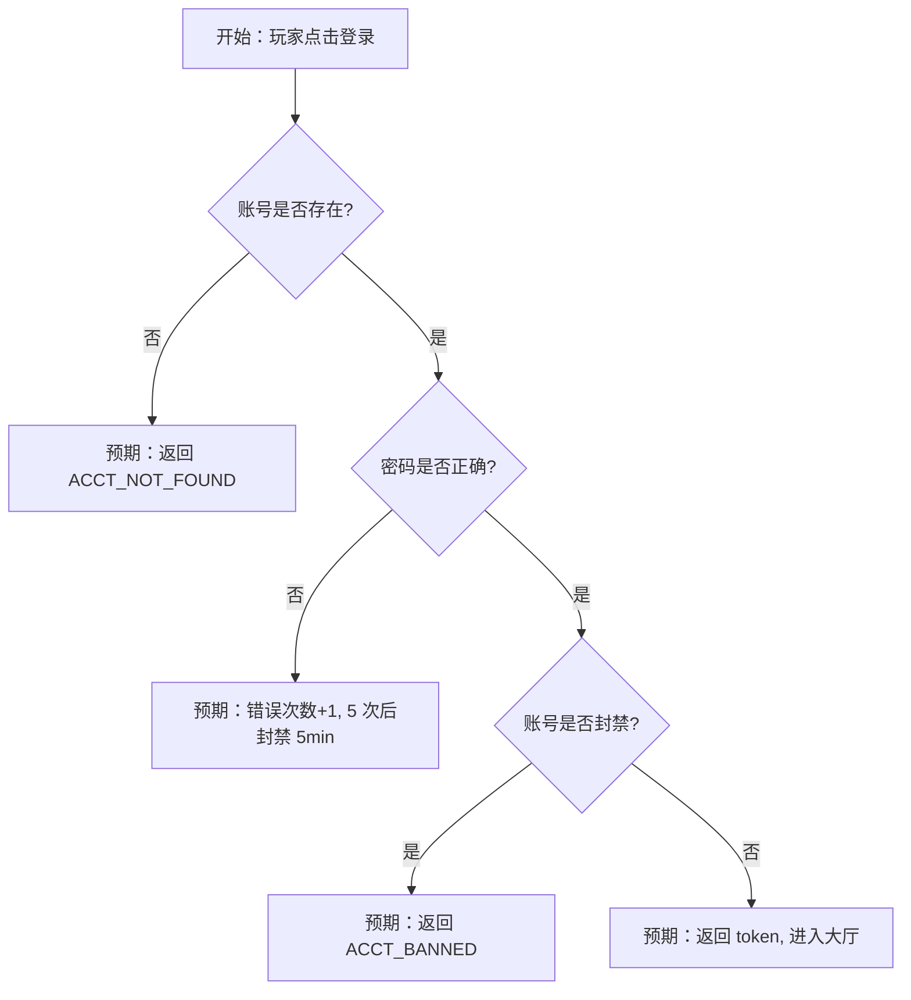
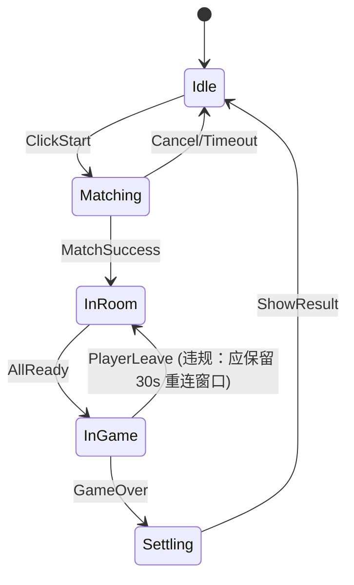

## 🎮 游戏工程测试用例设计 Skill

本 Skill 用于读取游戏工程代码，自动分析工程结构，并从专业游戏测试角度生成完整的测试用例设计方案。

---

## 运行逻辑

### 第一步：获取工程路径

向用户确认游戏工程的根目录路径。如果用户已提供，直接使用。

```
请提供游戏工程的根目录路径（本地路径或服务器路径均可）。
```

### 第二步：工程结构扫描

对游戏工程进行全面的目录结构扫描，识别项目类型和技术栈。

#### 2.1 识别项目类型

通过特征文件判断游戏引擎和语言：

| 特征文件/目录 | 项目类型 |
|---|---|
| `*.uproject`, `Source/` | Unreal Engine (C++) |
| `ProjectSettings/`, `Assets/`, `*.unity` | Unity (C#) |
| `project.godot` | Godot |
| `cocos2d/`, `CMakeLists.txt` | Cocos2d-x (C++) |
| `pom.xml`, `build.gradle` + 游戏特征包 | Java 游戏服务端 |
| `go.mod` + proto 文件 | Go 游戏服务端 |
| `requirements.txt` / `setup.py` + 游戏逻辑 | Python 游戏 |
| `package.json` + canvas/pixi/phaser | Web 游戏 (JS/TS) |
| `proto/`, `*.proto` | 含协议定义的游戏项目 |

#### 2.2 扫描关键目录

```bash
# Scan the project root directory structure
ls -la <project_root>/

# Recursively list directory tree (depth limited)
find <project_root> -maxdepth 3 -type d | head -100

# Identify source code files
find <project_root> -type f \( -name "*.cs" -o -name "*.cpp" -o -name "*.h" -o -name "*.java" -o -name "*.go" -o -name "*.py" -o -name "*.ts" -o -name "*.js" -o -name "*.lua" -o -name "*.proto" \) | head -200

# Look for config files
find <project_root> -type f \( -name "*.json" -o -name "*.yaml" -o -name "*.yml" -o -name "*.xml" -o -name "*.ini" -o -name "*.cfg" \) -not -path "*/node_modules/*" -not -path "*/.git/*" | head -100
```

#### 2.3 生成工程结构报告

输出格式：

```
📁 工程结构分析报告
├── 项目类型：[引擎/框架]
├── 主要语言：[语言列表]
├── 模块划分：
│   ├── 客户端模块：[列表]
│   ├── 服务端模块：[列表]
│   ├── 公共/协议模块：[列表]
│   └── 配置/资源模块：[列表]
├── 协议定义：[proto/json schema 位置]
├── 配置系统：[配置文件类型和位置]
└── 第三方依赖：[关键依赖列表]
```

### 第三步：深度代码分析

对各模块进行深度分析，提取测试关键信息。

#### 3.1 核心系统识别

重点扫描以下游戏核心系统：

| 系统类别 | 关键词/模式 | 测试重点 |
|---|---|---|
| 登录/认证 | `login`, `auth`, `token`, `session` | 认证流程、Token 安全 |
| 角色/玩家 | `player`, `character`, `role`, `avatar` | 属性计算、状态管理 |
| 背包/道具 | `bag`, `inventory`, `item`, `equip` | 增删改查、堆叠、上限 |
| 战斗系统 | `battle`, `combat`, `fight`, `damage` | 伤害计算、技能逻辑 |
| 经济系统 | `shop`, `trade`, `currency`, `gold`, `diamond` | 交易安全、货币溢出 |
| 任务系统 | `quest`, `task`, `mission` | 状态流转、条件判断 |
| 社交系统 | `friend`, `guild`, `chat`, `team` | 并发操作、消息同步 |
| 排行榜 | `rank`, `leaderboard`, `score` | 排序正确性、并发更新 |
| 匹配系统 | `match`, `matchmaking`, `queue` | 匹配公平性、超时处理 |
| 邮件系统 | `mail`, `message`, `notification` | 附件领取、过期清理 |
| 活动系统 | `activity`, `event`, `campaign` | 时间窗口、奖励发放 |
| 充值/支付 | `pay`, `recharge`, `purchase`, `order` | 支付安全、订单状态 |
| GM 工具 | `gm`, `admin`, `debug`, `cheat` | 权限控制、指令安全 |
| 数据持久化 | `save`, `db`, `redis`, `mysql`, `mongo` | 数据一致性、缓存同步 |

#### 3.2 协议分析

```bash
# Find protocol definition files
find <project_root> -type f -name "*.proto" -o -name "*protocol*" -o -name "*msg*" -o -name "*packet*" | head -50

# Analyze protocol structure
grep -rn "message\|service\|rpc\|enum" <proto_files> | head -100

# Find protocol handler/dispatcher
grep -rn "handler\|dispatch\|route\|register.*msg\|register.*cmd" <source_dir> --include="*.go" --include="*.java" --include="*.py" --include="*.cs" --include="*.cpp" --include="*.ts" | head -100
```

#### 3.3 安全敏感点扫描

```bash
# SQL injection risks
grep -rn "fmt.Sprintf.*SELECT\|fmt.Sprintf.*INSERT\|fmt.Sprintf.*UPDATE\|string.Format.*SELECT\|exec(\|eval(\|raw_input\|input()" <source_dir> | head -50

# Hardcoded secrets
grep -rn "password\s*=\|secret\s*=\|api_key\s*=\|token\s*=" <source_dir> --include="*.go" --include="*.java" --include="*.py" --include="*.cs" --include="*.ts" --include="*.js" | head -50

# Unsafe deserialization
grep -rn "pickle.loads\|yaml.load\|eval\|unserialize\|ObjectInputStream\|BinaryFormatter" <source_dir> | head -50

# Integer overflow risks in game logic
grep -rn "int32\|int16\|uint16\|short\|MaxValue\|overflow" <source_dir> --include="*.go" --include="*.java" --include="*.cs" --include="*.cpp" | head -50

# Rate limiting / anti-cheat
grep -rn "rate.limit\|throttle\|anti.cheat\|speed.hack\|frequency" <source_dir> | head -50
```

#### 3.4 工程时序图 / 流程图（**必出物**，先画图再设计用例）

> 在进入「第四步：生成测试用例方案」之前，**必须**先输出至少 3 张工程级 mermaid 图，把"我已经看懂了这块代码"显性化。设计用例时直接对着图列点，避免漏关键链路。
>
> 语法和自检规则统一遵循 `mermaid-diagram` skill。

**至少输出以下 3 张图（根据项目实际，命名可调整）**：

##### 1) 关键链路时序图（`sequenceDiagram`）

覆盖项目"最高频 / 最高风险"的端到端链路。每张图至少 5 个步骤、3 个 participant。



##### 2) 测试场景流程图（`flowchart TD`）

把"用例怎么测、走哪条分支、什么算 pass"用流程图表达。一图覆盖一条业务链路 + 异常分叉。



##### 3)（可选但强烈建议）状态机图（`stateDiagram-v2`）

游戏对象生命周期（角色 / 战斗 / 任务 / 房间），用状态机说明合法/非法转换：



##### 输出要求（提交前自检）

- [ ] 至少 1 张 sequenceDiagram + 1 张 flowchart TD（必有）
- [ ] 每张图节点数 ≥ 5；不出现孤立节点
- [ ] 每张图前面用一段中文短句说明"这张图对应的测试目标"
- [ ] mermaid 语法本地 dry-run 通过（用 mermaid CLI 或 mmdc，否则贴到 Hub 编辑器试渲染）
- [ ] 状态机图必须标注"非法转换"或"应被服务端拒绝的转换"

##### 这些图怎么帮你设计用例

| 图类型 | 用例对应关系 |
|---|---|
| sequenceDiagram | 每一步消息 → 一条**协议测试用例**（缺字段 / 字段越界 / 重放 / 乱序） |
| flowchart 的每个分支 | 一条**业务功能用例**（含正向 + 异常分叉） |
| stateDiagram 的每条非法转换 | 一条**安全/容错用例**（应被服务端拒绝） |

---

### 第四步：生成测试用例方案

基于分析结果（**含上一步产出的 3 张工程图**），按以下四大维度生成完整的测试用例设计方案。

---

## 📋 测试用例设计方案模板

### 一、代码单元测试（Unit Test）

针对每个核心模块的关键函数/方法，设计单元测试用例。

#### 输出格式

```
模块：[模块名]
文件：[源文件路径]
函数：[函数签名]

| 用例ID | 用例名称 | 输入数据 | 预期输出 | 测试类型 | 优先级 |
|--------|---------|---------|---------|---------|-------|
| UT-XXX-001 | 正常输入测试 | ... | ... | 正向 | P0 |
| UT-XXX-002 | 边界值测试 | ... | ... | 边界 | P0 |
| UT-XXX-003 | 异常输入测试 | ... | ... | 异常 | P1 |
| UT-XXX-004 | 空值/null测试 | ... | ... | 异常 | P1 |
```

#### 重点覆盖

- **数值计算类**：伤害公式、属性加成、经验计算、货币计算
  - 正常值、边界值（0、负数、最大值）、溢出值
- **状态机类**：角色状态、任务状态、战斗状态
  - 合法状态转换、非法状态转换、并发状态变更
- **集合操作类**：背包操作、好友列表、排行榜
  - 空集合、满容量、重复操作、并发操作
- **时间相关类**：CD 冷却、活动时间窗口、定时任务
  - 正常时间、跨天/跨周、时区问题、时间回拨
- **随机算法类**：掉落概率、抽卡、随机事件
  - 概率分布验证、种子一致性、边界概率（0%/100%）

### 二、协议逻辑测试（Protocol Test）

针对客户端-服务端通信协议，设计协议层面的测试用例。

#### 输出格式

```
协议：[协议名/消息ID]
方向：[C2S / S2C / 双向]
关联模块：[业务模块]

| 用例ID | 用例名称 | 请求内容 | 预期响应 | 异常场景 | 优先级 |
|--------|---------|---------|---------|---------|-------|
| PT-XXX-001 | 正常请求 | ... | ... | - | P0 |
| PT-XXX-002 | 字段缺失 | ... | 错误码 | 必填字段为空 | P0 |
| PT-XXX-003 | 字段越界 | ... | 错误码 | 超出范围 | P1 |
| PT-XXX-004 | 重复请求 | ... | 幂等/拒绝 | 快速重发 | P1 |
| PT-XXX-005 | 乱序请求 | ... | ... | 跳过前置步骤 | P1 |
```

#### 重点覆盖

- **协议合规性**：必填字段校验、字段类型校验、字段范围校验
- **协议顺序性**：前置条件未满足时发送后续协议
- **协议幂等性**：同一请求重复发送的处理
- **协议频率**：高频发送同一协议（防刷）
- **协议篡改**：修改协议中的关键字段（如 player_id、item_id、数量）
- **协议回放**：截获并重放历史协议包
- **大包/畸形包**：超大字段、特殊字符、非法编码
- **断线重连**：断线后协议状态恢复、消息补发

### 三、安全漏洞测试（Security Test）

从游戏安全角度，设计针对性的安全测试用例。

#### 输出格式

```
风险类别：[类别名]
风险等级：🔴 高 / 🟡 中 / 🟢 低
关联代码：[文件:行号]

| 用例ID | 漏洞类型 | 攻击向量 | 测试步骤 | 预期防御 | 优先级 |
|--------|---------|---------|---------|---------|-------|
| ST-XXX-001 | ... | ... | ... | ... | P0 |
```

#### 重点覆盖

**3.1 客户端信任漏洞**
- 客户端发送的数值是否被服务端校验（伤害值、移动速度、坐标）
- 客户端是否能伪造其他玩家的操作
- 客户端时间戳是否被信任

**3.2 数值溢出/下溢**
- 货币/道具数量的整数溢出（int32 → 负数）
- 负数购买（花费 -100 金币 = 获得 100 金币？）
- 超大数值运算导致的精度丢失

**3.3 竞态条件（Race Condition）**
- 同时使用同一道具（双花攻击）
- 并发领取同一奖励
- 同时进行交易和使用道具
- 多设备同时登录操作

**3.4 逻辑漏洞**
- 跳过前置条件直接完成任务
- 利用时间差刷活动奖励
- 通过异常流程获取未解锁内容
- GM 指令权限绕过

**3.5 注入攻击**
- 聊天内容 XSS/脚本注入
- 角色名/公会名特殊字符注入
- SQL 注入（如果存在拼接查询）
- 命令注入（GM 指令系统）

**3.6 协议安全**
- 协议是否加密/签名
- 是否可以伪造/篡改协议包
- 是否存在协议重放攻击风险
- Token/Session 是否可被劫持

**3.7 资源安全**
- 内存泄漏（长时间运行）
- 连接泄漏（WebSocket/TCP 未正确关闭）
- 恶意大量创建实体导致服务端 OOM
- 文件上传漏洞（如果有头像/截图上传）

### 四、业务功能测试（Functional Test）

从玩家视角出发，设计端到端的业务功能测试用例。

#### 输出格式

```
功能模块：[模块名]
前置条件：[测试前需要的状态/数据]

| 用例ID | 用例名称 | 操作步骤 | 预期结果 | 优先级 | 备注 |
|--------|---------|---------|---------|-------|------|
| FT-XXX-001 | ... | 1. ... 2. ... 3. ... | ... | P0 | ... |
```

#### 重点覆盖

**4.1 核心玩法流程**
- 新手引导完整流程
- 主线/支线任务全流程
- 核心战斗/玩法循环
- 日常/周常活动流程

**4.2 经济系统**
- 货币获取与消耗的所有路径
- 商店购买（单买、批量、满仓购买）
- 交易系统（上架、购买、取消、过期）
- 充值与发货流程

**4.3 社交系统**
- 好友添加/删除/屏蔽
- 公会创建/加入/退出/解散
- 聊天（私聊/群聊/世界频道）
- 组队/匹配

**4.4 数据持久化**
- 正常存档与读档
- 异常断线后数据恢复
- 跨服/跨区数据同步
- 版本更新后数据兼容

**4.5 异常与容错**
- 网络断线重连
- 服务端重启后客户端恢复
- 操作过程中强制退出
- 多端登录冲突处理

**4.6 性能相关功能**
- 大量玩家同屏表现
- 大量道具/邮件的加载
- 长时间在线稳定性
- 跨天/跨周结算

---

## 第五步：输出最终方案

将以上四大维度的测试用例整合为一份完整的测试方案文档，格式如下：

```
# 🎮 [项目名] 测试用例设计方案

## 一、工程分析概要
- 项目类型与技术栈
- 模块架构图
- 核心系统清单

## 二、代码单元测试用例
（按模块分组，每个模块列出关键函数的测试用例表）

## 三、协议逻辑测试用例
（按协议分组，每个协议列出正常/异常/安全测试用例表）

## 四、安全漏洞测试用例
（按风险类别分组，标注风险等级和关联代码位置）

## 五、业务功能测试用例
（按功能模块分组，包含完整操作步骤和预期结果）

## 六、测试优先级矩阵
（P0/P1/P2 用例统计和执行建议）

## 七、测试工具与环境建议
（推荐的测试框架、Mock 工具、压测工具等）
```

---

## ⚠️ 注意事项

1. **分析深度**：不要只看目录结构，必须深入阅读核心模块的源代码，理解业务逻辑后再设计用例
2. **用例可执行性**：每个用例必须包含具体的输入数据和预期输出，而非笼统描述
3. **优先级划分**：
   - **P0**：核心玩法、支付安全、数据一致性 — 必须测试
   - **P1**：重要功能、常见异常场景 — 应该测试
   - **P2**：边缘场景、低频功能 — 建议测试
4. **安全意识**：游戏项目的安全测试尤为重要，客户端不可信是基本原则
5. **协议测试**：如果项目有 proto 文件，必须逐个协议分析，不能遗漏
6. **输出格式**：最终方案使用表格形式，方便导入 TAPD 或其他测试管理平台
7. **持续更新**：如果用户提供了更多上下文（如需求文档、策划案），应据此补充和细化用例

---

## 🔗 闭环：把工程图沉淀到 Hub 架构快照（推荐）

第 3.4 步产出的 3 张图不要只放在用例文档里，**强烈建议同步投递到 Hub 工程分析中心的 architecture API**，让同一模块下次再设计用例时可以直接复用。

### 为什么要做这步？

- 同一模块第二次出用例时，先 `GET /api/v1/engineering/baselines/<bid>/architecture?target_module=登录` 看一眼上次画的图，省 30 分钟
- 全项目逐渐沉淀出"测试视角架构图谱"（与 Dev 视角、产品视角的图互补）
- 评审时直接打开 Hub 链接给评委看图，比贴在 Word 里强 10 倍

### 投递方式（Python 示例，Agent 直接调）

```python
import os, requests

HUB = "http://clawteam.woa.com:18800"
H = {"Authorization": f"Bearer {os.environ['HUB_API_TOKEN']}",
     "Content-Type": "application/json"}

def push_module_arch_for_testcase(baseline_id, module_name, content_md, summary):
    """把第 3.4 步的图打包成单模块架构快照投到 Hub。"""
    payload = {
        "scope": "module",
        "target_module": module_name,
        "title": f"[测试视角] {module_name} 架构与时序",
        "summary": summary,
        "content_md": content_md,           # 含 3 张 mermaid 的 markdown
        "structured": {},
        "source_type": "agent",
    }
    r = requests.post(
        f"{HUB}/api/v1/engineering/baselines/{baseline_id}/architecture",
        headers=H, json=payload, timeout=30)
    r.raise_for_status()
    data = r.json()
    print(f"✅ 已沉淀架构快照 #{data['id']}（LRU 删除 {data.get('lru_trimmed',0)} 条）")
    return data["id"]
```

### 何时调用

- 用户提供 `baseline_id` 时（说明该项目已在 Hub 工程分析中心建过基线），**自动调**
- 用户没提供时，**只在用例文档里展示 3 张图**，不强行要求

### 与 `engineering-analysis` skill 的关系

- **本 skill (game-test-design)**：站在测试视角画图 + 出用例
- **engineering-analysis skill (#139)**：架构快照的实际数据源（既接受本 skill 投递，也接受全工程级别的"开发视角"分析）
- 两者**互补不重复**，前者侧重"用例怎么落"，后者侧重"工程整体长啥样"

> 详见 `engineering-analysis` SKILL §9 架构分析协议。