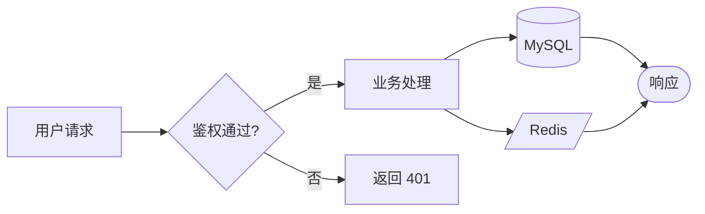
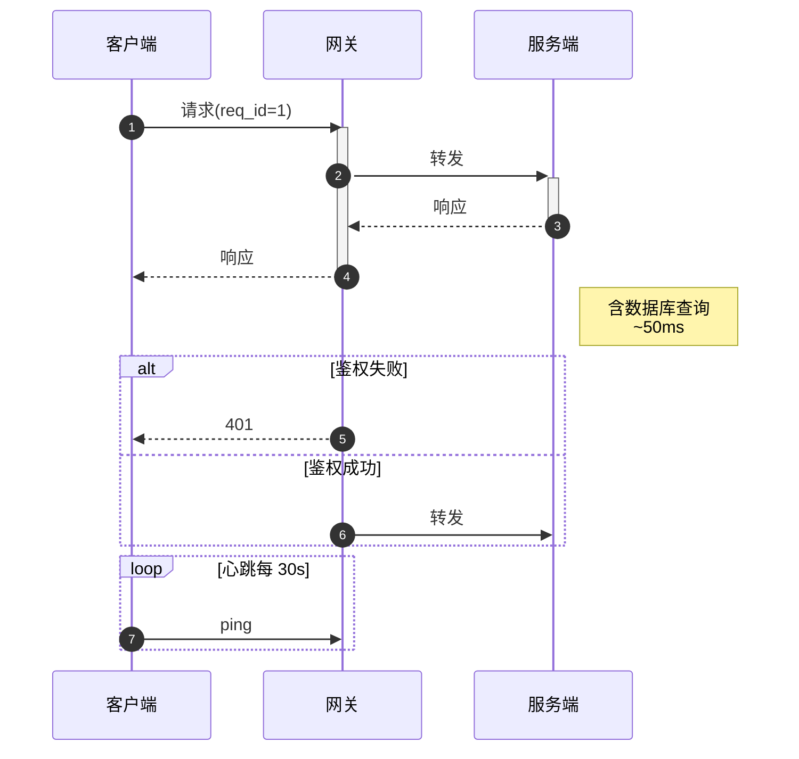
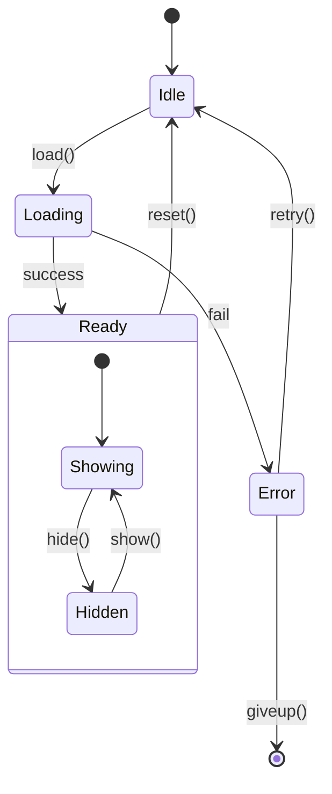
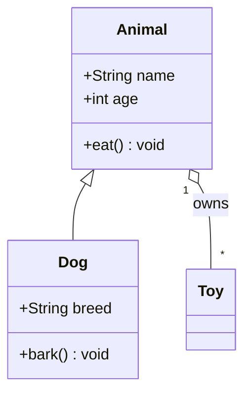
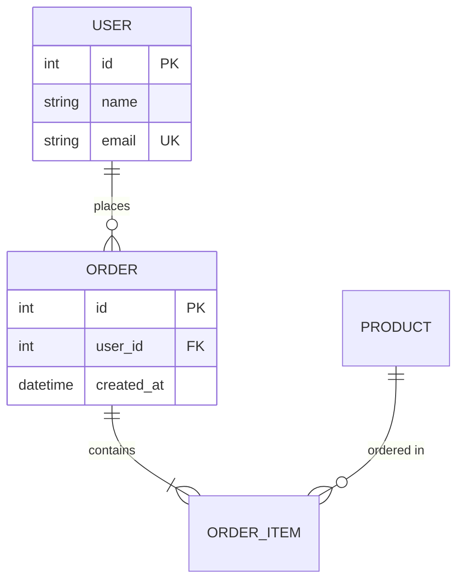
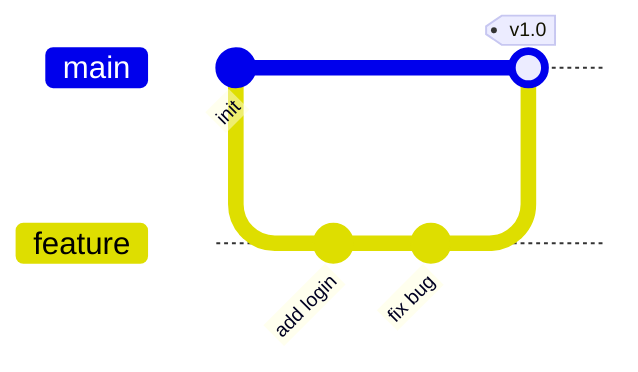
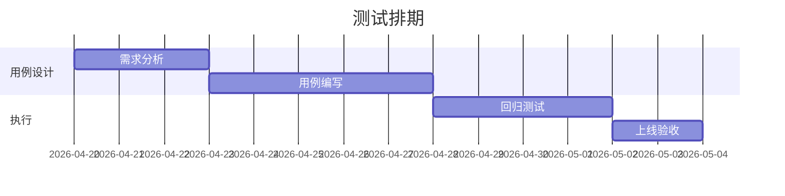
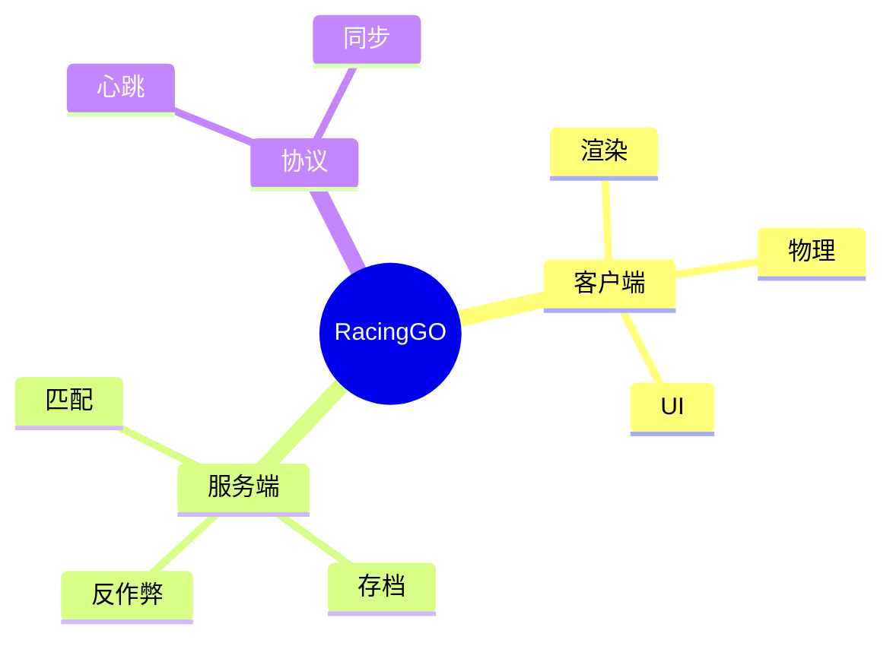

## 🧩 Mermaid 图表工具 Skill

本 skill 是 OpenClaw 体系内**唯一指定**的 mermaid 写图规范与工具集。任何 skill 在产出 markdown 报告需要嵌入图时，**必须**遵循本 skill 的语法子集与自检清单。

> **为什么单独抽一个 skill？**
> Hub 前端用 `mermaid@10` 渲染（见 `engineering.html` 的 `renderMarkdownWithMermaid`），任何语法不兼容（如 v9 才支持的写法、`::` 注释、未闭合 quote）都会导致整个面板 crash。集中规范一次，所有写图的 skill 复用。

---

## 一、Hub 端渲染环境（Agent 必须知道）

| 项 | 值 |
|---|---|
| 渲染库 | `mermaid@10`（CDN: `https://cdn.jsdelivr.net/npm/mermaid@10/dist/mermaid.min.js`） |
| 主题 | `default`，`securityLevel: 'loose'`（允许 HTML 标签） |
| Markdown 解析 | `marked@15.0.7` |
| 容错策略 | 单图渲染失败时，Hub 会用 `<pre>` 显示原始 mermaid 源码 + 错误提示，**不会让整个页面 crash**（已加 try/catch） |
| 长度限制 | `content_md` 单条 ≤ 60KB（实际数据库列是 `LONGTEXT`，但前端渲染太长会卡） |

---

## 二、八大常用图语法子集（**只用这 8 种**，其它图都用前端兼容性测过，但风险自担）

### 1) `flowchart` — 流程图 / 模块依赖图



**方向**：`TD`(top-down)/`LR`(left-right)/`RL`/`BT`。形状速查：
- `[文本]` 矩形 / `(文本)` 圆角 / `((文本))` 圆形
- `{文本}` 菱形（决策） / `[/文本/]` 平行四边形 / `[(文本)]` 圆柱（数据库）
- `>文本]` 旗帜 / `[[文本]]` 子流程 / `[\文本\]` 反梯形

**线**：`-->`(箭头) / `---`(实线) / `-.->`(虚线箭头) / `==>`(粗线箭头) / `--文字-->` / `-- 文字 -->`

### 2) `sequenceDiagram` — 时序图（接口/链路/通信必出）



**箭头语义**：
- `->>` 实心箭头同步消息 / `-->>` 虚线箭头响应
- `->` 实线无箭头 / `--x` 错误终止 / `--)` 异步消息
- `+`/`-` 激活/释放 lifeline

### 3) `stateDiagram-v2` — 状态机（**注意必须 v2**，老版语法 Hub 渲染不出来）



### 4) `classDiagram` — 类图



关系：`<|--`继承 / `*--`组合 / `o--`聚合 / `-->`关联 / `..>`依赖 / `..|>`实现

### 5) `erDiagram` — ER 图（数据库设计）



基数：`||--||`一对一 / `||--o{`一对多 / `}o--o{`多对多

### 6) `gitGraph` — Git 提交流（适合讲分支策略）



### 7) `gantt` — 甘特图（适合讲排期）



### 8) `mindmap` — 思维导图（mermaid v10+ 才支持，Hub 已升）



---

## 三、提交前自检清单（**每张图都过一遍**）

- [ ] 第一行图类型声明正确（`flowchart LR` / `sequenceDiagram` / `stateDiagram-v2` 等）
- [ ] **`stateDiagram` 必须写 `stateDiagram-v2`**（老语法 Hub 不渲染）
- [ ] 所有节点 ID 都是 ASCII，**不要用中文 ID**（中文做 label 没问题，做 ID 部分浏览器会挂）
  - ❌ `开始 --> 结束`  
  - ✅ `A[开始] --> B[结束]`
- [ ] 节点 label 含特殊字符（`()` `:` `<` `>` `&`）必须用 `"` 包起来
  - ❌ `A[处理(异步)]`  
  - ✅ `A["处理(异步)"]`
- [ ] 节点 label 内换行用 `<br/>`，**不要用 `\n`**
- [ ] sequenceDiagram 的 participant 别名（`as` 后面）可以用中文，但 ID 用 ASCII
- [ ] flowchart 不出现孤立节点（除非刻意展示）
- [ ] 一张图节点数 ≤ 30；超过就拆图
- [ ] **整个 markdown 中所有 mermaid 代码块都过一次本地 dry-run**（推荐 `mmdc` CLI 或贴到 https://mermaid.live 试一遍）
- [ ] 整个 markdown 总长 ≤ 60KB

---

## 四、常见踩坑速查（按出现频次排序）

| # | 报错 / 现象 | 原因 | 修复 |
|---|---|---|---|
| 1 | `Parse error on line X: Expecting 'NEWLINE'...` | label 含 `(` `)` `:` 没 quote | 用 `"..."` 包 label |
| 2 | sequenceDiagram 不显示箭头 | participant 写错 / 引用了未声明的 participant | 先声明再用 |
| 3 | stateDiagram 显示空白 | 用了老 v1 语法 | 第一行改 `stateDiagram-v2` |
| 4 | 中文节点跳过不渲染 | 把中文当 ID | 改 `A[中文 label]` |
| 5 | 整个图渲染消失 | 上一张图 crash 拖累（旧版 mermaid） | Hub 已加 try/catch，新现象一般是浏览器缓存 / CDN 失败 |
| 6 | flowchart 出现意外的边 | 漏空格：`A-->B[c]` 后紧接 `B-->C` 中间没换行 | 每条边独占一行 |
| 7 | classDiagram 字段不显示 | `+` `-` `#` 后没空格 | `+name String`（中间一个空格） |
| 8 | gantt 日期偏移 | dateFormat 与实际写法不匹配 | 显式 `dateFormat YYYY-MM-DD` |

---

## 五、渲染失败回退策略（Agent 端约定）

如果 Agent 在本地用 `mmdc` 或 web 试渲染时**任意一张图**报错，**不要把图直接发出去**，按下面三档处理：

1. **可修复**（语法错）→ 改完再发
2. **无法定位错**（mermaid 报错信息看不懂）→ 把这张图退化成 ASCII 框图（用 `+--+`、`-->`），其他正常图正常发，并在文档里标注 "图 N 因 mermaid 语法限制改为 ASCII"
3. **图过大节点 > 50** → 拆成 2-3 张子图，每张专注一个子链路

> Hub 前端已经加了 try/catch，单图失败不会 crash 全屏，但**会显示一个红色错误框**，影响阅读，应避免。

---

## 六、与 Hub `engineering-analysis` (#139) 的对接

任何 skill 产出工程级别 mermaid 图时，**推荐**直接调 Hub architecture API 沉淀为快照（按 `baseline_id` LRU 保留 10 个）。

### API 速查（详见 `engineering-analysis` SKILL §9）

| 方法 | URL | 说明 |
|---|---|---|
| GET | `/api/v1/engineering/baselines/<bid>/architecture?scope=&target_module=` | 列表 |
| GET | `/api/v1/engineering/architecture/<sid>` | 详情 |
| POST | `/api/v1/engineering/baselines/<bid>/architecture` | 新建（投递） |
| PUT | `/api/v1/engineering/architecture/<sid>` | 更新（限提交人/admin） |
| DELETE | `/api/v1/engineering/architecture/<sid>` | 删除（限提交人/admin） |

### 投递模板（拷走改 baseline_id 即可）

```python
import os, requests

HUB = os.environ.get("OPENCLAW_HUB", "http://your-hub-host:8088")
H = {"Authorization": f"Bearer {os.environ['HUB_API_TOKEN']}",
     "Content-Type": "application/json"}

def publish_diagrams_as_arch(baseline_id, *, scope, target_module, title, summary, content_md, structured=None):
    """
    把一组 mermaid 图打包投到 Hub 架构快照。
      scope='full'   → 全工程总览（target_module 必须为 ''）
      scope='module' → 单模块深度（target_module 必填，如 '登录'/'网络'/'匹配'）
    """
    assert scope in ("full", "module")
    if scope == "full":
        target_module = ""
    else:
        assert target_module, "scope=module 时 target_module 必填"
    assert len(content_md) <= 60000, f"content_md 太长（{len(content_md)} > 60000），请拆图"

    payload = {
        "scope": scope,
        "target_module": target_module,
        "title": title,
        "summary": summary,
        "content_md": content_md,
        "structured": structured or {},
        "source_type": "agent",
    }
    r = requests.post(
        f"{HUB}/api/v1/engineering/baselines/{baseline_id}/architecture",
        headers=H, json=payload, timeout=30)
    r.raise_for_status()
    data = r.json()
    print(f"✅ 架构快照 #{data['id']} 已沉淀（LRU 删除 {data.get('lru_trimmed', 0)} 条）")
    return data["id"]
```

---

## 七、复用本 skill 的 skill 清单（保持同步）

下列 skill 在画图时**必须**引用本 skill 的语法子集与自检清单：

- `game-test-design` (#127)：测试视角的工程时序图 / 流程图
- `client-engineering-test-design` (#133)：RacingGO 客户端时序图 / 流程图 / 状态机
- `engineering-analysis` (#139)：开发视角的架构图 / 时序图 / 流程图

如果新增了产出图的 skill，请在该 skill 顶部加一句：
> 本 skill 的 mermaid 图表语法和自检清单遵循 `mermaid-diagram` skill。

---

**技能版本**: v1.0  
**生效日期**: 2026-04-23  
**维护**: OpenClaw 平台组  
**说明**: mermaid 通用工具 skill，被 #127 / #133 / #139 等多个 skill 引用
