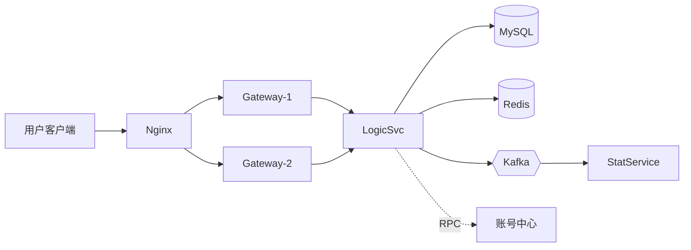
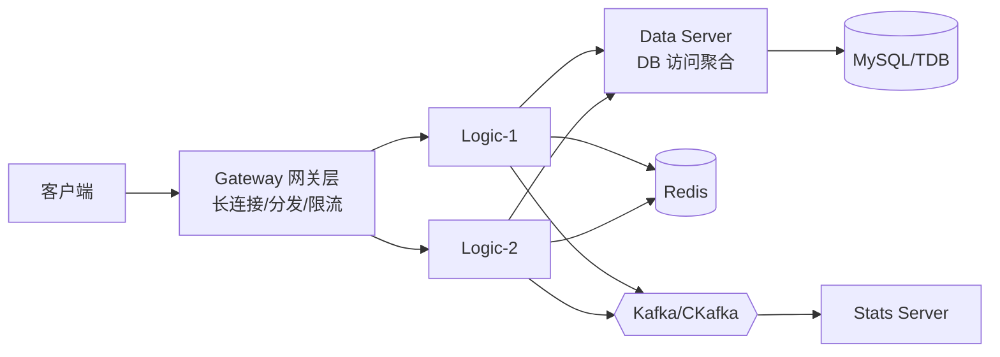
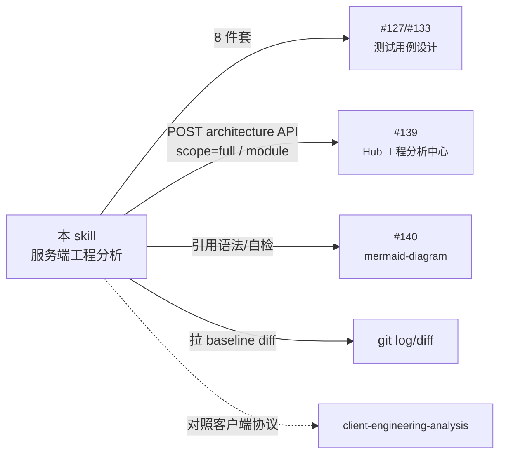

## 🖧 服务端工程分析 Skill

本 skill 站在**测试视角**对游戏/应用服务端工程做**系统化、可复核**的分析，最终交付物作为后续"协议测试用例 / 压测方案 / 故障演练方案"的**前置输入**。

> **目标读者**：OpenClaw Agent
> **使用时机**：第一次接触一个服务端工程、上线前 baseline 评估、压测前
> **不适用**：纯客户端工程（请用 `client-engineering-analysis` skill）

---

## 一、定位与边界

| 项 | 说明 |
|---|---|
| **是什么** | 服务端工程的"工程考古" + "拓扑/数据流可视化" + "测试关注点提炼" |
| **不是什么** | ❌ 不是开发者视角的架构设计文档（不评判好坏，只描述事实） |
| | ❌ 不是 SRE 的运维手册（只标注"测试 / 监控关注点"，不做容灾方案） |
| | ❌ 不是 DBA 的库表设计文档（只列表名 / 用途 / 关键字段，不分析索引）|
| **依赖 skill** | `mermaid-diagram` (#140) — 所有图表语法/自检遵循此 skill |
| **下游 skill** | `client-engineering-test-design` (#133) / `game-test-design` (#127) 的服务端协议章节、未来的 `server-load-testing-design` |
| **下游 Hub 模块** | `engineering-analysis` (#139) — 输出可直接 POST 到 architecture API 沉淀 |

---

## 二、铁律（先立规矩，再做事）

> 这 9 条铁律 **每一条都不可妥协**。任一违反 → 输出物作废重做。

| # | 铁律 | 反例（禁止）| 正例（必须）|
|---|---|---|---|
| 1 | **先扫后说** | "应该有 Redis"（凭印象）| "见 `cmd/gameserver/main.go:35` 调用 `redis.NewClient`，连接信息从 `etc/conf.yaml redis.addr` 读" |
| 2 | **每个结论都有源码引用** | "服务端有反作弊" | `cheat_detect/handler.go:1-200`，注册在 `route_init.go:67` |
| 3 | **不知道就标 ❓ 待确认** | 凭"行业惯例"推断 | "❓ 未找到结算落库逻辑，请向 @author 确认是异步队列还是同步事务" |
| 4 | **数据流双向验证** | 只看协议 handler | 看 handler **+** DB 落库点 **+** 缓存写入点 **+** MQ 投递点 |
| 5 | **配置驱动逻辑必读配置** | "限流 100 QPS" | 实际写在 `etc/conf.yaml ratelimit.qps`，dump 出来读，标"环境差异：dev=100, prod=10000" |
| 6 | **第三方依赖只标接入点** | 把 GORM 当业务模块详细分析 | "外部依赖：GORM v1.25.x，统一封装在 `pkg/db/`，业务侧不直接 import" |
| 7 | **时序图来自代码静态读取** | 凭策划文档画 | 沿 handler → service → dao 一行行追，不行就标 ❓ |
| 8 | **mermaid 必须能渲染** | 中文 ID | 遵循 #140 mermaid-diagram skill |
| 9 | **环境差异必须显式区分** | "RPC 用 gRPC" | "dev/prod 用 gRPC；test 环境降级为 HTTP（见 `conf/test.yaml protocol`）" |

---

## 三、分析顺序（**严格 12 步**，不要跳）

### Step 1. 项目档案（10 分钟）

| 项 | 怎么查 |
|---|---|
| 主语言/框架 | Go: `go.mod` + `gin/echo/iris/kratos/go-zero/grpc-go`；Java: `pom.xml`/`build.gradle` + `spring-boot/dubbo/grpc`；C++: `CMakeLists.txt` + `proto/skynet/gameserver`；Node: `package.json` + `express/koa/nestjs`；Python: `requirements.txt` + `flask/fastapi/django`；Rust: `Cargo.toml` |
| 服务架构 | 单体 / 微服务 / 网关+逻辑+DB / 游戏典型 GS-Login-DB / Mesh |
| 进程模型 | 单进程多 goroutine / 多进程 fork / 容器 |
| 部署形态 | Docker Compose / K8s / 物理机 / 蓝鲸 / 123 |
| 配置中心 | 本地 yaml / Apollo / Nacos / Consul / etcd |
| Git baseline | `git log -1 --pretty='%h %ad %s' --date=short` |
| 监控/日志 | Prometheus / Grafana / ELK / 自研 / Bugly Server |

**输出 1.1**：`项目档案表`

### Step 2. 进程/服务清单（**最重要的一步**，30 分钟）

服务端的"模块"边界是**进程/服务**，不是目录。先把所有可独立启动的进程找出来。

| 怎么找 | 工具 |
|---|---|
| Go | `find . -name "main.go" \| head -20`；通常 `cmd/<svc>/main.go` 一个对应一个进程 |
| Java | `pom.xml` 的 `<modules>` 子模块 + `*Application.java` |
| C++ | `CMakeLists.txt` 中的 `add_executable` 数量 |
| 容器化 | `docker-compose.yml` 的 services / `k8s/*.yaml` 的 Deployment |
| Procfile / supervisor 配置 | `Procfile` / `supervisor/*.conf` |

**输出 2.1**：`进程/服务清单表`

| 服务名 | 入口文件 | 监听端口 | 协议 | 副本数 | 上下游依赖 | 状态 |
|---|---|---|---|---|---|---|
| gateway | `cmd/gateway/main.go` | 8080 (HTTP) | REST + WS | 3 | logic, redis | ✅ |
| logic | `cmd/logic/main.go` | 9000 (gRPC) | gRPC | 2 | mysql, redis, mq | ✅ |
| ... | ... | ... | ... | ... | ... | ... |

### Step 3. 部署拓扑（30 分钟）

把"用户请求 → 网关 → 业务进程 → 中间件"的物理拓扑画出来。

- 反向代理 / 网关：Nginx / Traefik / Envoy / Kong
- 服务发现：Consul / etcd / Nacos / DNS
- 中间件：MySQL / Redis / Kafka / RabbitMQ / Pulsar / TDSQL / CKafka / TDB
- 对外集成：登录中心 / 充值中心 / TAPD / 自研账号

**输出 3.1**：`部署拓扑图`（mermaid `flowchart LR`）



### Step 4. 入口与请求路由表（45 分钟）

把"一个 HTTP/RPC 请求进来 → 路由到哪个 handler"的映射全部列清楚。

| 框架 | 路由位置 |
|---|---|
| Gin | `r.POST("/x", handler)` 全部 grep |
| Echo | `e.GET("/x", handler)` |
| Spring | `@RequestMapping`/`@GetMapping` 注解扫描 |
| gRPC | `*.proto` 的 `service` 块 + `Register*Server` 调用 |
| 自研派发器（游戏服）| `RegisterMsgHandler(MSG_LOGIN, OnLogin)` 之类 |

**输出 4.1**：`HTTP / WS 路由表`（path / method / handler 文件:行号 / 鉴权 / 限流 / 关联模块）
**输出 4.2**：`RPC 接口表`（同上结构）
**输出 4.3**：`游戏协议消息表`（msg id / 名称 / 方向 / handler / 鉴权 / 状态）

### Step 5. 中间件依赖（30 分钟）

#### 5.1 数据库

| 项 | 怎么查 |
|---|---|
| 库表清单 | `find . -name "*.sql"`；GORM model 文件 `grep -rn "gorm.Model\|TableName"`；Java JPA `@Entity`；Mybatis `*Mapper.xml`；建表 DDL 脚本 |
| 库连接 | `grep -rEn "(mysql|postgres|sqlite|mongo)://" --include='*.go' --include='*.yaml'` |
| 事务边界 | `grep -rn "Begin()\|Transaction\|@Transactional"` |
| 慢查询风险 | 看是否有"全表扫描"的 SQL（`SELECT * FROM huge_table` 无 WHERE）|

**输出 5.1**：`数据库表清单`（库 / 表 / 用途 / 关键字段 / 写入服务 / 读取服务）

#### 5.2 缓存

| 项 | 怎么查 |
|---|---|
| Key 格式 | `grep -rEn 'fmt\.Sprintf\("[a-z_]+:.+"' --include='*.go'` |
| TTL | `grep -rn "SetEx\|Expire\|EXPIRE"` |
| 一致性策略 | Cache-Aside / Write-Through / Write-Behind 看代码注释 |

**输出 5.2**：`缓存 Key 清单`（key 模板 / TTL / 模块 / 击穿/雪崩防护）

#### 5.3 消息队列 / 流

| 项 | 怎么查 |
|---|---|
| Topic 清单 | `grep -rEn "Subscribe\|Publish\|Send.*Topic"` |
| 消费者清单 | 同上 + worker 进程入口 |

**输出 5.3**：`MQ Topic 清单`（topic / 生产者 / 消费者 / 顺序性 / 幂等性）

### Step 6. 定时任务 / 后台 worker（20 分钟）

> 服务端的"隐藏功能"，不画出来测试就漏。

- Go: `cron.New()` / `time.Tick` / `goroutine + ticker`
- Java: `@Scheduled` / Quartz
- 独立调度系统：xxl-job / Apollo Schedule

**输出 6.1**：`定时任务清单`（任务名 / 执行频率 / 入口 / 影响数据 / 失败重试策略）

### Step 7. 数据流图（**综合性输出**，60 分钟）

把"一条核心业务"全链路画出来。例如游戏服选 **登录** 或 **结算**，内容包含：

- 协议入口
- 鉴权 / 限流 / 黑名单
- 业务逻辑分支
- 数据库读写
- 缓存读写
- MQ 投递
- 对外 RPC 调用
- 错误码返回

**输出 7.1**：`核心链路时序图`（mermaid `sequenceDiagram`，至少 1 张，推荐 2-3 张）

### Step 8. 鉴权与安全（30 分钟）

| 项 | 怎么查 |
|---|---|
| 入口鉴权 | 中间件链：JWT / Session / Sign / Token |
| 鉴权失败处理 | 401 / 跳转登录 / 黑名单 |
| 频率限制 | redis-rate / sentinel / 自研令牌桶 |
| 敏感字段加密 | AES / RSA / 国密 |
| SQL 注入风险 | 拼接 SQL: `grep -rEn 'fmt\.Sprintf\(.*SELECT'` 应该为 0 |
| XSS / 命令注入 | 用户输入直接 exec/eval |

**输出 8.1**：`鉴权与安全代码索引表`

### Step 9. 日志 / 监控 / 告警（20 分钟）

- 日志库：zap / logrus / log4j / winston
- 日志等级 & 输出位置
- Metrics：Prometheus 指标（grep `prometheus.NewCounter` 等）
- Tracing：jaeger / zipkin / OTLP
- 告警：Grafana alert / Alertmanager / 企微机器人

**输出 9.1**：`日志/监控/告警速查表`

### Step 10. 部署与发布（15 分钟）

- 构建：Dockerfile / Jenkinsfile / GitLab CI
- 配置区分：dev/test/staging/prod
- 蓝绿 / 灰度 / 滚动
- 健康检查：`/healthz` / `/ready`

**输出 10.1**：`部署/发布要点表`

### Step 11. 对外集成（20 分钟）

> 服务端最容易被忽略的"边界面"

- 账号中心 / 鉴权中心
- 支付 / IAP 验证
- 客服 / IM
- 风控
- 第三方推送
- TAPD / Memos / OpenClaw 等内部系统

**输出 11.1**：`对外集成清单`（系统名 / 协议 / 接入点代码位置 / 兜底策略 / 联系人 ❓）

### Step 12. 风险与待确认清单（强制）

把全程所有 ❓ ⚠️ 💀 整理一份按优先级排序。**这一段是最值钱的产出**。

**输出 12.1**：`风险与待确认清单`

---

## 四、按语言 / 框架识别工程类型（速查）

| 特征文件 | 主语言 | 主流框架 | 备注 |
|---|---|---|---|
| `go.mod` + `kratos.go` | **Go (Kratos)** | gRPC + HTTP | B 站系，全栈微服务 |
| `go.mod` + `internal/handler/` + `*.api` | **Go (go-zero)** | API gateway 强 | 大厂常用 |
| `go.mod` + `gin.New()` | **Go (Gin)** | HTTP REST | 最经典轻量 |
| `pom.xml` + `spring-boot-starter-*` | **Java (Spring Boot)** | REST + JPA | 企业级 |
| `pom.xml` + `dubbo` 依赖 | **Java (Dubbo)** | RPC | 阿里系 |
| `package.json` + `nestjs` | **Node (NestJS)** | TS + 装饰器 | 类 Java 风格 |
| `package.json` + `koa/express` | **Node (Koa/Express)** | JS/TS | 轻量 |
| `requirements.txt` + `fastapi/flask` | **Python** | 异步/同步 | AI 服务居多 |
| `Cargo.toml` + `actix/axum` | **Rust** | 高性能 | 新兴 |
| `CMakeLists.txt` + 自研服务器 | **C++ 游戏服** | 自研 | 大型 MMO |
| `*.proto` 占主导 | **Protobuf 驱动** | 必有 RPC | 一般是大型项目 |

---

## 五、典型架构 typical 模块清单

> 下面是**经验值**，本工程没有的标"本工程未实现"，**不要凭经验编出来**。

### 5.1 通用 Web 后台（电商 / SaaS / 中后台）

| 模块 | 说明 |
|---|---|
| Gateway / API Aggregator | 统一入口、鉴权、限流、路由 |
| User / Auth | 注册 / 登录 / Session / Token / 找回 |
| Permission / RBAC | 角色 / 资源 / 权限 |
| Business 核心服务 | 与业务强相关，按领域切 |
| Notification | 邮件 / 短信 / WebHook / IM 推送 |
| File / Storage | OSS / S3 / COS |
| Audit / Log | 审计日志、操作日志 |
| Schedule / Worker | 定时任务、异步任务 |
| Search | ES / Algolia |
| Report / BI | 数据导出、报表 |
| Admin | 内部管理后台 |

### 5.2 游戏后端（典型 MMO / SLG / 竞技手游）

| 模块 | 说明 | 测试关注点初值 |
|---|---|---|
| Login Server | 账号鉴权 / 渠道对接 / 客户端版本检查 | 多端登录 / Token 过期 / 渠道串号 |
| Gateway / Frontend | 长连接接入、消息分发 | 弱网 / 重连 / 消息乱序 |
| GameServer (GS) | 主游戏逻辑（玩家/战斗/匹配）| 同时在线、跨服 |
| Match Server | 匹配 / 房间 | 公平性、超时、撤销 |
| World Server | 世界状态、跨服活动 | 状态一致性 |
| Chat Server | 私聊/世界/公会 | 频次、敏感词、跨区 |
| Mail / Friend / Guild | 社交三件套 | 满仓、并发、权限 |
| Data Server / DBProxy | DB 访问层（聚合写）| 事务、幂等 |
| Pay / Order | 充值订单、IAP 验签 | 重复发货、回调延迟 |
| Stats / Report | 行为统计 | 不丢、不重 |
| AntiCheat | 服务端反作弊 | 加速 / 数值越界 / 多开 |
| Admin / GM | 内部 GM 工具 | 权限、审计 |
| Game Logic 子模块 | 业务相关（赛车 = 关卡、车辆养成、积分等）| 配置生效、跨天结算 |

### 5.3 网关 + 逻辑 + 数据三层（最常见游戏架构）



---

## 六、必须输出的「**8 件套**」（缺一不可）

| # | 件 | 内容 |
|---|---|---|
| 1 | **项目档案表** | Step 1 输出 |
| 2 | **服务/进程清单表** | Step 2 输出（**先于一切其他图**） |
| 3 | **部署拓扑图** | Step 3 输出 |
| 4 | **路由 / 协议清单**（HTTP + RPC + 游戏协议）| Step 4 输出 |
| 5 | **数据库 / 缓存 / MQ 清单** | Step 5 输出 |
| 6 | **核心链路时序图**（≥ 1 张）| Step 7 输出 |
| 7 | **定时任务 + 鉴权 + 监控 速查表** | Step 6/8/9 合并 |
| 8 | **测试关注点 + 风险/待确认清单** | Step 12 输出 |

### 文档骨架模板（拷走改）

```markdown
# <Project> 服务端工程分析（baseline: <commit>）

> 分析人：<agent>  分析时间：<yyyy-MM-dd>  主语言：<Go 1.21>  服务架构：<网关+逻辑+DB>

## 1. 项目档案

## 2. 进程 / 服务清单
| 服务 | 入口 | 端口 | 协议 | 副本 | 依赖 | 状态 |

## 3. 部署拓扑
\`\`\`mermaid
flowchart LR
    ...
\`\`\`

## 4. 路由/协议清单
### 4.1 HTTP / WS
### 4.2 RPC
### 4.3 游戏协议（如适用）

## 5. 中间件
### 5.1 数据库
### 5.2 缓存
### 5.3 消息队列

## 6. 关键链路时序：<登录/结算/匹配>
\`\`\`mermaid
sequenceDiagram
    ...
\`\`\`

## 7. 定时任务 / 鉴权 / 监控速查

## 8. 测试关注点与风险清单
### 8.1 P0 关注点
### 8.2 ❓ 待确认
### 8.3 ⚠️ 已发现风险
```

---

## 七、给测试用例设计的交接清单

| 测试维度 | 本 skill 已交付的依据 |
|---|---|
| **协议测试用例** | §4 路由/协议清单 + §6 时序图（一个协议出 5+ 用例：正常/缺字段/越界/重放/乱序/鉴权失败）|
| **业务功能用例** | §6 时序图的每个分支 |
| **数据一致性用例** | §5.1 库表清单 + §5.3 MQ topic 清单（写多份 → 读一致性、最终一致性窗口）|
| **缓存击穿/雪崩用例** | §5.2 缓存清单（按 TTL 找击穿风险）|
| **鉴权 / 安全用例** | §8 鉴权代码索引（每条鉴权一条用例：无 Token/伪造 Token/越权）|
| **定时任务用例** | §6 定时任务清单（每个任务正常执行 / 失败重试 / 跨天 / 时区 / 时间回拨）|
| **故障演练用例** | §3 拓扑图 + §11 对外集成（断 DB / 断 MQ / 断对外 RPC 各一条）|
| **压测方案** | §2 进程清单 + §4 路由表（按 QPS 分布选高频路由）|

---

## 八、提交前自检清单

- [ ] 8 件套完整，无任何 "// TODO" 或占位文字
- [ ] 每一条结论都有"文件:行号"或配置文件路径引用
- [ ] mermaid 全部 dry-run（语法遵循 #140 mermaid-diagram skill）
- [ ] 进程清单覆盖所有 `main.go` / `*Application.java` / `add_executable`
- [ ] 路由表条数 ≥ 5（小项目）/ ≥ 30（中型）
- [ ] 库表清单包含每个表的"写入服务"和"读取服务"（用于评估强弱依赖）
- [ ] 鉴权一节明确列出"哪些路由免鉴权"
- [ ] 至少 1 条对外集成（账号 / 支付 / 客服 / 风控 …）
- [ ] 风险清单不为空（至少 5 条 ❓ 待确认）
- [ ] 总长度 ≤ 60KB

---

## 九、与其他 skill / Hub 的协作



> ⚠️ **强烈建议**：客户端 skill 与服务端 skill **由不同 Agent 并行跑**，最后做"协议对照"——客户端发的字段是否与服务端 handler 接收的字段一致、消息 ID 是否对齐。这是最容易出 BUG 的地方。

### 投递到 Hub

```python
import os, requests

HUB = os.environ.get("OPENCLAW_HUB", "http://your-hub-host:8088")
H = {"Authorization": f"Bearer {os.environ['HUB_API_TOKEN']}",
     "Content-Type": "application/json"}

def publish_server_arch(baseline_id, full_md, summary):
    r = requests.post(
        f"{HUB}/api/v1/engineering/baselines/{baseline_id}/architecture",
        headers=H, json={
            "scope": "full",
            "target_module": "",
            "title": f"[服务端工程分析] {summary[:30]}",
            "summary": summary,
            "content_md": full_md,
            "structured": {},
            "source_type": "agent",
        }, timeout=30)
    r.raise_for_status()
    print(f"✅ 服务端架构快照 #{r.json()['id']}")
```

---

## 十、附录：常用 grep / find 模板（**直接拷走**）

```bash
# A. Go 入口扫描
grep -rn "^func main" --include='*.go' . | head -20

# B. Gin 路由（POST/GET/PUT/DELETE 全打）
grep -rEn "\.(GET|POST|PUT|DELETE|PATCH|OPTIONS)\(\"" --include='*.go' . | head -100

# C. gRPC service 列表
grep -rn "^service " --include='*.proto' . | head -30

# D. 自研游戏协议派发（msg_id → handler）
grep -rEn "Register(Msg|Cmd|Handler)\s*\(" --include='*.go' --include='*.cpp' --include='*.cs' . | head -100

# E. DB 模型（GORM）
grep -rn "gorm.Model\|TableName()" --include='*.go' . | head -50

# F. 事务边界
grep -rEn "(Begin|Transaction|@Transactional|withTransaction)\(" --include='*.go' --include='*.java' . | head -30

# G. Redis Key 模板
grep -rEn 'fmt\.Sprintf\("[a-z_]+:.+"' --include='*.go' . | head -50
grep -rn "SetEx\|Expire\|EXPIRE" --include='*.go' . | head -30

# H. MQ 生产/消费
grep -rEn "(Publish|Subscribe|Produce|Consume|Send.*Topic)\(" --include='*.go' --include='*.java' . | head -50

# I. 定时任务
grep -rEn "cron\.New|@Scheduled|time\.Tick|NewTicker" --include='*.go' --include='*.java' . | head -30

# J. 鉴权中间件
grep -rEn "(JWT|Bearer|Authorization|RequireAuth|RequireToken|@PreAuthorize)" --include='*.go' --include='*.java' . | head -30

# K. SQL 注入风险（拼接 SQL）
grep -rEn 'fmt\.Sprintf\(".*(SELECT|INSERT|UPDATE|DELETE)' --include='*.go' . | head -30
grep -rEn '(StringBuilder|String\.format).*(SELECT|INSERT)' --include='*.java' . | head -30

# L. 日志
grep -rEn "(zap|logrus|log4j|winston)\.New" --include='*.go' --include='*.java' --include='*.ts' . | head -10

# M. 监控指标
grep -rEn "prometheus\.New(Counter|Gauge|Histogram|Summary)" --include='*.go' . | head -30

# N. 健康检查
grep -rEn '"(/healthz|/health|/ready|/live)"' --include='*.go' . | head -10

# O. 环境配置
find . -name "*.yaml" -path "*/etc/*" -o -name "*.yml" -path "*config*" | head -20
find . -name "application*.yml" -o -name "application*.properties" | head -10

# P. K8s / Compose 部署文件
find . -name "docker-compose*.yml" -o -name "*.k8s.yaml" -o -path "*k8s/*.yaml" | head -10
```

---

## 十一、客户端-服务端协议对照清单（**两 skill 联合产出**）

> 客户端 skill 与本 skill **并行跑完后**，必须再做一次"协议对照"，输出一份补充表：

| 消息 ID | 消息名 | 客户端发起点（文件:行号）| 服务端 handler（文件:行号）| 字段一致性 | 备注 |
|---|---|---|---|---|---|
| 1001 | LoginReq | `Client/LoginMgr.cs:42` | `Server/login/handler.go:15` | ✅ | |
| 1002 | LoginResp | `Client/LoginMgr.cs:88` | `Server/login/handler.go:60` | ⚠️ 字段名不一致：`token` vs `t` | |
| ... | ... | ... | ... | ... | ... |

这张表 **就是发现协议不对齐 BUG 的最大武器**，比任何静态扫描都有效。

---

## 十二、触发时机

下列任一情境出现时，Agent 应启用本 skill：

- 用户提供"服务端工程路径" + 关键字：`分析工程`/`了解工程`/`服务端架构`/`接手项目`/`梳理服务`
- 用户要求"画服务架构图"/"画部署拓扑"/"画核心链路"
- 用户要求"做服务端测试方案 / 压测方案"但未提供工程分析输入（先跑本 skill）
- 服务端 baseline 切换到一个新版本（含进程数变化 / 中间件变化 / 协议变化）

---

**技能版本**：v1.0  
**生效日期**：2026-04-23  
**维护**：OpenClaw 平台组  
**说明**：服务端工程分析专用，与 `client-engineering-analysis` 配套。建议二者由不同 Agent 并行跑，最后联合产出"协议对照清单"。
